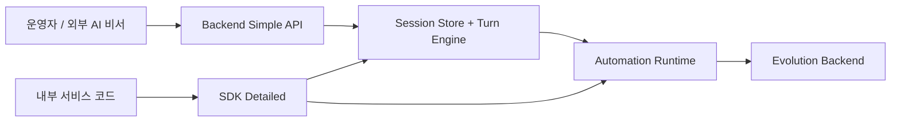

> Language: [English](./README.md) | [한국어](./README.ko.md)

# Adaptive Web Automation Core

`Rule-first` 웹 자동화 런타임으로, LLM/Vision 폴백을 통제하고 스크린샷 체크포인트 및 버그/예외 기반 진화(evolution)를 지원합니다.

법적 안전 기본값: 캡차/2FA/보안 챌린지 우회 자동화는 제공하지 않으며 human handoff를 사용합니다.

## Dual 사용 모드

1. `backend_simple`: 멀티턴 세션 API를 제공하는 가장 단순한 HTTP 백엔드 모드
2. `sdk_detailed`: 자체 서비스 코드에 임베딩하는 세밀 제어 SDK 모드



## 이 저장소가 제공하는 것

- 결정론 워크플로우 우선 실행 + 필요 구간만 폴백
- 자동화 계획/실행을 위한 멀티턴 세션 상태 관리
- 반복 리스트 합성 판단(`이미지 합성 -> YOLO26 -> 동일 이미지 VLM fallback -> 역추적`)
- Slack/Telegram 구현 없이 assistantless E2E 시뮬레이션
- worktree 격리 + 테스트/수정 + 승인 기반 진화 백엔드

## 빠른 시작

```bash
cd runtime
npm install
npx playwright install chromium
cp .env.example .env
npm run typecheck
npm test
```

## 모드 A: Backend Simple (HTTP + 샘플 UI)

백엔드 실행:

```bash
cd runtime
npm run backend:simple:server
```

접속:

- API health: `http://127.0.0.1:4888/health`
- 샘플 UI: `http://127.0.0.1:4888/backend/ui`

## 모드 B: SDK Detailed (임베딩)

예제 실행:

```bash
cd runtime
npm run example:sdk:basic
npm run example:sdk:multiturn
npm run example:sdk:auto-improve
npm run example:sdk:human-handoff
npm run example:repeated-item
```

## 모델 정책

- 코딩/자가개선 루프: `gemini-3.1-pro-preview`
- 자동화 상호작용 루프: `gemini-3.0-flash`

## 검증 명령

```bash
cd runtime
npm run typecheck
npm run test:sdk
npm run test:evolution
npm test
```

## 아티팩트/상태 경로

- 런타임 아티팩트: `runs/samples/artifacts/`
- backend 세션 상태: `testing/backend/state/`
- evolution 상태: `testing/evolution/state/`
- autonomous E2E 증적: `testing/autonomous-batch/`

## 이중언어 문서

- 문서 인덱스: [English](./doc/README.md) | [한국어](./doc/README.ko.md)
- SDK + Backend 사용법: [English](./doc/CODEX-SDK-BACKEND-USAGE.en.md) | [한국어](./doc/CODEX-SDK-BACKEND-USAGE.md)
- 실사용 가이드: [English](./doc/CODEX-PRACTICAL-USAGE.en.md) | [한국어](./doc/CODEX-PRACTICAL-USAGE.md)
- 환경설정: [English](./doc/CODEX-ENV-SETUP.en.md) | [한국어](./doc/CODEX-ENV-SETUP.md)
