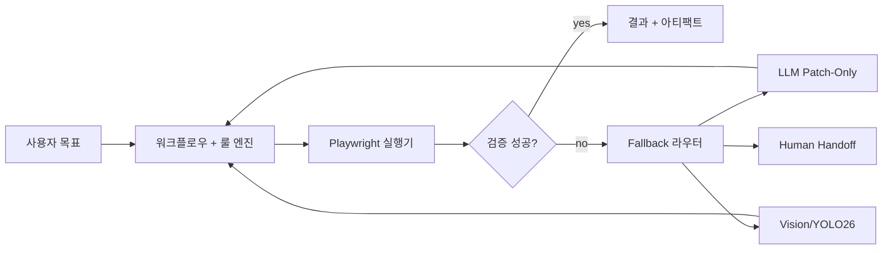
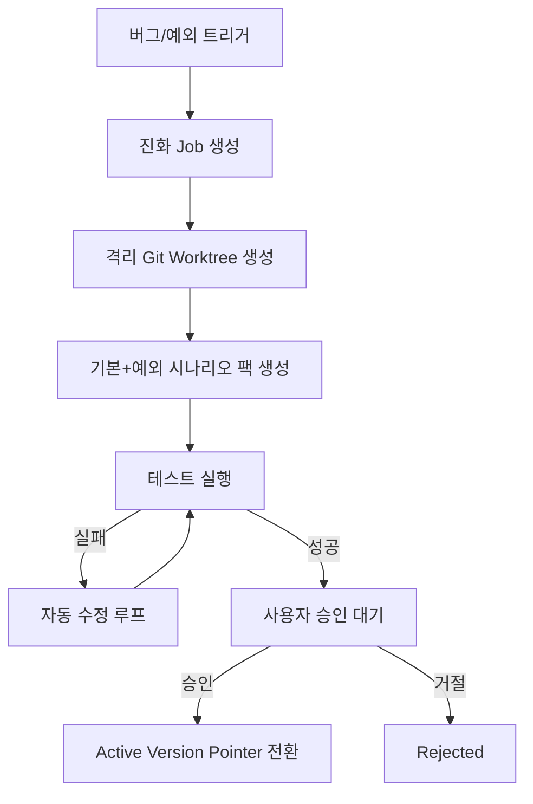

> Language: [English](./README.md) | [한국어](./README.ko.md)

# Adaptive Web Automation Core

`Rule-first` 웹 자동화 런타임으로, 실패 구간에만 LLM/Vision을 제한적으로 사용하고, 스크린샷 체크포인트와 예외 기반 버전 진화를 지원합니다.

## 이 저장소가 하는 일

- 결정론 워크플로우를 우선 실행
- 실패/모호 구간만 LLM/Vision으로 에스컬레이션
- 실행 아티팩트/테스트 증적 저장
- 외부 AI 비서 없이 assistantless E2E 시뮬레이션 수행
- 버그/예외 대응용 진화 백엔드(worktree 격리 + 승인 전환) 제공

## 이 저장소가 하지 않는 일

- Telegram/Slack 운영 연동 자체 구현
- 캡차/2FA/결제 우회
- 외부 AI 비서 프로젝트 전체 대체

## 아키텍처



## 진화 백엔드 흐름 (버그/예외 전용)



## 빠른 시작

```bash
cd runtime
npm install
npx playwright install chromium
cp .env.example .env
npm run typecheck
npm test
```

## 테스트 방법

### 1) 코어 계약/단위/통합 테스트

```bash
cd runtime
npm test
npm run typecheck
```

### 2) 전체 자동화 플로우

```bash
cd runtime
npm run test:full-flow
```

### 3) 한국 사이트 라이브 E2E (Headful)

```bash
cd runtime
PW_HEADLESS=0 RUN_KR_E2E=1 npm run test:e2e:kr
```

### 4) 복잡 시나리오 배치 E2E (Headful)

```bash
cd runtime
PW_HEADLESS=0 RUN_AUTONOMOUS_BATCH_E2E=1 AUTONOMOUS_BATCH_ITERATIONS=1 npm run test:e2e:autonomous:live
```

### 5) 진화 백엔드 테스트

```bash
cd runtime
npm run test:evolution
```

## 진화 백엔드 로컬 실행

```bash
cd runtime
npm run evolution:server
```

접속:

- UI: `http://127.0.0.1:4777/evolution/ui`
- Health: `http://127.0.0.1:4777/health`

## 아티팩트/기록 위치

- 런타임 아티팩트: `runs/samples/artifacts/`
- 복잡 배치 증적: `testing/autonomous-batch/<timestamp>/`
- 진화 상태 저장: `testing/evolution/state/`

## 이중언어 문서 인덱스

- English: [Documentation Index](./doc/README.md)
- 한국어: [문서 인덱스](./doc/README.ko.md)

## 핵심 문서

- PRD: [English](./doc/PRD-v0.1.en.md) | [한국어](./doc/PRD-v0.1.md)
- Runbook: [English](./doc/CODEX-RUNBOOK.en.md) | [한국어](./doc/CODEX-RUNBOOK.md)
- 구현 계획: [English](./doc/CODEX-IMPLEMENTATION-PLAN.en.md) | [한국어](./doc/CODEX-IMPLEMENTATION-PLAN.md)
- 테스트/수정 사이클: [English](./doc/CODEX-TEST-FIX-CYCLE.en.md) | [한국어](./doc/CODEX-TEST-FIX-CYCLE.md)
- 진화 백엔드: [English](./doc/CODEX-EVOLUTION-BACKEND.en.md) | [한국어](./doc/CODEX-EVOLUTION-BACKEND.md)
- SDK + 백엔드 사용법: [English](./doc/CODEX-SDK-BACKEND-USAGE.en.md) | [한국어](./doc/CODEX-SDK-BACKEND-USAGE.md)
- E2E 테스트: [English](./doc/CODEX-E2E-TESTING.en.md) | [한국어](./doc/CODEX-E2E-TESTING.md)
- 환경설정: [English](./doc/CODEX-ENV-SETUP.en.md) | [한국어](./doc/CODEX-ENV-SETUP.md)
