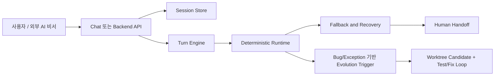

> Language: [English](./README.md) | [한국어](./README.ko.md)

# Adaptive Web Automation Core

최종 업데이트: 2026-02-25 (KST)

이 저장소는 외부 AI 비서 프로젝트가 호출하는 웹 자동화 코어를 제공합니다.
핵심 방향:
1. 결정론 우선 실행
2. 제한된 LLM 폴백
3. 민감 구간 스크린샷 기반 human handoff
4. 버그/예외 트리거 기반 자가개선(신규 요구마다 자동 실행 아님)

법적 안전 기본값:
- 캡차/2FA/보안 챌린지 자동 우회 금지
- 보안 챌린지 발생 시 즉시 사람 입력으로 전환

## 범위 경계

이 저장소가 담당하는 것:
- 웹 자동화 런타임, 세션 계약, 복구/폴백, E2E 시뮬레이션
- 채팅형 백엔드 샘플, SDK 임베딩 API

이 저장소가 담당하지 않는 것:
- 운영용 Slack/Telegram webhook 라우팅
- 운영 계정/비밀키 정책 관리 체계

## 핵심 기능

1. 결정론 워크플로우 엔진(`rule-first`)
2. Similo fingerprint 기반 selector 선행 복구(LLM patch 이전)
3. Cascaded LLM 라우팅(`flash 우선 -> 불확실/민감 게이트 -> pro -> rule fallback`)
4. 반복 태스크용 semantic replay + plan cache 재사용/적응
5. self-healing taxonomy 기반 실패 분류 + 제안 액션
6. 반복 아이템 시각 체인(`합성 이미지 -> YOLO26 -> VLM fallback -> 역매핑`)
7. 채팅 자동화 백엔드 샘플:
   - headful/headless 선택
   - SSE 실시간 진행 로그
   - pause/resume/cancel
   - captcha handoff 입력
   - 이미지 첨부
8. 진화 백엔드(`git worktree` 격리 + 승인 기반 승격)

## 아키텍처



## 빠른 시작

```bash
cd runtime
npm install
npx playwright install chromium
cp .env.example .env
npm run typecheck
npm test
```

## 실행 방법

### 모드 A: Backend Simple

```bash
cd runtime
npm run backend:simple:server
```

- Health: `http://127.0.0.1:4888/health`
- UI 샘플: `http://127.0.0.1:4888/backend/ui`

### 모드 B: Chat Automation Example Backend

```bash
cd runtime
npm run example:chat-backend
```

- Health: `http://127.0.0.1:4999/example/chat/health`
- Chat UI: `http://127.0.0.1:4999/example/chat/ui`

### 모드 C: SDK 임베딩

```bash
cd runtime
npm run example:sdk:basic
npm run example:sdk:multiturn
npm run example:sdk:auto-improve
npm run example:sdk:human-handoff
npm run example:repeated-item
```

## 환경 변수 핵심

- 지원 LLM provider: `gemini`, `openai`만 지원
- 기본 Gemini 모델: `gemini-3.1-pro-preview,gemini-3.0-flash`
- 기본 OpenAI 모델: `gpt-5.2-codex,gpt-5-mini`
- YOLO26 기본 모델: `yolo26l`

주요 변수:
- `BACKEND_AUTOMATION_MODEL`
- `BACKEND_CASCADE_ESCALATION_MODEL`
- `BACKEND_CASCADE_THRESHOLD`
- `PLAN_CACHE_ENABLED`
- `PLAN_CACHE_SIMILARITY_THRESHOLD`
- `SIMILO_ENABLED`

상세 설정:
- [Environment Setup (EN)](./doc/CODEX-ENV-SETUP.en.md)
- [환경설정 (KO)](./doc/CODEX-ENV-SETUP.md)

## E2E 테스트 시작점

대표 명령:

```bash
cd runtime
npm run typecheck
npm test
npm run test:e2e:chat-ui:headful
npm run test:e2e:kr:headful
npm run test:e2e:assistantless:live
npm run test:e2e:provider:live
npm run test:e2e:autonomous:live
```

live 플래그 의미:
1. `RUN_KR_E2E=1`: 한국 사이트 live smoke 실행
2. `RUN_ASSISTANTLESS_KR_E2E=1`: assistantless live 루프 실행
3. `RUN_PROVIDER_LIVE_E2E=1`: 실제 provider matrix 실행(대상 모델이 env에 있어야 동작)
4. `RUN_AUTONOMOUS_BATCH_E2E=1`: autonomous batch 실행 + `testing/autonomous-batch/`에 증적 저장

## 문서 안내

문서 시작점:
1. [Documentation Index (EN)](./doc/README.md)
2. [문서 인덱스 (KO)](./doc/README.ko.md)

자주 보는 문서:
1. [Runbook (EN)](./doc/CODEX-RUNBOOK.en.md) | [런북 (KO)](./doc/CODEX-RUNBOOK.md)
2. [Automation Test Plan (EN)](./doc/CODEX-AUTOMATION-TEST-PLAN.en.md) | [자동화 테스트 계획 (KO)](./doc/CODEX-AUTOMATION-TEST-PLAN.md)
3. [E2E Testing Guide (EN)](./doc/CODEX-E2E-TESTING.en.md) | [E2E 테스트 가이드 (KO)](./doc/CODEX-E2E-TESTING.md)
4. [SDK + Backend Usage (EN)](./doc/CODEX-SDK-BACKEND-USAGE.en.md) | [SDK + 백엔드 사용법 (KO)](./doc/CODEX-SDK-BACKEND-USAGE.md)
