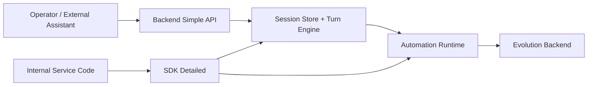

> Language: [English](./README.md) | [한국어](./README.ko.md)

# Adaptive Web Automation Core

Rule-first web automation runtime with controlled LLM fallback, screenshot checkpoints, and bug/exception-driven evolution.

Legal-safe default: captcha/2FA/security challenge bypass automation is not provided; use human handoff.

## Dual Usage Modes

1. `backend_simple`: easiest HTTP backend mode with multi-turn session APIs
2. `sdk_detailed`: embeddable SDK mode for fine-grained orchestration in your own service



## What This Repository Does

- deterministic workflow execution first, fallback only when needed
- multi-turn chat-like session state for automation planning/execution
- repeated-item composite judgement (`merge -> YOLO26 -> same-image VLM fallback -> reverse trace`)
- assistantless E2E simulation without implementing Slack/Telegram integration itself
- chat automation backend sample (`/example/chat/*`) with live log stream, headful/headless switch, pause/resume/cancel, captcha handoff input
- evolution backend for isolated candidate versions (worktree + test/fix + approval)

## Quick Start

```bash
cd runtime
npm install
npx playwright install chromium
cp .env.example .env
npm run typecheck
npm test
```

## Mode A1: Backend Simple (HTTP + Sample UI)

Start backend:

```bash
cd runtime
npm run backend:simple:server
```

Open:

- API health: `http://127.0.0.1:4888/health`
- sample UI: `http://127.0.0.1:4888/backend/ui`

## Mode A2: Chat Automation Backend (HTTP + Chat UI Example)

Start backend + chat UI:

```bash
cd runtime
npm run example:chat-backend
```

Open:

- API health: `http://127.0.0.1:4999/example/chat/health`
- chat UI: `http://127.0.0.1:4999/example/chat/ui`

Key features:

1. per-message browser mode (`headful`/`headless`)
2. live execution status/logs through SSE stream
3. user pause/resume/cancel controls
4. captcha/security handoff input + continue
5. auto-pause older session when another conversation starts (same operator)

## Mode B: SDK Detailed (Embedded)

Run examples:

```bash
cd runtime
npm run example:sdk:basic
npm run example:sdk:multiturn
npm run example:sdk:auto-improve
npm run example:sdk:human-handoff
npm run example:repeated-item
```

## Model Policy

- coding/self-improvement loops: `gemini-3.1-pro-preview`
- automation interaction loops: `gemini-3.0-flash`

## Verification Commands

```bash
cd runtime
npm run typecheck
npm run test:sdk
npm run test:evolution
npm test
```

## Artifacts and State Paths

- runtime artifacts: `runs/samples/artifacts/`
- backend sessions: `testing/backend/state/`
- evolution state: `testing/evolution/state/`
- autonomous E2E evidence: `testing/autonomous-batch/`

## Bilingual Documentation

- Documentation index: [English](./doc/README.md) | [한국어](./doc/README.ko.md)
- SDK + Backend usage: [English](./doc/CODEX-SDK-BACKEND-USAGE.en.md) | [한국어](./doc/CODEX-SDK-BACKEND-USAGE.md)
- Practical usage guide: [English](./doc/CODEX-PRACTICAL-USAGE.en.md) | [한국어](./doc/CODEX-PRACTICAL-USAGE.md)
- Environment setup: [English](./doc/CODEX-ENV-SETUP.en.md) | [한국어](./doc/CODEX-ENV-SETUP.md)
