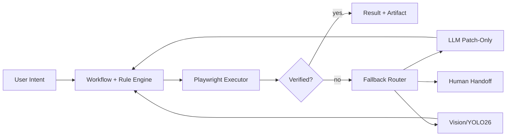
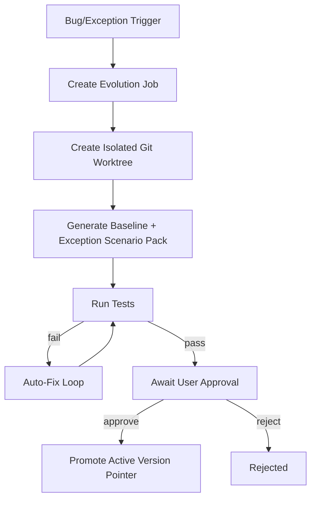

> Language: [English](./README.md) | [한국어](./README.ko.md)

# Adaptive Web Automation Core

Rule-first web automation runtime with controlled LLM fallback, screenshot-based checkpointing, and exception-driven version evolution.

## What This Repository Does

- Runs deterministic browser workflows first.
- Escalates only failed/ambiguous steps to LLM/Vision.
- Stores replayable artifacts and test evidence.
- Supports assistantless E2E simulation (chat-like automation without external assistant integration).
- Provides an evolution backend to create isolated candidate versions for bug/exception recovery.

## What This Repository Does Not Do

- It does not implement Telegram/Slack bot integrations in production.
- It does not bypass captcha/2FA/payment security gates.
- It does not replace your external AI-assistant orchestration project.

## Architecture



## Evolution Backend (Bug/Exception-Driven)



## Quick Start

```bash
cd runtime
npm install
npx playwright install chromium
cp .env.example .env
npm run typecheck
npm test
```

## Testing Guide

### 1) Core Contract + Unit + Integration

```bash
cd runtime
npm test
npm run typecheck
```

### 2) Full Automation Flow

```bash
cd runtime
npm run test:full-flow
```

### 3) Korea Live E2E (Headful)

```bash
cd runtime
PW_HEADLESS=0 RUN_KR_E2E=1 npm run test:e2e:kr
```

### 4) Assistantless Complex Batch E2E (Headful)

```bash
cd runtime
PW_HEADLESS=0 RUN_AUTONOMOUS_BATCH_E2E=1 AUTONOMOUS_BATCH_ITERATIONS=1 npm run test:e2e:autonomous:live
```

### 5) Evolution Backend Tests

```bash
cd runtime
npm run test:evolution
```

## Run Evolution Backend Locally

```bash
cd runtime
npm run evolution:server
```

Open:

- UI: `http://127.0.0.1:4777/evolution/ui`
- Health: `http://127.0.0.1:4777/health`

## Artifacts and Records

- Runtime artifacts: `runs/samples/artifacts/`
- Autonomous batch evidence: `testing/autonomous-batch/<timestamp>/`
- Evolution state store: `testing/evolution/state/`

## Bilingual Documentation Index

- English: [Documentation Index](./doc/README.md)
- Korean: [문서 인덱스](./doc/README.ko.md)

## Core Docs

- PRD: [English](./doc/PRD-v0.1.en.md) | [한국어](./doc/PRD-v0.1.md)
- Runbook: [English](./doc/CODEX-RUNBOOK.en.md) | [한국어](./doc/CODEX-RUNBOOK.md)
- Implementation Plan: [English](./doc/CODEX-IMPLEMENTATION-PLAN.en.md) | [한국어](./doc/CODEX-IMPLEMENTATION-PLAN.md)
- Test/Fix Cycle: [English](./doc/CODEX-TEST-FIX-CYCLE.en.md) | [한국어](./doc/CODEX-TEST-FIX-CYCLE.md)
- Evolution Backend: [English](./doc/CODEX-EVOLUTION-BACKEND.en.md) | [한국어](./doc/CODEX-EVOLUTION-BACKEND.md)
- E2E Testing: [English](./doc/CODEX-E2E-TESTING.en.md) | [한국어](./doc/CODEX-E2E-TESTING.md)
- Env Setup: [English](./doc/CODEX-ENV-SETUP.en.md) | [한국어](./doc/CODEX-ENV-SETUP.md)
