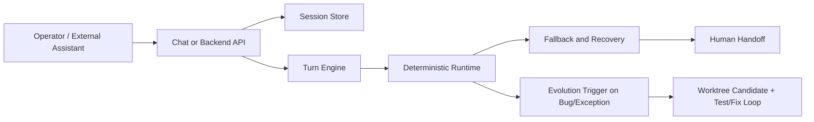

> Language: [English](./README.md) | [한국어](./README.ko.md)

# Adaptive Web Automation Core

Last Updated: 2026-02-25 (KST)

This repository provides the web-automation core for an external AI assistant project.
It is designed for:
1. deterministic-first web execution
2. bounded LLM fallback
3. screenshot-based human handoff for sensitive steps
4. bug/exception-driven self-improvement (not per every new request)

Legal-safe default:
- no automatic captcha/2FA/security bypass
- immediate handoff to human input on security challenges

## Scope Boundary

In scope:
- web automation runtime, session contracts, fallback/recovery, E2E simulation
- chat-style backend sample and SDK for embedding

Out of scope:
- production Slack/Telegram bot routing and webhook orchestration
- credential vault/policy management for production assistants

## Core Capabilities

1. Deterministic workflow engine (`rules first`)
2. Structure-first candidate reduction (`DOM -> 20~50 candidates`) before any semantic/LLM step
3. On-demand partial vectorization with page-scoped in-memory index (`hnswlib-node` if available, brute-force cosine fallback)
4. Selector recovery with Similo-style fingerprints before LLM patch fallback
5. Cascaded LLM routing (`flash-first -> uncertainty/sensitive gate -> pro -> rule fallback`)
6. Semantic replay + plan cache reuse/adaptation for repeated tasks
7. Self-healing taxonomy for failure classification and suggested action
8. Repeated-item visual chain (`composite image -> RFDETR -> VLM fallback -> reverse mapping`)
9. Chat automation backend sample with:
   - two-stage LLM flow: `task analyzer` (decomposition + strategy options) -> `action planner`
   - LLM-first action planning (default `flash -> rule fallback`, optional `flash -> pro -> rule fallback`) with JSON Action DSL validation
   - result validation loop (`LLM validator -> retry with alternate strategy`)
   - headful/headless switch
   - live logs/progress stream (SSE)
   - pause/resume/cancel
   - captcha handoff input
   - image attachments
10. Evolution backend for isolated candidate versions (`git worktree`) and approval-based promotion

## Architecture



## Quick Start

```bash
cd runtime
npm install
npx playwright install chromium
cp .env.example .env
npm run typecheck
npm test
```

## How to Run

### Mode A: Backend Simple

```bash
cd runtime
npm run backend:simple:server
```

- Health: `http://127.0.0.1:4888/health`
- UI sample: `http://127.0.0.1:4888/backend/ui`

### Mode B: Chat Automation Example Backend

```bash
cd runtime
npm run example:chat-backend
```

- Default execution mode for this command is `playwright` (real browser actions).
- Default planner mode is `llm_first`.
- Default automation tier policy is `flash_only` (Gemini Flash for runtime analyzer/planner/validator/formatter).
- To allow runtime pro escalation, set `CHAT_AUTOMATION_ALLOW_PRO_ESCALATION=1`.
- LLM provider order follows `LLM_VENDOR_ORDER` exactly; set `LLM_VENDOR_ORDER=gemini` for gemini-only runtime.
- To force simulation mode:
```bash
CHAT_AUTOMATION_EXECUTION_MODE=simulate npm run example:chat-backend
```
- If you request `browserMode=headful` and GUI launch fails, logs include:
  `Headful launch failed in current environment. Fallback to headless was applied.`

- Health: `http://127.0.0.1:4999/example/chat/health`
- Chat UI: `http://127.0.0.1:4999/example/chat/ui`

### Mode C: SDK Embedded Usage

```bash
cd runtime
npm run example:sdk:basic
npm run example:sdk:multiturn
npm run example:sdk:auto-improve
npm run example:sdk:human-handoff
npm run example:repeated-item
```

## Environment Essentials

- LLM providers supported: `gemini`, `openai` only
- Default Gemini models: `gemini-3.1-pro-preview,gemini-3-flash-preview`
- Default OpenAI models: `gpt-5-codex,gpt-5-mini`
- Runtime automation model policy: use low-cost first (`BACKEND_AUTOMATION_GEMINI_MODEL=gemini-3-flash-preview`, `BACKEND_AUTOMATION_OPENAI_MODEL=gpt-5-mini`)
- Coding/autofix model policy: use high-capability model (`EVOLUTION_CODING_MODEL=gemini-3.1-pro-preview`)
- RFDETR default model: `rf-detr-medium`
- Langfuse tracing: disabled by default (`LANGFUSE_ENABLED=0`), enable with env only when needed
- Prompt management: all LLM prompts are split into `runtime/src/prompts/*` with explicit `id@version`

Key variables:
- `BACKEND_AUTOMATION_MODEL`
- `BACKEND_AUTOMATION_GEMINI_MODEL`
- `BACKEND_AUTOMATION_OPENAI_MODEL`
- `BACKEND_CASCADE_ESCALATION_MODEL`
- `CHAT_AUTOMATION_PLANNER_MODE`
- `CHAT_AUTOMATION_ALLOW_PRO_ESCALATION`
- `CHAT_AUTOMATION_MAX_PLANNER_ATTEMPTS`
- `BACKEND_CASCADE_ESCALATION_GEMINI_MODEL`
- `BACKEND_CASCADE_ESCALATION_OPENAI_MODEL`
- `BACKEND_CASCADE_THRESHOLD`
- `PLAN_CACHE_ENABLED`
- `PLAN_CACHE_SIMILARITY_THRESHOLD`
- `SIMILO_ENABLED`
- `LANGFUSE_ENABLED`
- `LANGFUSE_PUBLIC_KEY`
- `LANGFUSE_SECRET_KEY`
- `LANGFUSE_BASE_URL`

Full setup:
- [Environment Setup (EN)](./doc/CODEX-ENV-SETUP.en.md)
- [환경설정 (KO)](./doc/CODEX-ENV-SETUP.md)

## E2E Test Entry

Main command groups:

```bash
cd runtime
npm run typecheck
npm test
npm run test:e2e:chat-ui:headful
npm run test:e2e:kr:headful
npm run test:e2e:assistantless:live
npm run test:e2e:provider:live
npm run test:e2e:autonomous:live
```

Meaning of live flags:
1. `RUN_KR_E2E=1`: run Korea live smoke scenarios
2. `RUN_ASSISTANTLESS_KR_E2E=1`: run assistantless live loop scenarios
3. `RUN_PROVIDER_LIVE_E2E=1`: run real provider matrix (if model targets are configured)
4. `RUN_AUTONOMOUS_BATCH_E2E=1`: run autonomous batch scenarios and save evidence under `testing/autonomous-batch/`

## Documentation Map

Start here:
1. [Documentation Index (EN)](./doc/README.md)
2. [문서 인덱스 (KO)](./doc/README.ko.md)

Most-used docs:
1. [Runbook (EN)](./doc/CODEX-RUNBOOK.en.md) | [런북 (KO)](./doc/CODEX-RUNBOOK.md)
2. [Automation Test Plan (EN)](./doc/CODEX-AUTOMATION-TEST-PLAN.en.md) | [자동화 테스트 계획 (KO)](./doc/CODEX-AUTOMATION-TEST-PLAN.md)
3. [E2E Testing Guide (EN)](./doc/CODEX-E2E-TESTING.en.md) | [E2E 테스트 가이드 (KO)](./doc/CODEX-E2E-TESTING.md)
4. [SDK + Backend Usage (EN)](./doc/CODEX-SDK-BACKEND-USAGE.en.md) | [SDK + 백엔드 사용법 (KO)](./doc/CODEX-SDK-BACKEND-USAGE.md)
