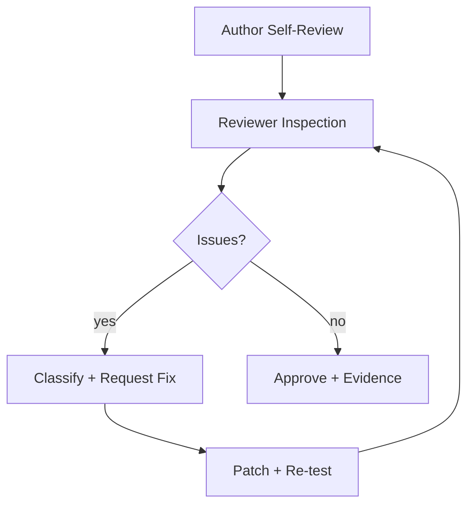

> Language: [English](./CODEX-CODE-REVIEW.en.md) | [한국어](./CODEX-CODE-REVIEW.md)

# CODEX CODE REVIEW

## 0. Purpose

Standardize merge-quality review. Test pass alone is not enough.

## 1. Scope

Review is mandatory for changes in:
1. `runtime/`
2. `services/`
3. `recipes/`
4. `doc/`
5. `runtime/src/evolution/` and `runtime/evolution-ui/`

## 2. Entry Criteria

Before review:
1. scope and intent summarized (<=3 lines)
2. test evidence attached
3. known risks/non-goals documented

## 3. Review Workflow

## 4. Severity Levels

| Severity | Meaning | Default Action |
|---|---|---|
| Blocker | deployment/consistency/safety risk | must fix now |
| Major | functional mismatch/regression risk | fix + re-test |
| Minor | maintainability/readability risk | fix now or track |
| Nit | style-level suggestion | optional |

## 5. Checklist

1. Correctness
2. Safety
3. Resilience
4. Observability
5. Scope control
6. Documentation sync
7. Evolution integrity (bug/exception trigger rule, approval promotion, pointer history)

## 6. Approval Rule

- Blocker = 0
- Major = 0
- Minor/Nit tracked or fixed
