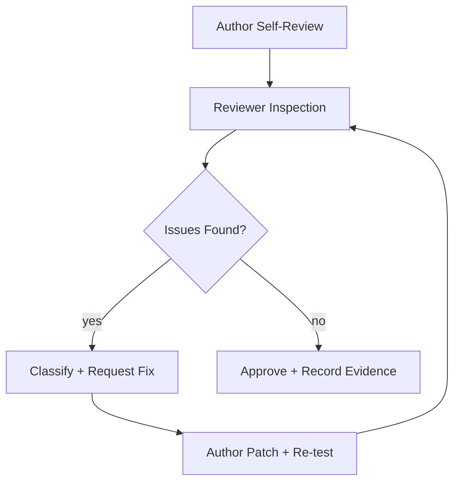

> Language: [English](./CODEX-CODE-REVIEW.en.md) | [한국어](./CODEX-CODE-REVIEW.md)

# CODEX CODE REVIEW

## 0. 목적

이 문서는 구현 완료 후 `병합 전 품질 게이트`로서 코드 리뷰를 표준화한다.  
핵심 원칙은 `tests-pass != merge-ready`다.

## 1. 적용 범위

다음 변경은 모두 리뷰 대상이다.

1. 런타임 로직(`runtime/`)
2. 서비스 로직(`services/`)
3. 정책/레시피(`recipes/`)
4. 실행/운영 문서(`doc/`)의 규칙성 변경
5. 진화 백엔드(`runtime/src/evolution/`, `runtime/evolution-ui/`) 변경

## 2. 리뷰 진입 조건

리뷰 시작 전 아래 항목이 충족되어야 한다.

1. 변경 범위와 목적이 3줄 이내로 정리됨
2. 테스트 결과가 첨부됨(통과/실패/미실행 사유)
3. 알려진 리스크와 비목표가 명시됨

## 3. 리뷰 절차



### 3.1 Author Self-Review

1. 불필요한 변경 제거
2. 로그/에러 처리 누락 확인
3. 문서 동기화 여부 확인

### 3.2 Reviewer Inspection

1. 요구사항 충족 여부
2. 리그레션 위험 여부
3. 운영 안전성(캡차/2FA/민감 액션) 위반 여부

### 3.3 승인 기준

1. `Blocker` 0건
2. `Major` 0건
3. `Minor/Nit`는 추적 가능 상태(즉시 수정 또는 후속 태스크 등록)

## 4. 이슈 등급

| 등급 | 의미 | 기본 처리 |
|---|---|---|
| `Blocker` | 배포/병합 시 즉시 장애 또는 보안/정합성 위반 가능 | 즉시 수정 후 재리뷰 |
| `Major` | 기능 오동작, 요구사항 미충족, 리그레션 가능성 높음 | 수정 후 재테스트/재리뷰 |
| `Minor` | 안정성/가독성/유지보수성 저하 | 같은 PR에서 우선 수정 권장 |
| `Nit` | 스타일/표현 개선 제안 | 선택 반영 가능, 누적 시 정리 |

## 5. 리뷰 체크리스트

1. Correctness: 요구사항과 실제 동작이 일치하는가
2. Safety: human-handoff 정책을 위반하지 않는가
3. Resilience: 실패 경로/폴백이 동작하는가
4. Observability: 로그/메트릭/아티팩트가 충분한가
5. Scope Control: 불필요한 변경이 없는가
6. Documentation: 관련 문서가 함께 갱신되었는가
7. Evolution: bug/exception 트리거 제한, 승인 전환, 버전 포인터 기록이 일관적인가

## 6. 리뷰 보고 템플릿

```md
## Code Review Report
- Scope:
- Reviewer:
- Summary:
- Issues:
  - severity: Blocker/Major/Minor/Nit
  - file:
  - comment:
  - action: fix/defer/reject
- Decision: approve/rework
- Evidence: (diff/log/test path)
```
