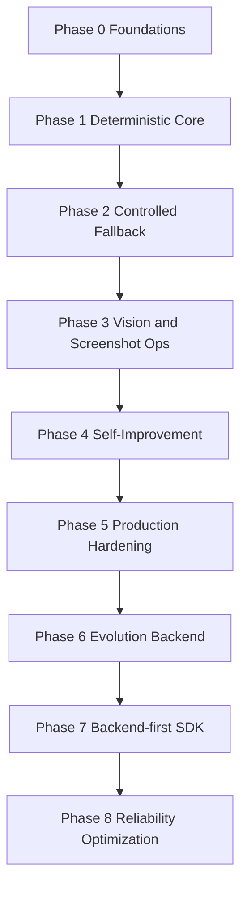

> Language: [English](./CODEX-IMPLEMENTATION-PLAN.en.md) | [한국어](./CODEX-IMPLEMENTATION-PLAN.md)

# CODEX IMPLEMENTATION PLAN

Last Updated: 2026-02-25 (KST)

## 0. Plan Principles

1. phase-based delivery (not week-based)
2. minimal, auditable changes
3. test and review are both required for completion
4. legal-safe boundaries are mandatory

## 1. Phase Status

Current state:
1. Phase 0-8 implemented in baseline form
2. reliability optimization is integrated:
   - Similo selector fingerprint recovery
   - cascaded LLM routing
   - semantic replay and plan cache
   - self-healing taxonomy classification

## 2. Completed Capability Summary

1. deterministic workflow validation/execution/retry
2. selector and visual recovery paths
3. screenshot-first human-loop runtime contracts
4. KR-focused live E2E scenarios and assistantless simulation
5. bug/exception-driven evolution backend with worktree isolation
6. SDK + backend APIs for external assistant projects
7. chat automation sample backend and headful UI e2e coverage

## 3. Phase Exit Rules

Every phase is considered complete only when:
1. code changes are merged
2. relevant docs are updated in EN/KO
3. required tests pass with evidence
4. code review has blocker/major = 0
5. residual risks are recorded

## 4. Current Priority Queue

1. increase deterministic recovery hit-rate before model escalation
2. reduce repeated-task cost with stronger cache matching
3. improve autonomous scenario stability for long live runs
4. expand quality metrics export for operational dashboards

## 5. Next Improvement Backlog

1. interaction-healing pre-step insertion for hidden elements
2. adaptive timeout policy by page complexity
3. region-aware VLM cropping for cluttered screens
4. routing policy auto-tuning from live success metrics

## 6. Review and Tracking

Review criteria and artifacts:
1. `doc/CODEX-CODE-REVIEW.*`
2. `doc/CODEX-TEST-FIX-CYCLE.*`
3. `doc/CODEX-RUN-ARTIFACTS.*`

Operational test references:
1. `doc/CODEX-AUTOMATION-TEST-PLAN.*`
2. `doc/CODEX-E2E-TESTING.*`
