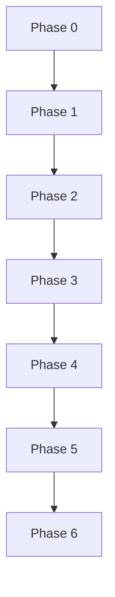

> Language: [English](./CODEX-IMPLEMENTATION-PLAN.en.md) | [한국어](./CODEX-IMPLEMENTATION-PLAN.md)

# CODEX IMPLEMENTATION PLAN

## 0. Plan Principles

- Manage by phase, not by week.
- Test pass is not completion; code-review approval is required.

## 1. Phase Roadmap

### Phase 0: Foundations

Goals:
1. repository skeleton (`runtime/services/recipes/runs/doc`)
2. shared run artifact types
3. artifact storage rule

Done criteria:
1. sample pass/fail run artifacts are storable
2. schema and naming policy documented

### Phase 1: Deterministic Core

Goals:
1. workflow validation/execution path
2. deterministic runner + retry policy
3. Playwright executor + basic extractor

Done criteria:
1. fixed scenario reproducible without LLM
2. retry behavior validated

### Phase 2: Controlled AI Fallback

Goals:
1. reduced context payload
2. patch-only validator
3. recipe versioning

Done criteria:
1. selector drift auto-recovery path works
2. patched rerun succeeds in tests

### Phase 3: Vision + Screenshot Ops

Goals:
1. ROI batching and remapping
2. screenshot checkpoint policy
3. channel-agnostic human-loop contract

Done criteria:
1. visual ambiguity recovery works
2. screenshot-based decision loop validated

### Phase 4: Self-Improvement

Goals:
1. replay storage
2. rule promotion gate
3. adaptive repeated-run controller

Done criteria:
1. repeated runs reduce LLM calls
2. promotion avoids regression

### Phase 5: Production Hardening

Goals:
1. session manager
2. metrics dashboard
3. rollback log + resilience orchestrator

Done criteria:
1. multi-scenario orchestration stable
2. rollback and resilience evidence available

### Phase 6: Exception-Driven Evolution Backend

Goals:
1. bug/exception triggered evolution state machine
2. isolated worktree candidate lifecycle
3. auto-fix loop + approval-based promotion pointer
4. API/SSE + testing UI

Done criteria:
1. state transitions validated
2. active pointer is updated only after approval
3. evolution test suite passes

## 2. Dependency Order

## 3. Phase Exit Checklist

For every phase:
1. code changes
2. docs updated
3. test evidence
4. code-review evidence
5. known issues
6. rollback point

## 4. Review Gate

A phase can close only when:
1. review executed using `CODEX-CODE-REVIEW`
2. Blocker = 0
3. Major = 0
4. Minor/Nit have explicit disposition

## 5. Evidence References

See review records in `runs/samples/` including phase-specific reports and final integrated review.
