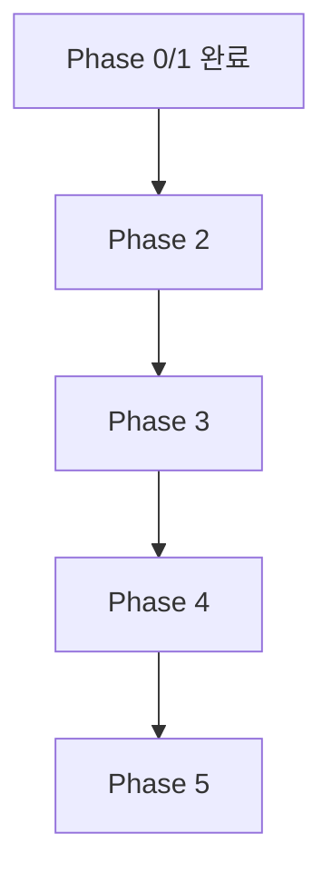

# CODEX IMPLEMENTATION PLAN

## 0. 계획 원칙

이 계획은 `주차`가 아니라 `Phase`로만 관리한다.
또한 테스트 통과 후에도 코드 리뷰 승인 전에는 완료로 처리하지 않는다.

## 1. Phase 구조

### Phase 0: Foundations

목표:

1. 저장소 골격(runtime/services/recipes/runs/doc)
2. 공통 타입/로그 스키마 정의
3. 실행 아티팩트 저장 규칙 확정

완료 기준:

1. 샘플 run 1회 저장 가능
2. 실패/성공 로그 구분 저장 가능
3. run artifact 타입/저장 규칙 문서화 완료

### Phase 1: Deterministic Core

목표:

1. DSL 해석기(node/action/verify/loop/branch)
2. Playwright Executor 액션 집합 구현
3. 기본 Extractor(E_inputs/E_clickables/E_state)

완료 기준:

1. 고정 시나리오 1개 LLM 없이 재현 성공
2. 검증 실패 시 재시도 정책 동작

진행 현황(2026-02-24):

1. `runtime/src/workflow/validate-workflow.ts` 추가(노드 중복/참조 무결성 검증)
2. `runtime/src/policies/retry-policy.ts` 추가(`AuthBlocked`, `ReviewRejected` 비재시도)
3. `runtime/src/workflow/build-execution-path.ts` 추가(Branch/Loop 실행 경로 생성)
4. `runtime/src/engine/deterministic-runner.ts` 추가(DSL 노드 실행 + retry + branch/loop + handoff)
5. `runtime/src/extractor/basic-extractor.ts` 추가(E_inputs/E_clickables/E_state)
6. `runtime/tests/*` 기반 단위/시나리오 테스트 19건 통과

### Phase 2: Controlled AI Fallback

목표:

1. 후보 축약 컨텍스트 생성
2. LLM Select + Patch-only 파이프라인
3. 레시피 버전업(v001→v002) 자동화

완료 기준:

1. 셀렉터 변경 케이스 자동 복구
2. 패치 적용 후 재실행 성공

### Phase 3: Vision + Live Ops

목표:

1. ROI 배칭 + 좌표 역매핑
2. CDP Screencast 기반 라이브 뷰어
3. go/not-go 체크포인트

완료 기준:

1. 시각 모호 케이스 1개 자동 복구
2. 라이브 또는 스샷 질의 모드 전환 가능

### Phase 4: Self-Improvement

목표:

1. Python DSPy/GEPA 서비스 연동
2. 오프라인 리플레이/카나리 게이트
3. Rule Promotion 자동화

완료 기준:

1. 동일 시나리오 반복 실행에서 LLM 호출률 감소
2. 리그레션 없는 룰 승격 자동 반영

### Phase 5: Production Hardening

목표:

1. 멀티 세션 운영 안정화
2. 비용/지연 대시보드
3. 롤백/감사로그/장애 대응 체계

완료 기준:

1. 복수 시나리오 안정 운영
2. 장애 시 빠른 복구 절차 확인

## 2. 작업 우선순위

선행 Phase가 완료되지 않으면 다음 Phase 기능을 본선 반영하지 않는다.

## 3. 산출물 체크리스트

각 Phase 종료 시:

1. 코드 변경
2. 문서 변경
3. 테스트 증적
4. 코드 리뷰 증적(`approve` 또는 `rework` 처리 이력)
5. Known issues
6. Rollback 지점

## 4. Code Review Gate

각 Phase는 아래 조건을 만족해야 종료 가능하다.

1. `doc/CODEX-CODE-REVIEW.md` 기준으로 리뷰 수행
2. `Blocker`/`Major` 0건
3. `Minor`/`Nit` 처리 방침 기록(즉시 수정 또는 후속 태스크)

## 5. Phase 0 Baseline Deliverables

현재 저장소 기준 Phase 0 베이스라인 산출물:

1. 디렉터리 골격: `runtime/`, `services/`, `recipes/`, `runs/`
2. 공통 타입: `runtime/src/types/run-artifact.ts`
3. 아티팩트 규칙 문서: `doc/CODEX-RUN-ARTIFACTS.md`
4. 샘플 아티팩트: `runs/samples/2026-02-24_sample-run-pass.json`, `runs/samples/2026-02-24_sample-run-fail.json`
5. 리뷰 증적: `runs/samples/2026-02-24_phase0-foundations-review.md`

## 6. Phase 1 Working Deliverables

현재 브랜치(`feature/phase1-deterministic-core`) 산출물:

1. 워크플로우 검증기: `runtime/src/workflow/validate-workflow.ts`
2. 재시도 정책: `runtime/src/policies/retry-policy.ts`
3. 실행 경로 빌더: `runtime/src/workflow/build-execution-path.ts`
4. 결정론 실행기: `runtime/src/engine/deterministic-runner.ts`
5. 기본 추출기: `runtime/src/extractor/basic-extractor.ts`
6. 테스트: `runtime/tests/workflow-validation.test.ts`, `runtime/tests/retry-policy.test.ts`, `runtime/tests/execution-path.test.ts`, `runtime/tests/deterministic-runner.test.ts`, `runtime/tests/basic-extractor.test.ts`
7. 리뷰 증적: `runs/samples/2026-02-24_phase1-deterministic-core-review.md`
