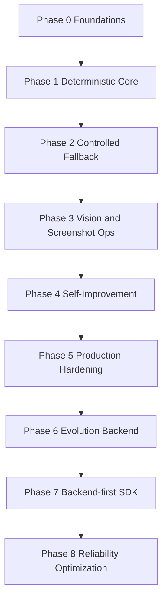

> Language: [English](./CODEX-IMPLEMENTATION-PLAN.en.md) | [한국어](./CODEX-IMPLEMENTATION-PLAN.md)

# CODEX IMPLEMENTATION PLAN

최종 업데이트: 2026-02-25 (KST)

## 0. 계획 원칙

1. 주차가 아니라 페이즈 기준으로 관리
2. 최소 변경 + 추적 가능한 변경
3. 완료 기준은 테스트 + 리뷰 동시 충족
4. 법적 안전 경계는 항상 우선

## 1. 페이즈 상태

현재 상태:
1. Phase 0-8 기본 구현 완료
2. 신뢰성 최적화 항목 통합 완료:
   - Similo selector fingerprint 복구
   - cascaded LLM 라우팅
   - semantic replay + plan cache
   - self-healing taxonomy 분류

## 2. 완료된 역량 요약

1. 결정론 워크플로우 검증/실행/재시도
2. selector/vision 복구 경로
3. screenshot 우선 human-loop 계약
4. 한국 사이트 중심 live E2E + assistantless 시뮬레이션
5. bug/exception 기반 worktree 격리 진화 백엔드
6. 외부 AI 비서 프로젝트 연동용 SDK + backend API
7. 채팅 자동화 샘플 백엔드 + headful UI E2E

## 3. 페이즈 종료 규칙

각 페이즈는 아래를 모두 충족해야 종료됩니다:
1. 코드 변경 반영
2. EN/KO 문서 동시 업데이트
3. 요구 테스트 통과 + 증적 확보
4. 코드 리뷰 blocker/major 0건
5. 잔여 리스크 기록

## 4. 현재 우선순위 큐

1. 상위 모델 에스컬레이션 전 결정론 복구 적중률 향상
2. 반복 태스크 캐시 매칭 강화로 비용 절감
3. 장시간 live 시나리오 안정성 강화
4. 운영 대시보드용 품질 지표 확장

## 5. 다음 개선 백로그

1. hidden element 대응용 interaction-healing 사전 스텝 삽입
2. 페이지 복잡도 기반 적응형 타임아웃
3. cluttered screen용 region-aware VLM crop
4. live 성공률 기반 라우팅 정책 자동 보정

## 6. 리뷰/추적 문서

리뷰 기준 및 증적:
1. `doc/CODEX-CODE-REVIEW.*`
2. `doc/CODEX-TEST-FIX-CYCLE.*`
3. `doc/CODEX-RUN-ARTIFACTS.*`

운영 테스트 기준:
1. `doc/CODEX-AUTOMATION-TEST-PLAN.*`
2. `doc/CODEX-E2E-TESTING.*`
