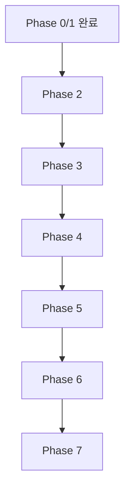

> Language: [English](./CODEX-IMPLEMENTATION-PLAN.en.md) | [한국어](./CODEX-IMPLEMENTATION-PLAN.md)

# CODEX IMPLEMENTATION PLAN

## 0. 계획 원칙

이 계획은 `주차`가 아니라 `Phase`로만 관리한다.
또한 테스트 통과 후에도 코드 리뷰 승인 전에는 완료로 처리하지 않는다.

## 1. Phase 구조

### Phase 0: Foundations

목표:

1. 저장소 골격(runtime/services/recipes/runs/doc)
2. 공통 타입/로그 스키마 정의
3. 실행 아티팩트 저장 규칙 확정

완료 기준:

1. 샘플 run 1회 저장 가능
2. 실패/성공 로그 구분 저장 가능
3. run artifact 타입/저장 규칙 문서화 완료

### Phase 1: Deterministic Core

목표:

1. DSL 해석기(node/action/verify/loop/branch)
2. Playwright Executor 액션 집합 구현
3. 기본 Extractor(E_inputs/E_clickables/E_state)

완료 기준:

1. 고정 시나리오 1개 LLM 없이 재현 성공
2. 검증 실패 시 재시도 정책 동작

진행 현황(2026-02-24):

1. `runtime/src/workflow/validate-workflow.ts` 추가(노드 중복/참조 무결성 검증)
2. `runtime/src/policies/retry-policy.ts` 추가(`AuthBlocked`, `ReviewRejected` 비재시도)
3. `runtime/src/workflow/build-execution-path.ts` 추가(Branch/Loop 실행 경로 생성)
4. `runtime/src/engine/deterministic-runner.ts` 추가(DSL 노드 실행 + retry + branch/loop + handoff)
5. `runtime/src/extractor/basic-extractor.ts` 추가(E_inputs/E_clickables/E_state)
6. `runtime/src/engine/playwright-executor.ts` 추가(필수 액션 집합 실행)
7. `runtime/tests/*` 기반 단위/시나리오 테스트 통과

완료 확인(2026-02-24):

1. `runtime/tests/phase-acceptance.test.ts::phase1` 통과
2. `runtime/tests/playwright-executor.test.ts` 통과

### Phase 2: Controlled AI Fallback

목표:

1. 후보 축약 컨텍스트 생성
2. LLM Select + Patch-only 파이프라인
3. 레시피 버전업(v001→v002) 자동화

완료 기준:

1. 셀렉터 변경 케이스 자동 복구
2. 패치 적용 후 재실행 성공

진행 현황(2026-02-24):

1. `runtime/src/fallback/context-reducer.ts` 추가(후보 축약 컨텍스트 생성)
2. `runtime/src/fallback/patch-validator.ts` 추가(patch-only 검증)
3. `runtime/src/fallback/recipe-version.ts` 추가(레시피 버전업 + selector patch 적용)
4. `runtime/src/fallback/auto-recovery.ts` 추가(셀렉터 자동 복구 + 재실행)
5. `runtime/tests/context-reducer.test.ts`, `runtime/tests/patch-validator.test.ts`, `runtime/tests/recipe-version.test.ts`, `runtime/tests/auto-recovery.test.ts` 통과

완료 확인(2026-02-24):

1. `runtime/tests/phase-acceptance.test.ts::phase2` 통과

### Phase 3: Vision + Screenshot Ops

목표:

1. ROI 배칭 + 좌표 역매핑
2. 스크린샷 질의 기반 운영
3. go/not-go 체크포인트

완료 기준:

1. 시각 모호 케이스 1개 자동 복구
2. Telegram/Slack 스크린샷 질의 경로로 의사결정 가능

진행 현황(2026-02-24):

1. `runtime/src/vision/roi-batcher.ts` 추가(ROI 배칭 + 좌표 역매핑)
2. `runtime/src/checkpoint/go-no-go.ts` 추가(go/not-go 정책 평가)
3. `runtime/src/view/view-mode.ts` 추가(스크린샷 우선 모드 정책)
4. `runtime/src/vision/visual-recovery.ts` 추가(VisualAmbiguity 자동 복구)
5. `runtime/src/chat/platform-normalizer.ts`, `runtime/src/chat/screenshot-checkpoint.ts`, `runtime/src/chat/screenshot-chat-loop.ts` 추가(텔레그램/슬랙 대화형 질의)
6. `runtime/src/integration/human-loop-runtime.ts` 추가(채널 비종속 human-loop 계약)
7. `runtime/src/e2e/kr-scenarios.ts` 추가(한국 사이트 중심 라이브 스모크 시나리오)
8. `runtime/tests/roi-batcher.test.ts`, `runtime/tests/checkpoint-policy.test.ts`, `runtime/tests/view-mode.test.ts`, `runtime/tests/visual-recovery.test.ts`, `runtime/tests/chat-platform.test.ts`, `runtime/tests/screenshot-checkpoint.test.ts`, `runtime/tests/screenshot-chat-loop.test.ts`, `runtime/tests/human-loop-runtime.test.ts`, `runtime/tests/kr-e2e-scenarios.test.ts`, `runtime/tests/e2e-kr-live.test.ts` 통과

완료 확인(2026-02-24):

1. `runtime/tests/phase-acceptance.test.ts::phase3` 통과
2. `runtime/tests/screenshot-chat-loop.test.ts`, `runtime/tests/human-loop-runtime.test.ts` 통과
3. `runtime/tests/e2e-kr-live.test.ts` 라이브 스모크(네이버/다음) 통과

### Phase 4: Self-Improvement

목표:

1. Python DSPy/GEPA 서비스 연동
2. 오프라인 리플레이/카나리 게이트
3. Rule Promotion 자동화

완료 기준:

1. 동일 시나리오 반복 실행에서 LLM 호출률 감소
2. 리그레션 없는 룰 승격 자동 반영

진행 현황(2026-02-24):

1. `runtime/src/learning/replay-store.ts` 추가(오프라인 리플레이 큐 저장/조회)
2. `runtime/src/learning/rule-promotion.ts` 추가(카나리 게이트 + rule version 승격)
3. `runtime/src/learning/adaptive-controller.ts` 추가(반복 실행 기반 자동 승격 반영)
4. `runtime/tests/replay-store.test.ts`, `runtime/tests/rule-promotion.test.ts`, `runtime/tests/adaptive-controller.test.ts` 통과

완료 확인(2026-02-24):

1. `runtime/tests/phase-acceptance.test.ts::phase4` 통과

### Phase 5: Production Hardening

목표:

1. 멀티 세션 운영 안정화
2. 비용/지연 대시보드
3. 롤백/감사로그/장애 대응 체계

완료 기준:

1. 복수 시나리오 안정 운영
2. 장애 시 빠른 복구 절차 확인

진행 현황(2026-02-24):

1. `runtime/src/ops/session-manager.ts` 추가(멀티 세션 동시성 제어)
2. `runtime/src/ops/metrics-dashboard.ts` 추가(비용/지연/실패율 집계)
3. `runtime/src/ops/rollback-log.ts` 추가(롤백 로그 추적)
4. `runtime/src/ops/resilience-orchestrator.ts` 추가(복수 시나리오 운영 + 복구 절차)
5. `runtime/tests/session-manager.test.ts`, `runtime/tests/metrics-dashboard.test.ts`, `runtime/tests/rollback-log.test.ts`, `runtime/tests/resilience-orchestrator.test.ts` 통과

완료 확인(2026-02-24):

1. `runtime/tests/phase-acceptance.test.ts::phase5` 통과

### Phase 6: Exception-Driven Evolution Backend

목표:

1. 버그/예외 트리거 기반 진화 상태머신 구축
2. `git worktree` 격리 후보 버전 생성 + 시나리오 팩 자동 확장
3. 자동 수정 루프 + 승인 기반 active version 전환 포인터 구축
4. 진행상황 통지를 위한 백엔드 API/SSE + 테스트 UI 제공

완료 기준:

1. 진화 잡 생성 시 `draft -> awaiting_approval/failed` 상태 전이 확인
2. 승인 시 `active-versions/<workflow>.json` 포인터 갱신 확인
3. 진화 테스트(`npm run test:evolution`) 통과
4. 문서(`CODEX-EVOLUTION-BACKEND`, ENV/RUNBOOK/TEST PLAN) 동기화

진행 현황(2026-02-24):

1. `runtime/src/evolution/model-policy.ts` 추가(코딩: gemini-3.1-pro-preview, 자동화: flash 강제)
2. `runtime/src/evolution/storage.ts` 추가(잡/이벤트/버전 포인터/히스토리 영속화)
3. `runtime/src/evolution/git-sandbox.ts` 추가(`git worktree` 기반 격리 실행)
4. `runtime/src/evolution/scenario-growth.ts` 추가(기본 + 예외 시나리오 팩 자동 생성)
5. `runtime/src/evolution/gemini-autofix.ts` 추가(Gemini patch 시도/적용 훅)
6. `runtime/src/evolution/service.ts` 추가(테스트-수정-승인 상태머신)
7. `runtime/src/evolution/server.ts` 추가(HTTP API + SSE)
8. `runtime/evolution-ui/*` 추가(백엔드 테스트 전용 UI)
9. `runtime/tests/evolution-model-policy.test.ts`, `runtime/tests/evolution-service.test.ts`, `runtime/tests/evolution-server.test.ts` 추가 및 통과
10. `runtime/package.json` 스크립트 추가(`test:evolution`, `evolution:server`)

### Phase 7: Backend-first SDK Access Layer

목표:

1. 외부 프로젝트가 쉽게 호출할 수 있는 SDK 엔트리포인트 제공
2. 실패 결과를 evolution으로 자동 연결하는 오케스트레이터 제공
3. evolution HTTP API를 코드에서 호출할 수 있는 클라이언트 제공
4. Backend-first 사용법 문서(EN/KR)와 실행 예제 제공

완료 기준:

1. `runtime/src/index.ts` 단일 엔트리포인트로 핵심 타입/SDK 노출
2. SDK 테스트(`npm run test:sdk`) 통과
3. `POST /evolution/auto-improve` API 동작 검증
4. `doc/CODEX-SDK-BACKEND-USAGE*` 문서 동기화

진행 현황(2026-02-24):

1. `runtime/src/sdk/automation-sdk.ts` 추가(`run`, `runWithImprovement`)
2. `runtime/src/evolution/auto-improvement-orchestrator.ts` 추가(실패 결과 기반 자동 트리거)
3. `runtime/src/sdk/evolution-api-client.ts` 추가(backend API 클라이언트)
4. `runtime/src/index.ts`, `runtime/src/sdk/index.ts` 추가(통합 export)
5. `runtime/examples/sdk-basic.ts`, `runtime/examples/sdk-auto-improvement.ts` 추가
6. `runtime/tests/auto-improvement-orchestrator.test.ts`, `runtime/tests/sdk-automation.test.ts`, `runtime/tests/sdk-evolution-api-client.test.ts` 추가
7. `runtime/src/evolution/server.ts`에 `POST /evolution/auto-improve` 추가
8. `runtime/package.json` 스크립트 추가(`test:sdk`, `example:sdk:*`)

## 2. 작업 우선순위

선행 Phase가 완료되지 않으면 다음 Phase 기능을 본선 반영하지 않는다.

## 3. 산출물 체크리스트

각 Phase 종료 시:

1. 코드 변경
2. 문서 변경
3. 테스트 증적
4. 코드 리뷰 증적(`approve` 또는 `rework` 처리 이력)
5. Known issues
6. Rollback 지점

## 4. Code Review Gate

각 Phase는 아래 조건을 만족해야 종료 가능하다.

1. `doc/CODEX-CODE-REVIEW.md` 기준으로 리뷰 수행
2. `Blocker`/`Major` 0건
3. `Minor`/`Nit` 처리 방침 기록(즉시 수정 또는 후속 태스크)

## 5. Phase 0 Baseline Deliverables

현재 저장소 기준 Phase 0 베이스라인 산출물:

1. 디렉터리 골격: `runtime/`, `services/`, `recipes/`, `runs/`
2. 공통 타입: `runtime/src/types/run-artifact.ts`
3. 아티팩트 규칙 문서: `doc/CODEX-RUN-ARTIFACTS.md`
4. 샘플 아티팩트: `runs/samples/2026-02-24_sample-run-pass.json`, `runs/samples/2026-02-24_sample-run-fail.json`
5. 리뷰 증적: `runs/samples/2026-02-24_phase0-foundations-review.md`

## 6. Phase 1 Working Deliverables

현재 브랜치(`feature/phase1-deterministic-core`) 산출물:

1. 워크플로우 검증기: `runtime/src/workflow/validate-workflow.ts`
2. 재시도 정책: `runtime/src/policies/retry-policy.ts`
3. 실행 경로 빌더: `runtime/src/workflow/build-execution-path.ts`
4. 결정론 실행기: `runtime/src/engine/deterministic-runner.ts`
5. 기본 추출기: `runtime/src/extractor/basic-extractor.ts`
6. Fallback 코어: `runtime/src/fallback/context-reducer.ts`, `runtime/src/fallback/patch-validator.ts`, `runtime/src/fallback/recipe-version.ts`
7. Vision/Screenshot 코어: `runtime/src/vision/roi-batcher.ts`, `runtime/src/vision/visual-recovery.ts`, `runtime/src/checkpoint/go-no-go.ts`, `runtime/src/view/view-mode.ts`
8. Chat 코어: `runtime/src/chat/platform-normalizer.ts`, `runtime/src/chat/screenshot-checkpoint.ts`, `runtime/src/chat/screenshot-chat-loop.ts`
9. Integration 코어: `runtime/src/integration/human-loop-runtime.ts`
10. Env/Config 코어: `runtime/src/config/env.ts`, `runtime/tests/env-config.test.ts`, `runtime/.env.example`
11. KR E2E 코어: `runtime/src/e2e/kr-scenarios.ts`, `runtime/tests/kr-e2e-scenarios.test.ts`, `runtime/tests/e2e-kr-live.test.ts`
12. Multi-provider 테스트 코어: `runtime/src/llm/model-registry.ts`, `runtime/src/config/provider-matrix-env.ts`, `runtime/src/testing/provider-model-matrix.ts`, `runtime/src/testing/provider-http-executor.ts`
13. Full-flow 테스트 코어: `runtime/src/testing/automation-full-flow.ts`, `runtime/src/testing/assistantless-chat-e2e.ts`, `runtime/tests/automation-full-flow.test.ts`, `runtime/tests/assistantless-chat-e2e.test.ts`, `runtime/tests/e2e-assistantless-kr-live.test.ts`
14. Learning 코어: `runtime/src/learning/replay-store.ts`, `runtime/src/learning/rule-promotion.ts`, `runtime/src/learning/adaptive-controller.ts`
15. Ops 코어: `runtime/src/ops/session-manager.ts`, `runtime/src/ops/metrics-dashboard.ts`, `runtime/src/ops/rollback-log.ts`, `runtime/src/ops/resilience-orchestrator.ts`
16. 테스트: `runtime/tests/*` 39개 파일, 기본 100 통과/8 스킵 (`RUN_KR_E2E=1` 또는 `RUN_ASSISTANTLESS_KR_E2E=1` 시 라이브 시나리오 추가 통과)
17. 리뷰/검증 증적: `runs/samples/2026-02-24_phase1-deterministic-core-review.md`, `runs/samples/2026-02-24_phase2-controlled-fallback-review.md`, `runs/samples/2026-02-24_phase3-screenshot-chat-review.md`, `runs/samples/2026-02-24_phase4-self-improvement-review.md`, `runs/samples/2026-02-24_phase5-production-hardening-review.md`, `runs/samples/2026-02-24_phase6-evolution-backend-review.md`, `runs/samples/2026-02-24_full-phase-completion-review.md`, `runs/samples/2026-02-24_assistantless-chat-loop-review.md`, `runs/samples/2026-02-24_assistantless-live-e2e-report.md`, `runs/samples/2026-02-24_kr-live-e2e-report.md`
18. 진화 백엔드 코어: `runtime/src/evolution/*`, `runtime/evolution-ui/*`
19. 진화 테스트 코어: `runtime/tests/evolution-model-policy.test.ts`, `runtime/tests/evolution-service.test.ts`, `runtime/tests/evolution-server.test.ts`
20. SDK 코어: `runtime/src/index.ts`, `runtime/src/sdk/*`, `runtime/src/evolution/auto-improvement-orchestrator.ts`
21. SDK 테스트/예제: `runtime/tests/auto-improvement-orchestrator.test.ts`, `runtime/tests/sdk-automation.test.ts`, `runtime/tests/sdk-evolution-api-client.test.ts`, `runtime/examples/*`
