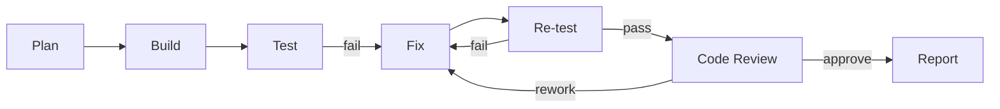

> Language: [English](./CODEX-RUNBOOK.en.md) | [한국어](./CODEX-RUNBOOK.md)

# CODEX RUNBOOK

Last Updated: 2026-02-25 (KST)

## 0. Purpose

Define the mandatory execution loop for this repository:
1. plan
2. build
3. test
4. fix
5. re-test
6. review
7. report

Rule: do not claim completion before review and verification evidence.

## 1. Pre-Flight Checklist

1. confirm scope in PRD: `doc/PRD-v0.1.*`
2. confirm current phase and status: `doc/CODEX-IMPLEMENTATION-PLAN.*`
3. confirm env/runtime assumptions: `doc/CODEX-ENV-SETUP.*`
4. confirm test requirements: `doc/CODEX-AUTOMATION-TEST-PLAN.*`
5. confirm review gate: `doc/CODEX-CODE-REVIEW.*`
6. define acceptance criteria in 3-6 lines

## 2. Execution Loop



For each step, record:
1. hypothesis
2. change set
3. verification result
4. decision

## 3. Engineering Guardrails

1. deterministic/rule-first before LLM
2. LLM usage is bounded and auditable
3. full DOM/full screenshot should not be sent to LLM by default
4. no captcha/2FA/payment bypass automation
5. bug/exception triggers evolution, not every new feature request
6. isolated candidate versions must run in `git worktree`
7. promotion to active version requires explicit approval

## 4. Mode-Specific Run Commands

### 4.1 Local quality baseline

```bash
cd runtime
npm run typecheck
npm test
```

### 4.2 Headful UI and live checks

```bash
cd runtime
npm run test:e2e:chat-ui:headful
npm run test:e2e:kr:headful
npm run test:e2e:assistantless:live
npm run test:e2e:provider:live
npm run test:e2e:autonomous:live
```

### 4.3 Backend and SDK

```bash
cd runtime
npm run backend:simple:server
npm run example:chat-backend
npm run test:sdk
npm run test:evolution
```

## 5. Failure Handling Rules

1. classify failure type first (selector, timing, data, interaction, rendering, runtime)
2. prefer local deterministic recovery before escalating model tier
3. keep retries bounded and explicit
4. capture screenshot + structured log on each failed step
5. if security challenge occurs, switch to human handoff immediately

## 6. Required Final Report

Always include:
1. changed files
2. implementation summary
3. test command list and outcomes
4. artifact/evidence paths
5. review findings and decision
6. residual risks and follow-up actions
