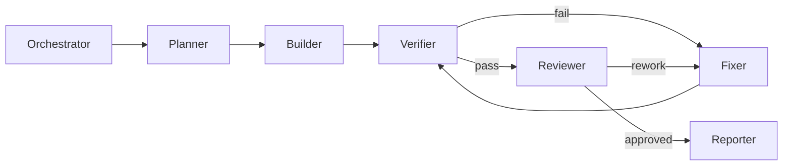

> Language: [English](./CODEX-RUNBOOK.en.md) | [한국어](./CODEX-RUNBOOK.md)

# CODEX RUNBOOK

## 0. Purpose

This runbook defines a reproducible execution protocol for this repository.
The priority is not speed alone, but auditable delivery: plan, build, verify, review, and report.

## 1. Startup Checklist

1. Read the PRD: `doc/PRD-v0.1.*`
2. Confirm current phase in `doc/CODEX-IMPLEMENTATION-PLAN.*`
3. Confirm artifact schema in `doc/CODEX-RUN-ARTIFACTS.*`
4. Confirm review gate in `doc/CODEX-CODE-REVIEW.*`
5. Define acceptance criteria in 3 lines max.
6. If bug/exception handling is requested, follow `doc/CODEX-EVOLUTION-BACKEND.*`.
7. If integration/usability work is requested, follow `doc/CODEX-SDK-BACKEND-USAGE.*`.

## 2. Execution Modes

### 2.1 Plan Mode
- Input: request + constraints
- Output: scope, risks, tests

### 2.2 Build Mode
- Input: approved plan
- Output: minimal code change

### 2.3 Verify Mode
- Input: code + tests
- Output: pass/fail evidence

### 2.4 Fix Mode
- Input: failure logs
- Output: minimal patch + re-test

### 2.5 Review Mode
- Input: diff + evidence + risk summary
- Output: issue severity + approve/rework

## 3. Logical Multi-Role Flow

Each transition must record:
- hypothesis
- change made
- validation result
- review decision

## 4. Decision Rules

1. Prefer rules before LLM.
2. Use LLM for candidate selection/patch generation only.
3. Use vision only with ROI context.
4. Prefer screenshot-based checkpoints over real-time streaming.
5. Record `go/not-go/revise` decision history.
6. Never bypass captcha/2FA/payment security gates.
7. Do not auto-run evolution for every new request.
8. Use isolated `git worktree` for candidate evolution and promote only after approval.

## 5. Report Template (Required)

Final report must include:
1. changed files
2. implementation summary
3. test status (pass/fail/not-run)
4. artifact paths
5. checkpoint decision log
6. code review result
7. remaining risks
8. optional next actions
9. evolution status and active version pointer path (if applicable)
