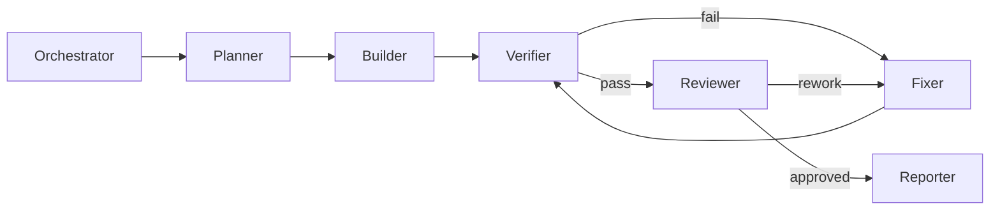

# CODEX RUNBOOK

## 0. 목적

이 문서는 Codex가 이 저장소에서 작업할 때 사용할 `실행 표준 절차`다.  
핵심은 빠른 구현이 아니라 `재현 가능한 구현 + 검증 가능한 변경`이다.

## 1. 시작 절차

1. `doc/PRD-v0.1.md`를 읽고 목표/비목표 확인
2. `doc/CODEX-IMPLEMENTATION-PLAN.md`에서 현재 Phase 확인
3. `doc/CODEX-RUN-ARTIFACTS.md`의 저장/스키마 규칙 확인
4. `doc/CODEX-CODE-REVIEW.md`의 승인 기준 확인
5. 이번 요청의 완료 조건(acceptance criteria) 3줄 이내로 명시

## 2. 작업 모드

### 2.1 Plan Mode

- 입력: 사용자 요청 + PRD 제약
- 출력: 수정 범위, 위험요소, 테스트 항목

### 2.2 Build Mode

- 입력: 계획 결과
- 출력: 최소 변경 코드

### 2.3 Verify Mode

- 입력: 변경 코드
- 출력: 테스트 결과, 실패 분류

### 2.4 Fix Mode

- 입력: 실패 로그/아티팩트
- 출력: 패치 + 재검증 결과

### 2.5 Review Mode

- 입력: 테스트 결과 + 코드 diff + 리스크 요약
- 출력: 이슈 등급화(Blocker/Major/Minor/Nit), 승인/반려 결정

## 3. 멀티에이전트 실행 규칙(논리적 역할 전환)

역할 전환 시 반드시 아래를 기록한다.

1. 현재 가설
2. 적용한 변경
3. 검증 결과
4. 리뷰 결정(approve/rework)과 근거

## 4. 의사결정 규칙

1. 룰로 풀 수 있으면 룰로 해결
2. LLM은 후보 선택/패치 생성에 한정
3. Vision은 ROI+bbox 준비가 된 경우만 사용
4. 실시간 스트리밍 대신 스크린샷 질의를 기본으로 사용
5. Telegram/Slack 응답이 필요한 단계는 `go/not-go/revise` 결과를 기록
6. 캡차/2FA/결제는 사람 승인 없이는 진행 금지

## 5. 결과 보고 형식

최종 보고는 항상 아래를 포함한다.

1. 변경 파일 목록
2. 구현 내용 요약
3. 테스트 결과(통과/실패/미실행 사유)
4. 실행 아티팩트 경로(run/log/screenshot 등)
5. 채팅 의사결정 기록(채널/질문/응답)
6. 코드 리뷰 결과(이슈 등급/승인 여부)
7. 남은 리스크
8. 다음 권장 액션(선택)
