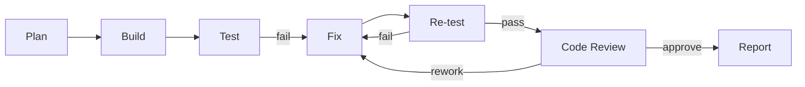

> Language: [English](./CODEX-RUNBOOK.en.md) | [한국어](./CODEX-RUNBOOK.md)

# CODEX RUNBOOK

최종 업데이트: 2026-02-25 (KST)

## 0. 목적

이 저장소에서 반드시 지켜야 하는 실행 루프를 정의합니다:
1. 계획(Plan)
2. 구현(Build)
3. 테스트(Test)
4. 수정(Fix)
5. 재검증(Re-test)
6. 리뷰(Review)
7. 보고(Report)

원칙: 리뷰 승인과 검증 증적 없이 완료 선언하지 않습니다.

## 1. 시작 체크리스트

1. PRD 범위 확인: `doc/PRD-v0.1.*`
2. 현재 페이즈/상태 확인: `doc/CODEX-IMPLEMENTATION-PLAN.*`
3. 환경 가정 확인: `doc/CODEX-ENV-SETUP.*`
4. 테스트 요구사항 확인: `doc/CODEX-AUTOMATION-TEST-PLAN.*`
5. 리뷰 게이트 확인: `doc/CODEX-CODE-REVIEW.*`
6. 완료 조건(acceptance criteria) 3~6줄 정의

## 2. 실행 루프



각 단계마다 반드시 기록:
1. 가설
2. 변경 내용
3. 검증 결과
4. 의사결정

## 3. 엔지니어링 가드레일

1. 결정론/룰 우선, LLM은 보조
2. LLM 사용은 제한적이고 추적 가능해야 함
3. 전체 DOM/전체 스크린샷/전체 HTML 원문을 LLM에 보내지 않음(추출 요약 + 길이 제한 + sanitize 적용)
4. 웹 요소 탐색은 구조 기반 후보 축소를 먼저 수행하고, 목표가 생긴 경우에만 부분 벡터화를 수행
5. 캡차/2FA/결제 우회 자동화 금지
6. 진화 파이프라인은 bug/exception에서만 트리거
7. 진화 후보는 `git worktree` 격리 실행 필수
8. active version 승격은 명시적 승인 후에만 수행

## 4. 모드별 실행 명령

### 4.1 로컬 품질 기준

```bash
cd runtime
npm run typecheck
npm test
```

### 4.2 headful UI/live 점검

```bash
cd runtime
npm run test:e2e:chat-ui:headful
npm run test:e2e:kr:headful
npm run test:e2e:assistantless:live
npm run test:e2e:provider:live
npm run test:e2e:autonomous:live
```

### 4.3 백엔드/SDK

```bash
cd runtime
npm run backend:simple:server
npm run example:chat-backend
npm run test:sdk
npm run test:evolution
```

`example:chat-backend` 기본은 `playwright` 실동작 모드이며, 시뮬레이션 강제는
`CHAT_AUTOMATION_EXECUTION_MODE=simulate npm run example:chat-backend`를 사용한다.

## 5. 실패 대응 원칙

1. 실패 유형을 먼저 분류(selector, timing, data, interaction, rendering, runtime)
2. 상위 모델로 올리기 전에 결정론 복구 경로 우선 시도
3. 재시도 횟수는 명시적으로 제한
4. 실패 스텝마다 스크린샷+구조화 로그 저장
5. 보안 챌린지 발생 시 즉시 human handoff

## 6. 최종 보고 필수 항목

항상 포함:
1. 변경 파일 목록
2. 구현 요약
3. 테스트 명령/결과
4. 아티팩트 경로
5. 리뷰 이슈/결정
6. 잔여 리스크/후속 액션
