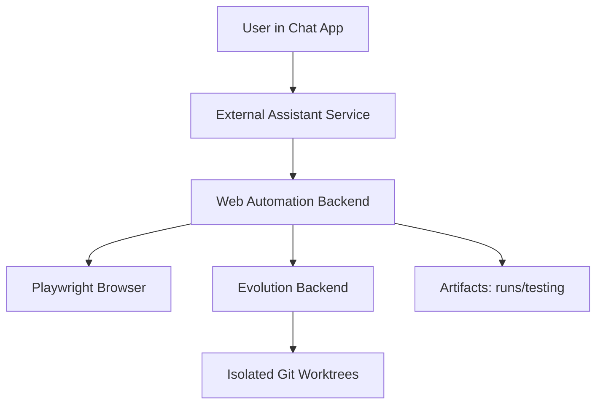

> Language: [English](./CODEX-SDK-BACKEND-USAGE.en.md) | [한국어](./CODEX-SDK-BACKEND-USAGE.md)

# CODEX SDK + BACKEND USAGE

## 0. Purpose

Standardize usage as `Backend-first + SDK-internal` so external assistant projects can integrate quickly.

Core principles:
1. backend owns execution state and records
2. SDK is used internally for composition/tests/embedded control
3. self-improvement is triggered only for `bug/exception` paths

## 1. Recommended Topology

```mermaid
flowchart LR
    A[External Assistant\nSlack/Telegram] --> B[Automation Backend API]
    B --> C[WebAutomationSdk]
    C --> D[Deterministic + Recovery Runtime]
    D --> E[Run Outcome]
    E --> F[AutoImprovementOrchestrator]
    F --> G[EvolutionService]
    G --> H[Git Worktree Candidate]
    H --> I[Test/Fix Loop]
    I --> J[Await Approval]
    J --> K[Promoted Active Pointer]
```



## 2. Why Backend-first

1. centralized session/checkpoint/artifact lifecycle
2. easier model key/policy/cost governance
3. external project integrates via stable HTTP contracts
4. evolution lifecycle is observable and auditable

## 3. SDK Surface

Entrypoints:
1. `runtime/src/index.ts`
2. `runtime/src/sdk/automation-sdk.ts`
3. `runtime/src/sdk/evolution-api-client.ts`
4. `runtime/src/evolution/auto-improvement-orchestrator.ts`

Capabilities:
1. `createWebAutomationSdk(...)`: `run` + `runWithImprovement`
2. `AutoImprovementOrchestrator`: trigger evolution from failed outcomes
3. `EvolutionApiClient`: programmatic control over evolution server APIs

## 4. Usage Scenarios

### 4.1 Embedded SDK

```ts
import { createWebAutomationSdk } from '../src/index';

const sdk = createWebAutomationSdk();
const result = await sdk.run({ workflow, adapter });
```

Run example:

```bash
cd runtime
npm run example:sdk:basic
```

### 4.2 Auto-improvement on failure

```ts
import {
  createWebAutomationSdk,
  EvolutionService,
  AutoImprovementOrchestrator
} from '../src/index';

const evolutionService = new EvolutionService({ ... });
const orchestrator = AutoImprovementOrchestrator.fromEvolutionService(evolutionService, {
  triggerStatuses: ['fail'],
  autoApprove: false
});

const sdk = createWebAutomationSdk({ autoImprovement: orchestrator });
const output = await sdk.runWithImprovement({ workflow, adapter });
```

Run example:

```bash
cd runtime
npm run example:sdk:auto-improve
```

## 5. Evolution Backend APIs

### 5.1 Start server

```bash
cd runtime
npm run evolution:server
```

### 5.2 Key endpoints

1. `GET /health`
2. `POST /evolution/jobs`
3. `GET /evolution/jobs/:id`
4. `POST /evolution/jobs/:id/approve`
5. `POST /evolution/jobs/:id/reject`
6. `POST /evolution/jobs/:id/retry`
7. `POST /evolution/auto-improve`
8. `GET /evolution/jobs/:id/stream`

### 5.3 Auto-improve request example

```json
{
  "workflowId": "wf-purchase-flow",
  "status": "fail",
  "failures": [
    { "code": "SelectorNotFound", "message": "checkout button moved" }
  ],
  "requestedBy": "assistant-backend",
  "autoApprove": false
}
```

## 6. Recommended Improvement Policy

1. trigger on `fail` only
2. do not trigger on `blocked` by default
3. default `autoApprove=false`
4. include regression command in `EVOLUTION_TEST_COMMAND`
5. keep human/operator approval for promotion

## 7. Validation Checklist

```bash
cd runtime
npm run typecheck
npm run test:sdk
npm run test:evolution
npm test
```

## 8. Deployment Topology (Mini PC / Mac mini)



Operational notes:
1. keep browser + backend on same node
2. keep `testing/` gitignored
3. persist promotion decisions in audit logs
