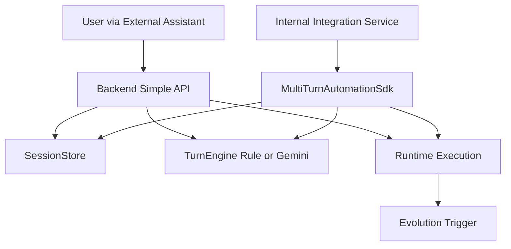

> Language: [English](./CODEX-SDK-BACKEND-USAGE.en.md) | [한국어](./CODEX-SDK-BACKEND-USAGE.md)

# CODEX SDK + BACKEND USAGE

## 0. Purpose

Define one reinforced operating model:

1. `backend_simple` for simple HTTP usage
2. `chat_automation_example` for chat-style runtime control with progress logs and captcha handoff
3. `sdk_detailed` for embedded advanced usage

Both modes share the same session model and can trigger evolution only on bug/exception style failures.

Legal-safe rule: do not automate captcha/2FA bypass; switch to human handoff.

## 1. Topology



## 2. Mode A: Backend Simple

### 2.1 Start backend

```bash
cd runtime
npm run backend:simple:server
```

Default endpoint: `http://127.0.0.1:4888`

### 2.2 Core APIs

1. `GET /health`
2. `GET /backend/sessions`
3. `POST /backend/sessions`
4. `GET /backend/sessions/:id`
5. `POST /backend/sessions/:id/turns`
6. `POST /backend/sessions/:id/close`
7. `GET /backend/sessions/:id/screenshot`
8. `GET /backend/sessions/:id/handoffs`
9. `GET /backend/sessions/:id/stream` (SSE)
10. `GET /backend/ui`

### 2.3 Minimal flow example

Create session:

```bash
curl -s http://127.0.0.1:4888/backend/sessions \
  -H 'content-type: application/json' \
  -d '{"mode":"backend_simple","title":"naver assistant session"}'
```

Send turn:

```bash
curl -s http://127.0.0.1:4888/backend/sessions/<SESSION_ID>/turns \
  -H 'content-type: application/json' \
  -d '{"content":"Check weather then suggest kid-friendly places near Pangyo"}'
```

## 3. Mode A2: Chat Automation Example Backend

### 3.1 Start backend + example UI

```bash
cd runtime
npm run example:chat-backend
```

Default endpoint: `http://127.0.0.1:4999`

### 3.2 Core APIs

1. `GET /example/chat/health`
2. `GET /example/chat/sessions`
3. `POST /example/chat/sessions`
4. `GET /example/chat/sessions/:id`
5. `POST /example/chat/sessions/:id/message`
6. `GET /example/chat/sessions/:id/handoffs`
7. `GET /example/chat/sessions/:id/screenshot`
8. `POST /example/chat/sessions/:id/pause`
9. `POST /example/chat/sessions/:id/resume`
10. `POST /example/chat/sessions/:id/cancel`
11. `POST /example/chat/sessions/:id/captcha`
12. `GET /example/chat/sessions/:id/stream` (SSE)
13. `POST /example/chat/sessions/:id/handoffs/:handoffId/resolve`
14. `GET /example/chat/progress/stream` (SSE progress)
15. `GET /example/chat/ui`

### 3.3 Behavior guarantees

1. browser mode is selectable per message (`headful` or `headless`)
2. runtime logs and step progress stream to UI continuously
3. captcha/security challenge is handled by explicit user input route, not bypass logic
4. new message can auto-pause older session when operator id is the same
5. message accepts image attachments (`attachments[]`) for similar-search automation flows
6. operator dashboard can consume cross-session progress from `GET /example/chat/progress/stream`
7. captcha/security handoffs can be resolved per item via the `resolve` endpoint

## 4. Mode B: SDK Detailed

### 4.1 SDK entrypoints

1. `createWebAutomationSdk` (full flow + auto-improvement integration)
2. `createMultiTurnAutomationSdk` (session-centric detailed API)
3. `createEvolutionApiClient` (evolution HTTP control)

Major `createEvolutionApiClient` methods:

1. `listJobs`, `createJob`, `getSnapshot`
2. `getJobDiff`
3. `listVersionSummaries`, `getVersionSummary`
4. `getCurrentVersion`, `getVersionHistory`
5. `rollbackVersion`
6. `approveJob`, `rejectJob`, `retryJob`, `waitForTerminal`

### 4.2 Multi-turn SDK example

```ts
import { createMultiTurnAutomationSdk } from '../src/index';

const sdk = createMultiTurnAutomationSdk();
const session = await sdk.createSession({ mode: 'sdk_detailed', title: 'detailed-run' });

const turn = await sdk.sendUserTurn({
  sessionId: session.id,
  content: 'Run deterministic first, then recovery if selector fails.'
});

console.log(turn.assistantTurn.content);
```

Run example:

```bash
cd runtime
npm run example:sdk:multiturn
```

Human handoff example:

```bash
cd runtime
npm run example:sdk:human-handoff
```

### 4.3 Attach automation run to a turn

`sendUserTurn` in detailed mode can include `automation` payload.
The SDK runs `runWithImprovement`, then stores automation summary in the user turn metadata.

### 4.4 Repeated-item composite judgement chain

For repeated listing images, use the composite chain:

1. merge many item images into one composite image
2. run YOLO26 first
3. when YOLO confidence is insufficient, fallback to VLM with the same composite image
4. reverse-map detection bbox to original item IDs

Core modules:

- `runtime/src/vision/composite-sheet.ts`
- `runtime/src/vision/repeated-item-judgement.ts`
- `runtime/src/testing/assistantless-chat-e2e.ts`

Example:

```bash
cd runtime
npm run example:repeated-item
```

## 5. Model Policy

1. `EVOLUTION_CODING_MODEL=gemini-3.1-pro-preview`
2. `EVOLUTION_AUTOMATION_MODEL=gemini-3.0-flash`
3. `BACKEND_AUTOMATION_MODEL=gemini-3.0-flash`
4. `BACKEND_LLM_ENABLED=0|1` to toggle rule-only vs Gemini hybrid

## 6. UI Boilerplate

- Path: `runtime/backend-ui/`
- URL: `GET /backend/ui`
- Features: create session, select session, send turns, close session, inspect history

Chat automation example UI:

- Path: `runtime/examples/chat-automation-ui/`
- URL: `GET /example/chat/ui`
- Features: session list, browser mode select, live logs/status, pause/resume/cancel, captcha submit

## 7. Verification Checklist

```bash
cd runtime
npm run typecheck
npm run test:sdk
npm run test:evolution
npm test
```

## 8. Integration Boundary Reminder

This repository does not implement production Slack/Telegram bot routing.
External assistant projects should call backend/simple or SDK contracts provided here.
