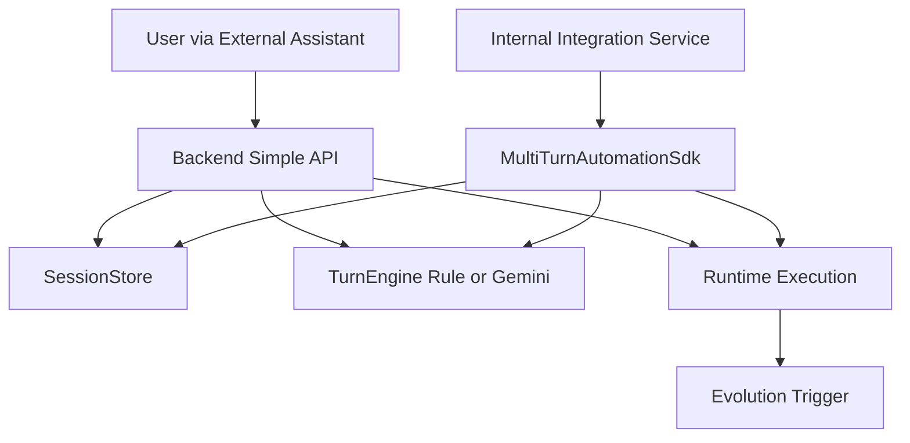

> Language: [English](./CODEX-SDK-BACKEND-USAGE.en.md) | [한국어](./CODEX-SDK-BACKEND-USAGE.md)

# CODEX SDK + BACKEND USAGE

## 0. Purpose

Define one reinforced operating model:

1. `backend_simple` for simple HTTP usage
2. `sdk_detailed` for embedded advanced usage

Both modes share the same session model and can trigger evolution only on bug/exception style failures.

Legal-safe rule: do not automate captcha/2FA bypass; switch to human handoff.

## 1. Topology



## 2. Mode A: Backend Simple

### 2.1 Start backend

```bash
cd runtime
npm run backend:simple:server
```

Default endpoint: `http://127.0.0.1:4888`

### 2.2 Core APIs

1. `GET /health`
2. `GET /backend/sessions`
3. `POST /backend/sessions`
4. `GET /backend/sessions/:id`
5. `POST /backend/sessions/:id/turns`
6. `POST /backend/sessions/:id/close`
7. `GET /backend/sessions/:id/stream` (SSE)
8. `GET /backend/ui`

### 2.3 Minimal flow example

Create session:

```bash
curl -s http://127.0.0.1:4888/backend/sessions \
  -H 'content-type: application/json' \
  -d '{"mode":"backend_simple","title":"naver assistant session"}'
```

Send turn:

```bash
curl -s http://127.0.0.1:4888/backend/sessions/<SESSION_ID>/turns \
  -H 'content-type: application/json' \
  -d '{"content":"Check weather then suggest kid-friendly places near Pangyo"}'
```

## 3. Mode B: SDK Detailed

### 3.1 SDK entrypoints

1. `createWebAutomationSdk` (full flow + auto-improvement integration)
2. `createMultiTurnAutomationSdk` (session-centric detailed API)
3. `createEvolutionApiClient` (evolution HTTP control)

### 3.2 Multi-turn SDK example

```ts
import { createMultiTurnAutomationSdk } from '../src/index';

const sdk = createMultiTurnAutomationSdk();
const session = await sdk.createSession({ mode: 'sdk_detailed', title: 'detailed-run' });

const turn = await sdk.sendUserTurn({
  sessionId: session.id,
  content: 'Run deterministic first, then recovery if selector fails.'
});

console.log(turn.assistantTurn.content);
```

Run example:

```bash
cd runtime
npm run example:sdk:multiturn
```

Human handoff example:

```bash
cd runtime
npm run example:sdk:human-handoff
```

### 3.3 Attach automation run to a turn

`sendUserTurn` in detailed mode can include `automation` payload.
The SDK runs `runWithImprovement`, then stores automation summary in the user turn metadata.

## 4. Model Policy

1. `EVOLUTION_CODING_MODEL=gemini-3.1-pro-preview`
2. `EVOLUTION_AUTOMATION_MODEL=gemini-3.0-flash`
3. `BACKEND_AUTOMATION_MODEL=gemini-3.0-flash`
4. `BACKEND_LLM_ENABLED=0|1` to toggle rule-only vs Gemini hybrid

## 5. UI Boilerplate

- Path: `runtime/backend-ui/`
- URL: `GET /backend/ui`
- Features: create session, select session, send turns, close session, inspect history

## 6. Verification Checklist

```bash
cd runtime
npm run typecheck
npm run test:sdk
npm run test:evolution
npm test
```

## 7. Integration Boundary Reminder

This repository does not implement production Slack/Telegram bot routing.
External assistant projects should call backend/simple or SDK contracts provided here.
