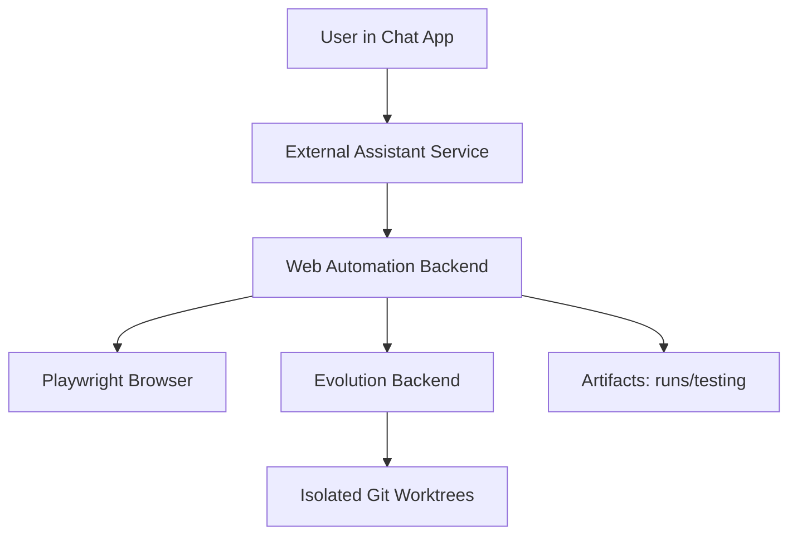

> Language: [English](./CODEX-SDK-BACKEND-USAGE.en.md) | [한국어](./CODEX-SDK-BACKEND-USAGE.md)

# CODEX SDK + BACKEND USAGE

## 0. 목적

이 저장소를 "외부 AI 비서 프로젝트에서 쉽게 재사용"할 수 있도록, 사용 형태를 `Backend-first + SDK-internal`로 표준화한다.

핵심:

1. 실행/상태/기록은 백엔드가 책임진다.
2. SDK는 백엔드 내부 로직 조합 및 테스트/임베딩 용도로 사용한다.
3. 실패 시 `bug/exception` 조건에서만 자가개선(evolution)을 트리거한다.

## 1. 권장 운영 형태

```mermaid
flowchart LR
    A[External Assistant Project\nSlack/Telegram] --> B[Automation Backend API]
    B --> C[WebAutomationSdk]
    C --> D[Deterministic + Recovery Runtime]
    D --> E[Run Outcome]
    E --> F[AutoImprovementOrchestrator]
    F --> G[EvolutionService]
    G --> H[Git Worktree Candidate]
    H --> I[Test/Fix Loop]
    I --> J[Await Approval]
    J --> K[Promoted Active Pointer]
```



## 2. 왜 Backend-first가 유리한가

1. 세션/체크포인트/스크린샷/아티팩트 관리가 중앙화됨
2. 모델 키/정책/리트라이/비용 통제가 쉬움
3. 외부 프로젝트는 HTTP 계약만 맞추면 됨
4. 진화 상태머신(승인/거절/재시도)을 표준 API로 노출 가능

## 3. SDK 레이어 구성

### 3.1 엔트리포인트

1. `runtime/src/index.ts`
2. `runtime/src/sdk/automation-sdk.ts`
3. `runtime/src/sdk/evolution-api-client.ts`
4. `runtime/src/evolution/auto-improvement-orchestrator.ts`

### 3.2 제공 기능

1. `createWebAutomationSdk(...)`
: run / runWithImprovement 제공
2. `AutoImprovementOrchestrator`
: run outcome 기반 evolution 자동 트리거
3. `EvolutionApiClient`
: evolution backend HTTP API 클라이언트

## 4. 기본 사용 시나리오

### 4.1 임베딩(SDK 직접 호출)

```ts
import { createWebAutomationSdk } from '../src/index';

const sdk = createWebAutomationSdk();
const result = await sdk.run({ workflow, adapter });
```

실행 예시:

```bash
cd runtime
npm run example:sdk:basic
```

### 4.2 실패 시 자동 개선 트리거

```ts
import {
  createWebAutomationSdk,
  EvolutionService,
  AutoImprovementOrchestrator
} from '../src/index';

const evolutionService = new EvolutionService({ ... });
const orchestrator = AutoImprovementOrchestrator.fromEvolutionService(evolutionService, {
  triggerStatuses: ['fail'],
  autoApprove: false
});

const sdk = createWebAutomationSdk({ autoImprovement: orchestrator });
const output = await sdk.runWithImprovement({ workflow, adapter });
```

실행 예시:

```bash
cd runtime
npm run example:sdk:auto-improve
```

## 5. Evolution Backend API 사용

### 5.1 서버 실행

```bash
cd runtime
npm run evolution:server
```

### 5.2 주요 API

1. `GET /health`
2. `POST /evolution/jobs`
3. `GET /evolution/jobs/:id`
4. `POST /evolution/jobs/:id/approve`
5. `POST /evolution/jobs/:id/reject`
6. `POST /evolution/jobs/:id/retry`
7. `POST /evolution/auto-improve`
8. `GET /evolution/jobs/:id/stream` (SSE)

### 5.3 자동개선 API 샘플

```json
{
  "workflowId": "wf-purchase-flow",
  "status": "fail",
  "failures": [
    { "code": "SelectorNotFound", "message": "checkout button moved" }
  ],
  "requestedBy": "assistant-backend",
  "autoApprove": false
}
```

## 6. 자동 개선 정책 권장값

1. trigger status: `fail` only
2. blocked는 기본 미트리거(정책적으로 필요한 경우만 포함)
3. autoApprove는 기본 `false`
4. 테스트 명령은 회귀 세트 포함:
: `EVOLUTION_TEST_COMMAND=npm run test:automation:full`
5. 승인은 운영자(또는 승인 정책 엔진)에서 수행

## 7. 실행/검증 체크리스트

```bash
cd runtime
npm run typecheck
npm run test:sdk
npm run test:evolution
npm test
```

## 8. 배포 토폴로지 (Mini PC / Mac mini)



운영 팁:

1. backend 프로세스와 브라우저는 동일 노드에 둔다.
2. `testing/` 경로는 Git ignore 상태 유지.
3. 승인/거절 액션은 운영 감사 로그로 남긴다.
