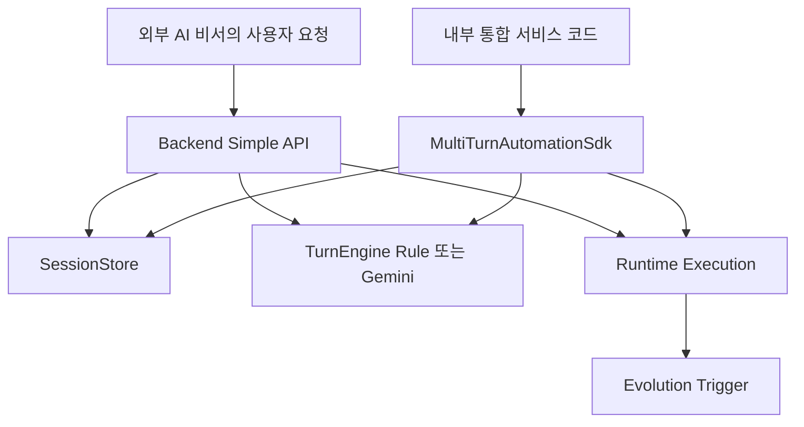

> Language: [English](./CODEX-SDK-BACKEND-USAGE.en.md) | [한국어](./CODEX-SDK-BACKEND-USAGE.md)

# CODEX SDK + BACKEND USAGE

## 0. 목적

강화된 운영 형태를 아래 두 모드로 표준화한다.

1. `backend_simple`: HTTP 기반 단순 사용
2. `chat_automation_example`: 채팅형 런타임 제어 + 진행 로그/캡차 handoff
3. `sdk_detailed`: 임베딩 기반 상세 제어 사용

두 모드는 동일한 세션 모델을 공유하고, bug/exception 실패 경로에서만 진화를 트리거한다.

법적 안전 원칙: 캡차/2FA 우회 자동화는 하지 않고 human handoff로 전환한다.

## 1. 토폴로지



## 2. 모드 A: Backend Simple

### 2.1 서버 실행

```bash
cd runtime
npm run backend:simple:server
```

기본 주소: `http://127.0.0.1:4888`

### 2.2 핵심 API

1. `GET /health`
2. `GET /backend/sessions`
3. `POST /backend/sessions`
4. `GET /backend/sessions/:id`
5. `POST /backend/sessions/:id/turns`
6. `POST /backend/sessions/:id/close`
7. `GET /backend/sessions/:id/stream` (SSE)
8. `GET /backend/ui`

### 2.3 최소 플로우 예시

세션 생성:

```bash
curl -s http://127.0.0.1:4888/backend/sessions \
  -H 'content-type: application/json' \
  -d '{"mode":"backend_simple","title":"naver assistant session"}'
```

턴 전송:

```bash
curl -s http://127.0.0.1:4888/backend/sessions/<SESSION_ID>/turns \
  -H 'content-type: application/json' \
  -d '{"content":"판교 기준 오늘 날씨 확인 후 아이와 갈만한 서울 근교 장소 추천"}'
```

## 3. 모드 A2: Chat Automation Example Backend

### 3.1 백엔드 + 예제 UI 실행

```bash
cd runtime
npm run example:chat-backend
```

기본 주소: `http://127.0.0.1:4999`

### 3.2 핵심 API

1. `GET /example/chat/health`
2. `GET /example/chat/sessions`
3. `POST /example/chat/sessions`
4. `GET /example/chat/sessions/:id`
5. `POST /example/chat/sessions/:id/message`
6. `POST /example/chat/sessions/:id/pause`
7. `POST /example/chat/sessions/:id/resume`
8. `POST /example/chat/sessions/:id/cancel`
9. `POST /example/chat/sessions/:id/captcha`
10. `GET /example/chat/sessions/:id/stream` (SSE)
11. `GET /example/chat/ui`

### 3.3 동작 보장

1. 메시지마다 브라우저 모드(`headful`/`headless`)를 선택할 수 있다.
2. 실행 로그/스텝 진행률이 UI로 연속 스트리밍된다.
3. 캡차/보안 챌린지는 우회하지 않고 사용자 입력 라우트로 처리한다.
4. 같은 operator가 새 대화를 시작하면 이전 세션을 자동 일시정지할 수 있다.

## 4. 모드 B: SDK Detailed

### 4.1 SDK 엔트리포인트

1. `createWebAutomationSdk` (full flow + auto-improvement 연계)
2. `createMultiTurnAutomationSdk` (세션 중심 상세 API)
3. `createEvolutionApiClient` (evolution HTTP 제어)

### 4.2 멀티턴 SDK 예시

```ts
import { createMultiTurnAutomationSdk } from '../src/index';

const sdk = createMultiTurnAutomationSdk();
const session = await sdk.createSession({ mode: 'sdk_detailed', title: 'detailed-run' });

const turn = await sdk.sendUserTurn({
  sessionId: session.id,
  content: 'deterministic 우선 실행, selector 실패 시 recovery 순서로 진행해.'
});

console.log(turn.assistantTurn.content);
```

예시 실행:

```bash
cd runtime
npm run example:sdk:multiturn
```

Human handoff 예시:

```bash
cd runtime
npm run example:sdk:human-handoff
```

### 4.3 자동화 실행 결과를 턴에 연결

`sendUserTurn`(detailed 모드)에서 `automation` payload를 함께 주면,
SDK가 `runWithImprovement`를 수행하고 사용자 turn metadata에 자동화 요약을 저장한다.

### 4.4 반복 아이템 합성 판단 체인

반복 리스트 이미지 상황에서는 아래 체인을 사용한다.

1. 여러 아이템 이미지를 합성 이미지 1장으로 병합
2. YOLO26 1차 판단
3. YOLO 신뢰도가 낮으면 동일 합성 이미지로 VLM fallback
4. 탐지 bbox를 원본 아이템 ID로 역매핑

핵심 모듈:

- `runtime/src/vision/composite-sheet.ts`
- `runtime/src/vision/repeated-item-judgement.ts`
- `runtime/src/testing/assistantless-chat-e2e.ts`

실행 예제:

```bash
cd runtime
npm run example:repeated-item
```

## 5. 모델 정책

1. `EVOLUTION_CODING_MODEL=gemini-3.1-pro-preview`
2. `EVOLUTION_AUTOMATION_MODEL=gemini-3.0-flash`
3. `BACKEND_AUTOMATION_MODEL=gemini-3.0-flash`
4. `BACKEND_LLM_ENABLED=0|1`으로 rule-only 또는 Gemini hybrid 선택

## 6. UI 보일러플레이트

- 경로: `runtime/backend-ui/`
- 접속: `GET /backend/ui`
- 기능: 세션 생성, 세션 선택, 턴 전송, 세션 종료, 히스토리 조회

Chat automation 예제 UI:

- 경로: `runtime/examples/chat-automation-ui/`
- 접속: `GET /example/chat/ui`
- 기능: 세션 목록, 브라우저 모드 선택, 실시간 로그/상태, pause/resume/cancel, captcha 제출

## 7. 검증 체크리스트

```bash
cd runtime
npm run typecheck
npm run test:sdk
npm run test:evolution
npm test
```

## 8. 연동 경계 재확인

이 저장소는 운영용 Slack/Telegram 봇 라우팅 자체를 구현하지 않는다.
외부 AI 비서 프로젝트는 여기서 제공하는 backend/simple 또는 SDK 계약을 호출해 연동한다.
