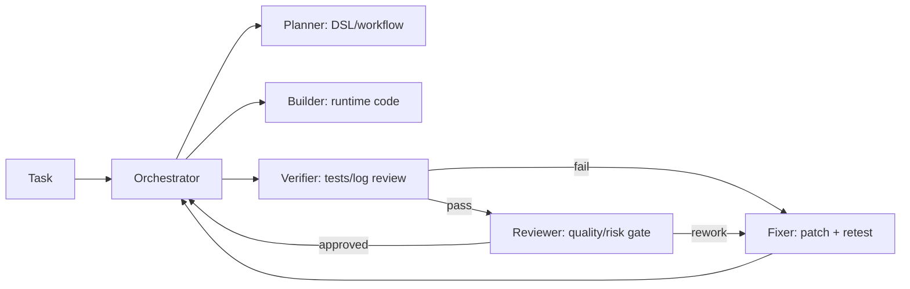

# CODEX TASK TEMPLATE

## 1) 요청 템플릿 (사용자 -> Codex)

```md
### Goal
(무엇을 자동화할지 1~2줄)

### Constraints
- must:
- must-not:
- budget/latency:

### Inputs
- url:
- credentials source:
- target data:

### Done Criteria
- [ ] 기능 완료 기준 1
- [ ] 기능 완료 기준 2
- [ ] 테스트 완료 기준
- [ ] 코드 리뷰 승인 기준
```

## 2) 실행 템플릿 (Codex 내부)

```md
## Plan
1.
2.
3.

## Build
- files:
- changes:

## Test
- unit:
- integration:
- scenario:

## Fix (if needed)
- failure type:
- patch:
- retest:

## Review
- reviewer:
- decision: approve/rework
- blocker_major_count:
- followups:
```

## 3) 멀티에이전트 태스크 분해 템플릿



## 4) 완료 보고 템플릿

```md
## Result
- summary:
- files changed:

## Validation
- passed:
- failed:
- not run:
- artifacts:
  - run_json:
  - log:
  - screenshot:

## Review
- decision:
- blocker_major_count:
- unresolved_minor_nit:

## Risks
- 

## Next Options
1.
2.
```
