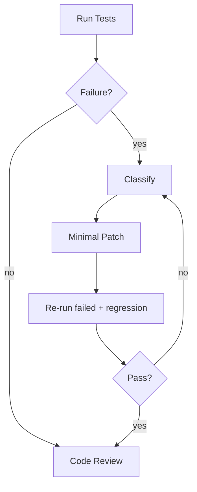

> Language: [English](./CODEX-TEST-FIX-CYCLE.en.md) | [한국어](./CODEX-TEST-FIX-CYCLE.md)

# CODEX TEST & FIX CYCLE

## 0. Purpose

Reduce regressions with a standard test-fix loop.

## 1. Test Layers

1. Unit
2. Integration
3. Scenario
4. Replay
5. Evolution (bug/exception-triggered isolated candidate loop)

## 2. Failure Classification

| Code | Meaning | Action |
|---|---|---|
| SelectorNotFound | target missing | Similo selector recovery, then patch fallback |
| ActionNotApplied / HiddenElement | click/input not applied or element hidden | interaction-healing pre-step + verify |
| TimingTimeout / NetworkTransient | transient timing/network instability | bounded retry with wait policy |
| ExpectationFailed / DataMismatch | assertion or extracted data mismatch | refine rule and data validation |
| VisualAmbiguity / RenderBlocked | DOM not enough or render incomplete | ROI vision/checkpoint and re-verify |
| RuntimeCrash | browser/runtime crash | restart context and resume checkpoint |
| AuthBlocked | captcha/2FA/security gate | immediate human handoff |
| ReviewRejected | review failed | patch + re-test + re-review |
| EvolutionApprovalPending | candidate passed and waits for approval | approve/reject and continue |

## 3. Fix Loop

## 4. Fix Principles

1. patch minimally
2. no broad refactor without root cause
3. no speculative fix without reproducible evidence
4. always re-run regression set
5. review approval is required for completion
6. evolution path is for bug/exception failures, not every new request
