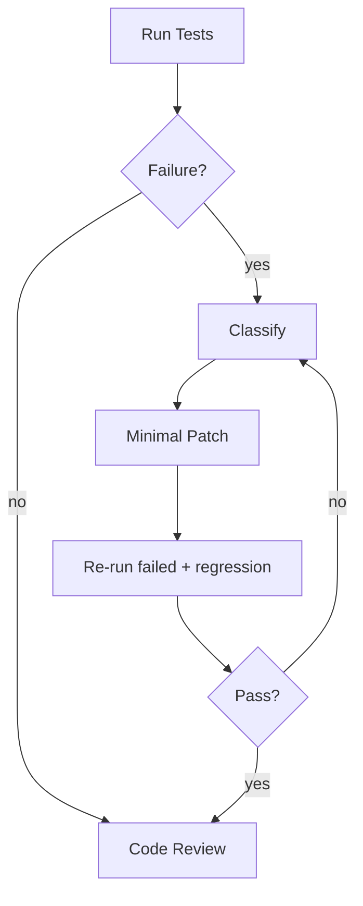

> Language: [English](./CODEX-TEST-FIX-CYCLE.en.md) | [한국어](./CODEX-TEST-FIX-CYCLE.md)

# CODEX TEST & FIX CYCLE

## 0. Purpose

Reduce regressions with a standard test-fix loop.

## 1. Test Layers

1. Unit
2. Integration
3. Scenario
4. Replay
5. Evolution (bug/exception-triggered isolated candidate loop)

## 2. Failure Classification

| Code | Meaning | Action |
|---|---|---|
| SelectorNotFound | target missing | re-extract + patch |
| ActionNotApplied | action did not stick | alternate action + verify |
| ExpectationFailed | assertion failed | refine rule/branch |
| VisualAmbiguity | DOM not enough | ROI vision/checkpoint |
| AuthBlocked | captcha/2FA/security gate | immediate handoff |
| ReviewRejected | review failed | patch + re-test + re-review |
| EvolutionApprovalPending | candidate passed and waits for human approval | approve/reject and continue |

## 3. Fix Loop

## 4. Fix Principles

1. patch minimally
2. no broad refactor without root cause
3. no speculative fix without reproducible evidence
4. always re-run regression set
5. review approval is required for completion
6. evolution path is for bug/exception failures, not every new request
