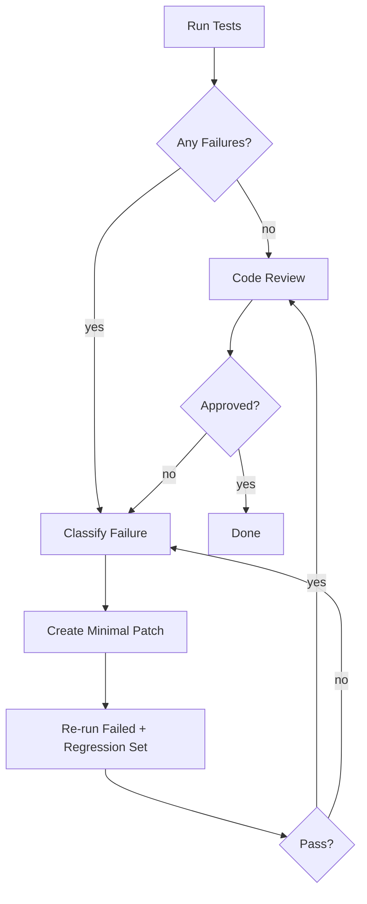

> Language: [English](./CODEX-TEST-FIX-CYCLE.en.md) | [한국어](./CODEX-TEST-FIX-CYCLE.md)

# CODEX TEST & FIX CYCLE

## 0. 목적

개발-테스트-수정-재검증-리뷰 사이클을 표준화해 리그레션을 줄인다.

## 1. 테스트 계층

1. Unit: DSL 파서, 정책 엔진, 검증기
2. Integration: Executor + Extractor + Verifier 연결
3. Scenario: 실제 웹 플로우 재현(샘플 태스크)
4. Replay: 과거 실패 로그 재실행
5. Evolution: bug/exception 트리거 발생 시 격리 후보 버전 생성 + 자동 수정 루프

## 2. 실패 분류 표준

| 코드 | 의미 | 기본 대응 |
|---|---|---|
| `SelectorNotFound` | 타겟 탐색 실패 | 후보 재추출 + 패치 생성 |
| `ActionNotApplied` | 클릭/입력 반영 실패 | 대체 액션 + 재검증 |
| `ExpectationFailed` | 검증 실패 | 룰 보정 또는 분기 수정 |
| `VisualAmbiguity` | DOM만으로 판단 불가 | ROI Vision 또는 사용자 질의 |
| `AuthBlocked` | 캡차/2FA/보안 차단 | 즉시 handoff |
| `ReviewRejected` | 코드 리뷰 반려 | 이슈 수정 + 재테스트 + 재리뷰 |
| `EvolutionApprovalPending` | 후보 버전 테스트 통과 후 사용자 승인 대기 | approve/reject 결정 후 pointer 전환 또는 재시도 |

## 3. 수정 루프



## 4. 수정 원칙

1. 패치는 최소 단위로 적용
2. 원인 불명 상태에서 광범위 리팩터링 금지
3. 실패 재현 로그 없이 추정 수정 금지
4. 수정 후 반드시 리그레션 세트 재실행
5. 테스트 통과 후에도 리뷰 반려 시 완료 처리 금지
6. bug/exception 대응은 필요 시 evolution 파이프라인으로 분기하고, 신규 요구에는 적용하지 않는다

## 5. 테스트 보고 템플릿

```md
## Test Report
- Scope:
- Environment:
- Cases:
  - case_id:
    - result: pass/fail
    - evidence: (log/screenshot path)
- Failures:
  - type:
  - root cause:
  - patch:
- Regression:
- Review:
  - decision: approve/rework
  - issues:
    - severity:
    - file:
    - action:
- Conclusion:
```
