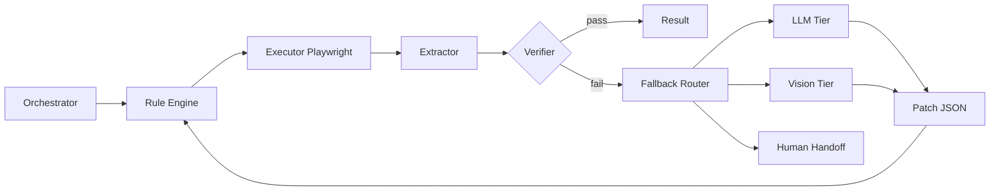

> Language: [English](./PRD-v0.1.en.md) | [한국어](./PRD-v0.1.md)

# Adaptive Web Automation PRD v0.1 (English Companion)

This document is the English companion for the Korean PRD. It keeps the same product direction and execution constraints.

## 0. Product Direction

Build adaptive web automation that:
1. executes rule-first deterministic workflows
2. escalates only failed/ambiguous steps to LLM/VLM
3. improves over repeated runs while reducing LLM calls

Core principles:
- Rule-first
- Patch-only
- Verify-always
- Human-handoff

## 1. Execution Constraints

1. no coding without plan
2. always test and review before completion
3. never trust raw LLM output as direct code action
4. do not bypass captcha/2FA/security challenges
5. sync docs with code changes

## 2. UX Model

### Screenshot Chat Mode (default)

- use screenshot checkpoints instead of real-time live stream
- ask `go / not_go / revise` at uncertain or sensitive points
- preserve channel-agnostic core contracts

### Autonomous Continuation (policy-bounded)

- continue automatically only within safe policy bounds
- stop on low confidence, sensitive action, or security gate

## 3. Architecture Summary

## 4. LLM Boundary

1. Step-level LLM budget is constrained.
2. Full DOM/full screenshot must not be sent by default.
3. Send reduced candidates (JSON) and ROI images only when required.
4. LLM response should be patch instructions, then verified by runtime.

## 5. Workflow / DSL Intent

Main node types:
- NavigateNode
- DiscoverNode
- DecideNode
- ActionNode
- VerifyNode
- LoopNode
- BranchNode
- CheckpointNode
- HandoffNode

Required action families:
- click/double/right-click
- drag/hover/scroll
- type/key_press
- wait_for/select_option/upload_file

## 6. Reliability and Safety

- bounded retries (no infinite loops)
- hard stop on security-sensitive flows without explicit approval
- run artifacts and review evidence required

## 7. Learning and Evolution

- replay failures
- canary-based rule promotion
- exception-driven isolated candidate evolution (worktree)
- approval-based active version promotion

## 8. Success Metrics

1. LLM call rate decreases on repeated workflows
2. success rate improves without regression
3. human intervention is reserved for truly sensitive/blocked cases

## 9. Full Source of Truth

For full details, refer to Korean PRD:
- [PRD-v0.1.md](./PRD-v0.1.md)
