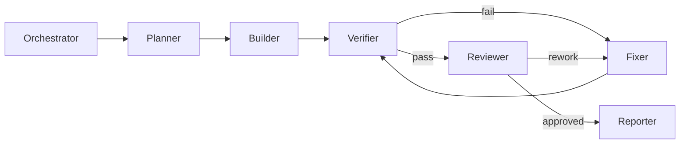
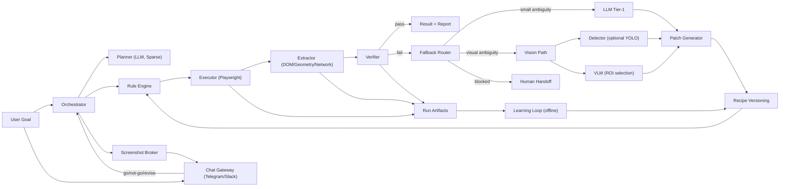
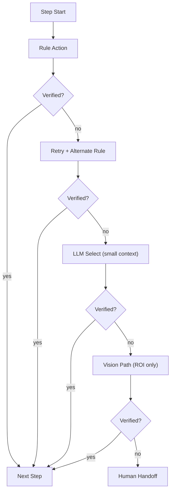
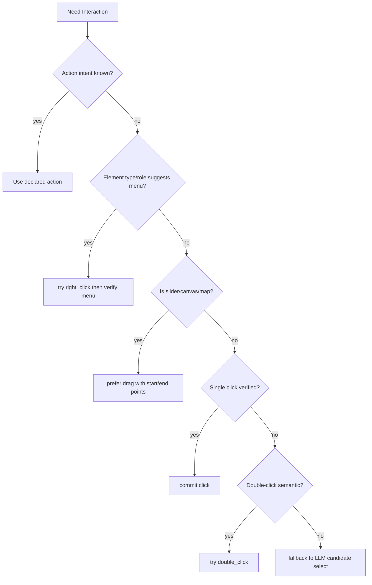
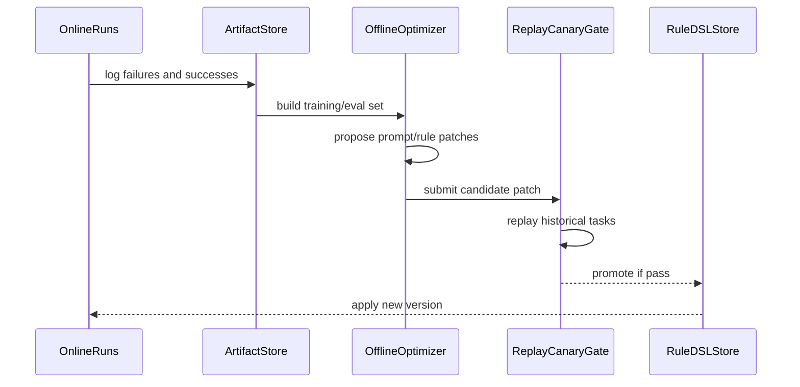
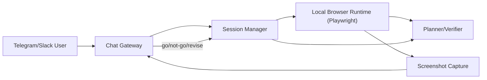

# Adaptive Web Automation PRD v0.1

## -1. Codex 실행 지시 프로필

이 PRD는 기획 문서이면서 동시에 Codex 실행 지시서다.  
Codex는 아래 규칙을 우선 적용한다.

1. 계획 없이 바로 코딩하지 않는다. 최소 계획(범위/리스크/테스트)을 먼저 명시한다.
2. 구현 후 반드시 테스트와 코드 리뷰를 수행하고, 실패 시 수정 루프를 수행한다.
3. LLM 호출 경계(`Rule-first`, `Patch-only`)를 코드/문서에서 유지한다.
4. 캡차/2FA/보안 챌린지는 우회 구현 대신 human handoff 경로를 만든다.
5. 변경 시 아래 문서도 함께 동기화한다.
   - `AGENTS.md`
   - `doc/CODEX-RUNBOOK.md`
   - `doc/CODEX-IMPLEMENTATION-PLAN.md`
   - `doc/CODEX-TEST-FIX-CYCLE.md`
   - `doc/CODEX-RUN-ARTIFACTS.md`
   - `doc/CODEX-CODE-REVIEW.md`
   - `doc/CODEX-EVOLUTION-BACKEND.md`

## -0. 멀티에이전트 실행 규칙

실제 병렬 에이전트가 없어도, Codex는 아래 역할을 순차적으로 분리해 수행한다.

1. `Orchestrator`: 요청 분해/우선순위/완료조건 관리
2. `Planner`: DSL/워크플로우/예외 경로 설계
3. `Builder`: 코드 작성
4. `Verifier`: 테스트 및 실패 분류
5. `Fixer`: 최소 패치 + 재검증
6. `Reviewer`: 코드 리뷰 점검, 이슈 등급화, 승인/반려
7. `Reporter`: 결과/리스크/다음 단계 보고



## 0. 문서 목적

이 문서는 `룰/워크플로우 중심 실행 + 예외 시 제한적 LLM/VLM 개입 + 반복 실행으로 LLM 호출 최소화`를 목표로 하는 웹 자동화 제품의 기술 PRD다.  
핵심은 다음 3가지다.

1. 처음부터 모든 스텝을 고정하지 않고, 실행 중 필요한 만큼만 생성/수정한다.
2. 매 실행의 결과를 저장/분석해 다음 실행에서 더 적은 토큰으로 해결한다.
3. 기본 UX는 스크린샷 질의 기반이며, Telegram/Slack 대화를 통해 자동화를 점진 완성하도록 설계한다.

---

## 1. 입력 문서 통합 원칙

기준 문서:

- 원본: `/Users/jedi/Downloads/adaptive-web-automation-prd.md`
- 참고: `/Users/jedi/Downloads/v01.md`

통합 원칙:

1. 운영 복잡도 대비 효과가 큰 것은 수용
2. 벤더 종속/과도한 비용/법적 리스크가 큰 것은 보류 또는 비수용
3. 외부 근거(논문/공식 문서/검증된 오픈소스)가 있는 방향만 강화

### 1.1 수용/보류/비수용 표

| 항목 | 결정 | 반영 내용 |
|---|---|---|
| X/E/R/L/V 모듈 분리 | 수용 | 실행기/추출기/규칙/플래너/검증기 역할 고정 |
| 계층형 에스컬레이션(룰→LLM→Vision→사람) | 수용 | 비용/지연 예산 기반 게이트 추가 |
| 이미지 배칭 + 좌표 역매핑 | 수용 | Vision 호출 시 기본 전략으로 채택 |
| 실패 패턴의 룰 승격(Rule Promotion) | 수용 | 성공 임계치 기반 자동 승격 |
| DSPy + GEPA 자기개선 | 수용(제한) | 오프라인 리플레이/카나리 통과 시만 반영 |
| 특정 모델명 고정(Gemini/YOLO26 하드코딩) | 보류 | 인터페이스는 모델 중립, 초기 권장만 제시 |
| Stagehand 전면 의존 | 보류 | 코어는 Playwright, Stagehand는 어댑터 옵션 |
| Anti-bot 우회(stealth 패치 중심) | 비수용 | 캡차/2FA/보안 챌린지는 human handoff 원칙 |
| 전체 DOM/스크린샷 상시 LLM 전송 | 비수용 | 후보 축약 JSON + ROI 이미지만 전송 |

---

## 2. 제품 정의

### 2.1 한 줄 정의

사용자 목표를 받아 브라우저를 자동 조작하되, 기본은 결정론적 워크플로우로 실행하고, 실패 구간만 최소 컨텍스트로 LLM/VLM에 질의해 스스로 워크플로우를 진화시키는 시스템.

### 2.2 성공 기준

1. 반복 실행할수록 `LLM 호출률`, `실행 시간`, `실패율`이 감소한다.
2. 동일 목표 재실행 시 재현성 있는 결과를 낸다.
3. 사람이 개입해야 하는 상황(캡차/결제/2FA)을 명확히 분리한다.

### 2.3 비목표(Non-goals)

1. 보안 챌린지 자동 우회
2. 완전 무감독 결제 자동화
3. 무제한 자유형 에이전트(항상 계획 새로 생성)

---

## 3. 사용자 경험(UX) 모드

### 3.1 Screenshot Chat 모드(기본)

사용자는 실시간 스트리밍 대신, 필요 시점의 스크린샷과 요약을 Telegram/Slack에서 받는다.

핵심 흐름:

1. 에이전트가 단계별 실행
2. 판단 불확실/민감 액션 전 스크린샷 캡처
3. 채팅으로 `go / not go / 수정 지시` 질의
4. 사용자 응답을 반영해 워크플로우/셀렉터/정책 갱신

### 3.2 Autonomous Continuation 모드

사용자 응답 지연 시, 안전 정책 범위 안에서 자동으로 진행 가능한 스텝만 계속 수행한다.

중단 조건:

1. 신뢰도 임계치 미달
2. 결제/제출/계정 변경 등 민감 액션
3. 캡차/2FA/법적 민감 단계

---

## 4. 상위 아키텍처



---

## 5. 실행 원리: LLM 호출 경계

### 5.1 결정 원칙

1. `Rule-first`: 룰/DSL로 가능한 모든 단계를 우선 실행
2. `Candidate-only LLM`: LLM에는 자유 행동이 아닌 후보 선택만 요청
3. `Patch-only`: LLM 출력은 코드가 아니라 patch JSON만 허용
4. `Verify-always`: 액션 뒤 검증 실패 시에만 에스컬레이션

### 5.2 단계별 게이트



### 5.3 LLM/VLM 호출 예산

기본 정책:

1. step당 LLM 최대 1회, task당 고급 모델 최대 2회
2. VLM은 ROI 이미지+후보 bbox가 있을 때만 호출
3. 예산 초과 시 자동 중단 후 사용자 확인

---

## 6. Workflow 노드와 DSL v0.1

### 6.1 노드 타입

| 타입 | 역할 |
|---|---|
| `NavigateNode` | URL 이동/탭 전환 |
| `DiscoverNode` | 입력/클릭 후보 추출 |
| `DecideNode` | 룰 또는 LLM 선택 |
| `ActionNode` | 실제 상호작용 수행 |
| `VerifyNode` | URL/DOM/데이터/네트워크 검증 |
| `LoopNode` | 조건 만족 시까지 반복 |
| `BranchNode` | 상태 분기(if/else) |
| `CheckpointNode` | 사용자 승인(go / not go) |
| `HandoffNode` | human 개입 전환 |

### 6.2 액션 스펙

필수 액션:

- `click`
- `double_click`
- `right_click`
- `drag`
- `hover`
- `scroll`
- `type`
- `key_press`
- `wait_for`
- `select_option`
- `upload_file`

### 6.3 Geometry 기반 제어 필드

모든 후보에 아래 필드를 포함한다.

- `bbox_viewport`: `[x1,y1,x2,y2]`
- `center`: `[cx,cy]`
- `visible_ratio`
- `z_index_hint`
- `is_occluded`
- `scroll_container_id`

`bbox_viewport`는 `getBoundingClientRect()` 기반으로 산출한다.  
레이아웃 시프트를 고려해 클릭 직전에 재계산한다.

### 6.4 click vs drag vs double/right-click 결정 규칙



### 6.5 DSL 예시(JSON)

```json
{
  "workflow_id": "shopping_search_v01",
  "vars": {
    "query": "핸드백",
    "max_price": 500000,
    "min_rating": 4.7
  },
  "nodes": [
    {"id":"n1","type":"NavigateNode","op":"goto","args":{"url":"https://shopping.naver.com"}},
    {"id":"n2","type":"DiscoverNode","op":"extract_inputs","save_as":"inputs"},
    {"id":"n3","type":"DecideNode","op":"pick_candidate","from":"inputs","policy":"search_input_policy","save_as":"search_box"},
    {"id":"n4","type":"ActionNode","op":"type","target":"search_box","args":{"value":"{{vars.query}}"}},
    {"id":"n5","type":"ActionNode","op":"key_press","args":{"key":"Enter"}},
    {"id":"n6","type":"VerifyNode","op":"assert","expect":[{"kind":"results_exist"}]},
    {"id":"n7","type":"LoopNode","until":"enough_products","body":["extract_products","apply_filters","paginate_or_scroll"]},
    {"id":"n8","type":"CheckpointNode","op":"ask_user","args":{"message":"결과 저장 후 종료할까요?"}}
  ]
}
```

---

## 7. Extractor 설계

### 7.1 출력 채널

1. `E_inputs`: 입력 가능한 요소
2. `E_clickables`: 클릭 가능한 요소
3. `E_entities`: 상품/리스트/카드 데이터
4. `E_state`: URL, 정렬 상태, 필터 상태, 팝업 상태

### 7.2 후보 축약 규칙

LLM에 보낼 때는 전체 DOM 대신 아래만 보낸다.

1. 상위 후보 N개(기본 5~12개)
2. 텍스트/역할/aria/핵심 속성
3. bbox와 주변 문맥 1-hop
4. 검증 실패 이유

### 7.3 ROI 중심 Vision 연동

1. 후보 bbox를 기준으로 ROI 이미지를 만든다.
2. 여러 ROI를 배칭 이미지로 합친다.
3. 모델 결과를 역매핑해 원래 좌표를 복원한다.

---

## 8. 학습 루프(반복 수행으로 LLM 최소화)

### 8.1 저장 아티팩트

- step 실행 결과(`ok/fail`, latency, retry count)
- 검증 실패 사유
- 후보 목록과 선택 결과
- 스크린샷(필요 시), ROI, 네트워크 힌트
- 최종 패치와 버전

### 8.2 승격 정책(Rule Promotion)

1. 동일 컨텍스트에서 동일 패턴 3회 이상 성공
2. 최근 실패율 임계치 이하
3. 오프라인 리플레이 통과

### 8.3 개선 루프 다이어그램



---

## 9. DSPy + GEPA 외부 프로세스 설계

Python 서비스로 분리하고 웹 자동화 런타임(TS)과 HTTP로 통신한다.

### 9.1 분리 이유

1. 온라인 런타임과 학습/최적화 경로의 장애 분리
2. DSPy/GEPA 실험의 독립 배포
3. GPU/CPU 자원 분리 운영

### 9.2 인터페이스

| Endpoint | 목적 |
|---|---|
| `POST /optimize/select-prompt` | 후보 선택 프롬프트 개선 |
| `POST /optimize/plan-prompt` | 계획 프롬프트 개선 |
| `POST /evaluate/replay` | 과거 로그 리플레이 평가 |
| `GET /artifacts/:id` | 개선 근거 조회 |

### 9.3 안전장치

1. 온라인 즉시 반영 금지(반드시 오프라인 평가 통과)
2. 비용 가드(`max_tokens`, `max_calls`) 강제
3. 리그레션 시 자동 롤백

---

## 10. Screenshot + Chat 운영 설계

### 10.1 개인 환경 우선 배치

권장:

1. 소형 PC/맥미니에서 단일 세션 중심으로 실행
2. Playwright가 브라우저 제어
3. 필요 시점 스크린샷만 캡처해 Telegram/Slack에 전달

### 10.2 통신 구조



### 10.3 스크린샷 질의 규칙

1. 민감 액션 전 반드시 캡처
2. 불확실성(신뢰도 임계치 미달) 발생 시 캡처
3. 채팅 응답 타임아웃 시 안전 스텝만 진행, 민감 스텝은 대기

---

## 11. 예외 처리 정책(요약)

| 카테고리 | 기본 대응 | 에스컬레이션 |
|---|---|---|
| DOM 변형/포털/iframe/shadow | 대체 selector + 재추출 | LLM 후보 선택 |
| 무한 스크롤/가상 리스트 | 반복 스크롤 + 중복 제거 | LLM로 중단 조건 재설정 |
| 슬라이더/지도/캔버스 | drag + 네트워크 힌트 | ROI Vision |
| 대기열/트래픽 지연 | 대기 정책 + 백오프 | 사용자 알림/승인 |
| 캡차/2FA/결제 민감 | 즉시 handoff | 사람이 처리 후 재개 |

원칙: `우회`보다 `명시적 handoff`가 우선.

---

## 12. 기술 스택 판단(JS vs Python)

### 12.1 결론

- 코어 런타임: **TypeScript/Node + Playwright**
- 보조 지능 서비스: **Python (DSPy/GEPA, Vision, 분석 파이프라인)**

### 12.2 이유

1. Playwright 생태계/브라우저 제어는 JS/TS가 주 경로
2. DSPy 및 실험 도구는 Python이 성숙
3. 프로세스 분리 시 장애 격리와 배포 전략이 명확

---

## 13. Phase 계획(주차 없이)

### Phase 0. Foundations

- 런타임 골격(Orchestrator, Executor, Verifier)
- 레시피 저장소/버전 체계
- 기본 로깅/아티팩트 수집

### Phase 1. Deterministic Core

- DSL 해석기 + 핵심 액션(click/double/right/drag/type/scroll)
- Extractor(E_inputs/E_clickables/E_state)
- Verify 규칙(URL/DOM/데이터)

### Phase 2. Controlled AI Fallback

- LLM 후보 선택 경로
- Patch-only 업데이트
- Screenshot Question 모드

### Phase 3. Vision + Screenshot Ops

- ROI 배칭/역매핑
- Screenshot 질의 흐름
- Human handoff 워크플로우

### Phase 4. Self-Improvement

- DSPy+GEPA 외부 서비스 연결
- 리플레이/카나리 게이트
- 룰 승격 자동화

### Phase 5. Production Hardening

- 멀티세션 운영
- 비용 대시보드/알림
- 롤백/재현성/감사 로그 고도화

---

## 14. KPI 및 게이트

핵심 KPI:

1. End-to-end 성공률
2. LLM 호출률(런당)
3. 평균 토큰 사용량
4. 평균 실행 시간
5. Human handoff 비율
6. 재실행 재현성

릴리즈 게이트:

1. 리플레이 셋 성공률 하락 금지
2. 비용 상승률 임계치 이하
3. 치명 예외(결제/보안) 자동화 시도 금지 정책 준수

---

## 15. 외부 근거(논문/오픈소스/문서)

### 15.1 벤치마크/연구

1. [WebArena (ICLR 2024)](https://openreview.net/forum?id=oKn9c6ytLx)
2. [VisualWebArena (arXiv)](https://arxiv.org/abs/2401.13649)
3. [Mind2Web (arXiv)](https://arxiv.org/abs/2306.06070)
4. [WebVoyager / Set-of-Mark 계열 접근 (arXiv)](https://arxiv.org/abs/2401.13919)
5. [AssistantBench for realistic web tasks (arXiv)](https://arxiv.org/abs/2407.15711)

### 15.2 실행 프레임워크/도구

1. [Playwright Docs](https://playwright.dev/docs/intro)
2. [Playwright Auto-waiting](https://playwright.dev/docs/actionability)
3. [Stagehand Docs](https://docs.stagehand.dev/)
4. [BrowserGym (Farama)](https://github.com/ServiceNow/BrowserGym)
5. [browser-use](https://github.com/browser-use/browser-use)
6. [Skyvern](https://github.com/Skyvern-AI/skyvern)

### 15.3 시각/브라우저/최적화 관련

1. [Chrome DevTools Protocol `Page.startScreencast`](https://chromedevtools.github.io/devtools-protocol/tot/Page/#method-startScreencast)
2. [MDN `getBoundingClientRect()`](https://developer.mozilla.org/en-US/docs/Web/API/Element/getBoundingClientRect)
3. [DSPy Docs](https://dspy.ai/)
4. [GEPA paper (arXiv)](https://arxiv.org/abs/2507.19457)
5. [MinerU-HTML](https://github.com/opendatalab/MinerU-HTML)
6. [ReaderLM-v2](https://huggingface.co/jinaai/ReaderLM-v2)

---

## 16. 최종 방향성

이 PRD의 최종 방향은 `Always-Agentic`이 아니라 `Adaptive-Agentic`이다.

1. 기본 실행은 작은 DSL 함수들의 조합으로 처리한다.
2. LLM은 필요한 순간에만 `후보 선택/패치 생성` 역할로 제한한다.
3. 반복 수행으로 룰을 강화해, 같은 작업은 점점 더 결정론적으로 수렴시킨다.
