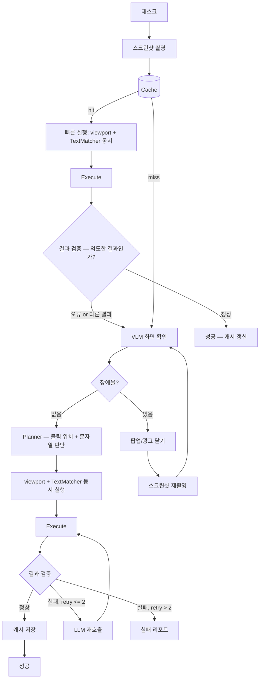
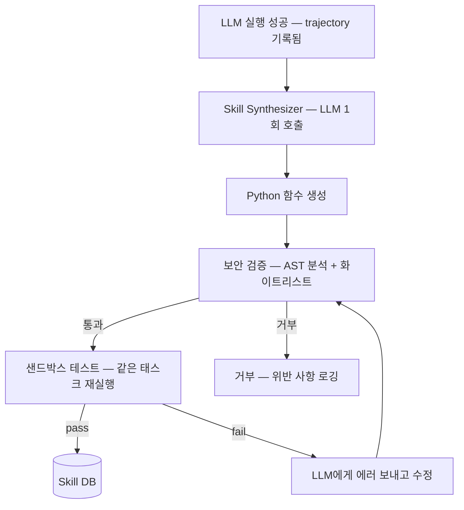

# 아키텍처 v3: 적응형 웹 자동화 엔진

> **버전**: 3.0 | **작성일**: 2026-02-28
> **v2 대비 변경**: 모듈 수 절반 이하로 축소. 핵심 루프만 남기고 최적화 모듈 전부 제거.

---

## 1. 핵심 아이디어

**한 문장**: LLM이 처음에 해결하고, 성공하면 그 판단을 코드로 굳혀서, 다음부터는 코드만 실행한다.

```
1회차:  Screenshot → LLM 계획 → DOM 필터링 → LLM 셀렉터 선택 → 실행 → 성공
        → 성공한 실행을 Python 함수로 합성 (Skill Synthesis)

2회차:  합성된 함수 실행 → 성공? → 끝 (LLM 0회)
        실패? → LLM 재호출 → 함수 업데이트

N회차:  함수만 실행. LLM 완전히 빠짐.
```

**v3의 이전 버전(캐시만 저장)과의 차이**:
캐시는 셀렉터만 저장한다. 사이트가 바뀌면 못 쓴다.
Skill Synthesis는 **판단 로직 자체**를 코드로 만든다. 셀렉터가 바뀌어도 로직이 동작한다.

**Prune4Web이 핵심 가치인 이유**:
일반적인 웹 에이전트는 DOM 전체(수천 개 요소)를 LLM에 넣는다. 비싸고 느리다.
Prune4Web은 LLM이 `{"검색": 0.9, "input": 0.7}` 같은 keyword-weight dict만 만들면,
**고정 수식**으로 DOM을 20개로 줄인다. 이 20개만 LLM에 보내면 된다.

결과: LLM 입력 토큰이 1/10~1/50로 줄어든다.

---

## 2. 전체 구조

모듈 4개 + 캐시 1개. 그게 전부.



### 모듈별 역할

| 모듈 | 하는 일 | LLM 호출 | 의존성 |
|------|--------|---------|--------|
| **Planner** | 스크린샷 보고 장애물 감지 + 클릭 위치/문자열 판단 + 스텝 분해 | VLM 1회 | Gemini Flash VLM |
| **DOM Extractor** | CDP로 DOM + AX Tree 추출 | 0 | Playwright(프레임) + CDP(추출) |
| **Element Filter** | keyword_weights × DOM 텍스트 스코어링 | 0 | TextMatcher (다국어) |
| **Actor** | 후보 중 대상 선택 + selector + viewport_xy 출력 | LLM 1회 | Gemini Flash |
| **Cache** | selector + viewport_xy + 스크린샷 + 기대결과 저장 | 0 | SQLite |
| **ResultVerifier** | 액션 후 결과가 의도한 것인지 검증 | 0 (로컬) / VLM 1회 | SSIM + RF-DETR / VLM |

**캐시 히트: 일단 실행 → 결과 검증 → 오류 시 풀 파이프라인**
**캐시 미스: VLM 화면 확인 → 장애물 제거 → Planner → viewport + TextMatcher 동시 → 실행**

**첫 실행: LLM 2회** (Planner 1 + Actor 1), 장애물 있으면 +α
**재실행 (정상): LLM 0회** (캐시 실행 + 결과 검증 통과)
**재실행 (사이트 변경): LLM 2회** (캐시 실패 → 풀 파이프라인)

---

## 3. 모듈 상세

### 3.0 Browser — Playwright 실행 + CDP 추출 하이브리드

**실행(click, fill, type)은 Playwright**, **추출(DOM, AX Tree, 스크린샷)은 CDP**.
두 계층을 하나의 `Browser` 객체로 감싸서 모든 모듈이 동일한 인터페이스를 사용한다.

```python
from playwright.async_api import Page, CDPSession

class Browser:
    """Playwright(실행) + CDP(추출) 하이브리드 래퍼.

    왜 하이브리드인가:
    - 실행(click/fill/type): Playwright의 actionability 보장이 필수.
      visible, stable, receives-events, enabled 자동 체크.
      CDP Input.dispatch*로 직접 하면 이 보장을 잃어 flaky 증가.
    - 추출(DOM/AX Tree): Playwright가 제공하지 않는 CDP 전용 기능.
      DOM.getDocument(pierce=True), Accessibility.getFullAXTree 등.
    - 스크린샷: CDP Page.captureScreenshot (clip 지원, 더 세밀한 제어).
    """

    def __init__(self, page: Page):
        self._page = page
        self._cdp: CDPSession | None = None

    async def _ensure_cdp(self) -> CDPSession:
        """CDP 세션 lazy 초기화."""
        if self._cdp is None:
            self._cdp = await self._page.context.new_cdp_session(self._page)
        return self._cdp

    # ==================== 실행 계층 (Playwright) ====================
    # Playwright가 actionability를 자동 보장:
    # - 요소가 visible인지
    # - 요소가 stable(애니메이션 완료)인지
    # - 요소가 이벤트를 받을 수 있는지 (다른 요소에 가려지지 않았는지)
    # - 요소가 enabled인지

    async def click_selector(self, selector: str, timeout_ms: int = 3000) -> None:
        """CSS selector 클릭. Playwright actionability 보장."""
        await self._page.click(selector, timeout=timeout_ms)

    async def fill_selector(self, selector: str, value: str) -> None:
        """CSS selector 요소에 텍스트 입력."""
        await self._page.fill(selector, value, timeout=3000)

    async def mouse_click(self, x: int, y: int) -> None:
        """뷰포트 절대 좌표 클릭. 텍스트 없는 요소용."""
        await self._page.mouse.click(x, y)

    async def key_press(self, key: str) -> None:
        await self._page.keyboard.press(key)

    async def type_text(self, text: str) -> None:
        await self._page.keyboard.type(text)

    # ==================== 추출 계층 (CDP) ====================

    async def cdp_send(self, method: str, params: dict | None = None) -> dict:
        """CDP 직접 호출. DOM/AX Tree 추출 등에 사용."""
        cdp = await self._ensure_cdp()
        return await cdp.send(method, params or {})

    async def screenshot(self) -> bytes:
        """스크린샷 (CDP — clip 지원 등 세밀한 제어)."""
        return await self._page.screenshot()

    async def screenshot_clip(self, clip: dict) -> bytes:
        """특정 영역만 캡처. clip: {x, y, width, height}."""
        cdp = await self._ensure_cdp()
        result = await cdp.send("Page.captureScreenshot", {
            "format": "png", "clip": {**clip, "scale": 1},
        })
        import base64
        return base64.b64decode(result["data"])

    async def evaluate(self, expression: str) -> any:
        """JavaScript 실행 (Playwright — 안정적)."""
        return await self._page.evaluate(expression)

    # ==================== 유틸리티 ====================

    async def get_viewport_size(self) -> tuple[int, int]:
        return await self._page.evaluate("[window.innerWidth, window.innerHeight]")

    @property
    def url(self) -> str:
        return self._page.url

    @property
    def frames(self):
        """iframe 접근 — Playwright가 프레임 트리 관리."""
        return self._page.frames

    async def wait(self, ms: int) -> None:
        await self._page.wait_for_timeout(ms)
```

**계층 분리 원칙**:

```
┌─────────────────────────────────────────────┐
│ Browser 래퍼                                 │
│                                              │
│  실행 (Playwright)          추출 (CDP)        │
│  ├─ click_selector()       ├─ cdp_send()     │
│  ├─ fill_selector()        │  └ DOM.get*     │
│  ├─ mouse_click()          │  └ AX.get*      │
│  ├─ key_press()            │  └ Page.get*    │
│  └─ type_text()            └─ screenshot_clip│
│                                              │
│  actionability 보장 ✓      Playwright 미지원 ✓│
└─────────────────────────────────────────────┘
```

**왜 CDP-only가 아닌 하이브리드인가**:

CDP `Input.dispatchMouseEvent`로 직접 클릭하면 Playwright가 제공하는
actionability 보장(visible/stable/receives-events/enabled)을 잃는다.
실사이트에서 광고 오버레이, 애니메이션 중 클릭, disabled 버튼 등에 의한
flaky 실패가 증가한다. Playwright는 클릭 전에 이 조건들을 자동으로 체크하고
조건이 만족될 때까지 대기한다.

반면 DOM 추출(`DOM.getDocument`, `Accessibility.getFullAXTree`)은
Playwright API에 없는 CDP 전용 기능이다. 따라서 하이브리드가 최적.

---

### 3.1 Planner — 시각 확인 먼저, 그 다음 계획

**Planner가 제일 먼저 하는 일은 "화면을 보는 것"**이다. HTML이 아니라 스크린샷을 본다.

왜 시각 확인이 1st인가:
- 광고 팝업, 이벤트 배너, 쿠키 동의창 등이 대상 요소를 가릴 수 있다
- DOM에서는 가려진 요소도 존재하므로, TextMatcher가 찾아도 클릭 불가
- VLM이 먼저 "지금 화면에 뭐가 보이는가"를 판단해야 한다

```python
@dataclass
class ScreenState:
    """VLM이 스크린샷을 보고 판단한 화면 상태."""
    has_obstacle: bool = False
    obstacle_type: str | None = None     # "popup", "ad_banner", "cookie_consent", "event_splash"
    obstacle_close_xy: tuple[float, float] | None = None  # 닫기 버튼 뷰포트 상대 좌표
    obstacle_description: str | None = None

@dataclass
class StepPlan:
    step_index: int
    action_type: str                    # "click", "type"
    target_description: str             # "스포츠/레저 카테고리 메뉴"
    value: str | None = None            # type일 때 입력값

    # --- 항상 둘 다 생성. 사전 분류하지 않음 ---
    keyword_weights: dict[str, float] = field(default_factory=dict)  # 텍스트 매칭용
    target_viewport_xy: tuple[float, float] | None = None            # 좌표 매칭용

    # 액션 후 기대 결과 (결과 검증용 — 우선순위 순)
    # "URL 변경: /category/sports"   → URL assertion (1순위)
    # "DOM 존재: .search-results"    → DOM assertion (2순위)
    # "화면 변화"                     → 비전 비교 fallback (3순위)
    expected_result: str | None = None
```

**핵심: Planner는 매 스텝마다 keyword_weights와 target_viewport_xy를 항상 둘 다 출력한다.**
텍스트가 있는지 없는지는 Planner가 미리 판단하지 않는다.
실행 시 Element Filter 스코어가 임계값 이상이면 텍스트 경로, 이하면 좌표 경로.
이 결정은 **실제 DOM 매칭 결과**가 한다.

Planner 프롬프트 — **시각 확인 + 계획을 1회 호출로 처리**:

```
당신은 웹 자동화 에이전트입니다.
스크린샷을 보고 다음 순서로 답하세요.

## 1단계: 화면 상태 확인
현재 화면에 태스크 실행을 방해하는 요소가 있는가?
(광고 팝업, 이벤트 배너, 쿠키 동의창, 로딩 스플래시 등)
- 있으면: obstacle_type과 닫기 버튼의 위치(뷰포트 비율 0~1)를 알려줘
- 없으면: has_obstacle = false

## 2단계: 태스크 분해
태스크를 실행 스텝으로 분해하세요.
각 스텝마다 반드시 아래 두 가지를 모두 출력:
- keyword_weights: 대상 요소에서 보이는 텍스트 키워드와 가중치
  (텍스트가 안 보여도 추측해서 작성. 예: 돋보기 아이콘 → {"search": 0.8, "검색": 0.8})
- target_viewport_xy: 대상 요소의 뷰포트 상대 좌표 (0~1, 0~1)

그리고:
- expected_result: 이 액션 후 기대하는 변화. 아래 형식 중 택 1:
  - "URL 변경: /category/sports" (페이지 이동 시)
  - "DOM 존재: .search-results" (같은 페이지 내 변화 시)
  - "화면 변화" (위 둘로 표현 못할 때)

[태스크]: {task}
[스크린샷]: (이미지)
```

**장애물 처리 흐름**:

```python
class Orchestrator:
    async def _ensure_clean_screen(self, browser: Browser) -> Image.Image:
        """장애물이 없는 깨끗한 화면을 확보한다. 미캐시 경로에서만 호출."""
        for _ in range(3):  # 최대 3회 시도 (중첩 팝업 대비)
            screenshot = Image.open(io.BytesIO(await browser.screenshot()))
            screen_state = await self.planner.check_screen(screenshot)

            if not screen_state.has_obstacle:
                return screenshot

            # 장애물 닫기 — 뷰포트 좌표로 클릭
            if screen_state.obstacle_close_xy:
                vw, vh = await browser.get_viewport_size()
                x = int(screen_state.obstacle_close_xy[0] * vw)
                y = int(screen_state.obstacle_close_xy[1] * vh)
                await browser.mouse_click(x, y)
                await browser.wait(500)
            else:
                await browser.key_press("Escape")
                await browser.wait(500)

        return screenshot
```

**"등산복 → 스포츠/레저" 문제가 여기서 해결되는 이유**:

Planner(VLM)가 스크린샷에서 메뉴를 보고, 세계 지식으로 판단한다.
"등산복은 스포츠 카테고리 하위" → keyword_weights: `{"스포츠": 0.9, "레저": 0.8}`
이 키워드로 Element Filter가 "스포츠/레저" 메뉴를 높은 점수로 선택한다.

즉, **텍스트 매칭 문제가 아니라 Planner의 판단 문제**다.
TextMatcher는 "스포츠"라는 키워드와 "스포츠/레저"라는 DOM 텍스트를 매칭하는 것만 하면 된다.
"등산복이 스포츠 카테고리다"라는 판단은 Planner가 한다.

### 3.2 DOM Extractor — DOM 가져오기

CDP 2개 호출을 병렬로:

```python
class DOMExtractor:
    async def extract(self, browser: Browser) -> list[DOMNode]:
        dom, ax = await asyncio.gather(
            browser.cdp_send("DOM.getDocument", {"depth": -1, "pierce": True}),
            browser.cdp_send("Accessibility.getFullAXTree"),
        )
        return self._merge(dom, ax)
```

```python
@dataclass
class DOMNode:
    node_id: int
    tag: str
    text: str                           # textContent (truncated 200자)
    attrs: dict[str, str]               # id, class, name, placeholder, aria-label, ...
    ax_role: str | None = None          # AX Tree role
    ax_name: str | None = None          # AX Tree name
```

v2에서는 CDP 3-call(DOM + AX + Snapshot)이었으나, **Snapshot은 제거**.
DOM + AX Tree만으로 충분하고, Snapshot은 거의 활용하지 않았다.

### 3.3 Element Filter — DOM 줄이기 (Prune4Web)

keyword_weights로 DOM을 스코어링하여 상위 N개만 남긴다.
**LLM 호출 없이** 고정 수식으로 계산.

```
Score[node] = Σ( W[keyword] × α[match_type] × β[attr_tier] )

α: exact=1.0, phrase=0.9, word=0.7, synonym=0.6, fuzzy=0.3
β: text=1.0, aria-label=0.95, placeholder=0.85, name/id=0.8, class=0.3
```

```python
class ElementFilter:
    def filter(
        self,
        nodes: list[DOMNode],
        keyword_weights: dict[str, float],
        top_n: int = 20,
    ) -> list[ScoredNode]:

        scored = []
        for node in nodes:
            score = 0.0
            for keyword, weight in keyword_weights.items():
                # 각 속성에서 매칭 시도
                for attr, tier in self.ATTR_TIERS.items():
                    text = self._get_attr(node, attr)
                    if not text:
                        continue
                    match_type, match_score = self._matcher.match(keyword, text)
                    if match_score > 0:
                        score += weight * match_score * tier
            if score > 0:
                scored.append(ScoredNode(node=node, score=score))

        scored.sort(key=lambda x: x.score, reverse=True)
        return scored[:top_n]
```

TextMatcher (다국어: Snowball Stemmer + CJK 형태소 분석):

```python
import snowballstemmer

class TextMatcher:
    """DOM 텍스트와 keyword 매칭. 다국어 지원.

    두 계열의 언어 처리:
    - 유럽어/아랍어 (30개 언어): Snowball Stemmer — 어간 추출 후 비교
    - CJK (한/중/일): 형태소 분석기 — 토큰 분리 후 비교
    - 공통: exact, phrase, synonym, fuzzy는 언어 무관
    """

    # Snowball이 지원하는 언어 → stemmer 이름 매핑
    SNOWBALL_LANGS: dict[str, str] = {
        "en": "english", "de": "german", "fr": "french", "es": "spanish",
        "pt": "portuguese", "it": "italian", "nl": "dutch", "ru": "russian",
        "sv": "swedish", "no": "norwegian", "da": "danish", "fi": "finnish",
        "hu": "hungarian", "ro": "romanian", "tr": "turkish", "ar": "arabic",
        "el": "greek", "ca": "catalan", "eu": "basque", "hi": "hindi",
        "id": "indonesian", "ga": "irish", "lt": "lithuanian",
        "ne": "nepali", "sr": "serbian", "ta": "tamil",
        # ... 총 30개 언어
    }

    def __init__(
        self,
        cjk_tokenizers: dict[str, CJKTokenizer] | None = None,
        synonym_dict: dict[str, list[str]] | None = None,
    ):
        # CJK 형태소 분석기 — 언어별 플러그인
        self._cjk = cjk_tokenizers or {}
        # 예: {"ko": MecabKoTokenizer(), "ja": FugashiTokenizer(), "zh": JiebaTokenizer()}

        # Snowball stemmer 캐시 (lazy init)
        self._stemmers: dict[str, snowballstemmer.stemmer] = {}

        # 동의어 사전
        self._synonyms = synonym_dict or {}

    def match(self, keyword: str, text: str) -> tuple[str, float]:
        """keyword와 text의 매칭 수준을 판단.
        Returns: (match_type, score) — exact/phrase/word/synonym/fuzzy/none
        """
        # 1. exact — 언어 무관
        if keyword == text.strip():
            return ("exact", 1.0)

        # 2. phrase — 언어 무관 (부분 문자열)
        if keyword.lower() in text.lower():
            return ("phrase", 0.9)

        # 3. word — 언어별 분기
        lang = self._detect_lang(text)
        tokens = self._tokenize(text, lang)
        kw_lower = keyword.lower()

        # 3a. 토큰 직접 비교
        token_lowers = [t.lower() for t in tokens]
        if kw_lower in token_lowers:
            return ("word", 0.7)

        # 3b. 어간(stem) 비교 — Snowball 지원 언어만
        if lang in self.SNOWBALL_LANGS:
            stemmer = self._get_stemmer(lang)
            kw_stem = stemmer.stemWord(kw_lower)
            token_stems = [stemmer.stemWord(t) for t in token_lowers]
            if kw_stem in token_stems:
                return ("word", 0.7)

        # 3c. CJK — 형태소 분석 결과의 원형(lemma) 비교
        if lang in self._cjk:
            lemmas = self._cjk[lang].lemmatize(text)
            kw_lemmas = self._cjk[lang].lemmatize(keyword)
            if any(kl in lemmas for kl in kw_lemmas):
                return ("word", 0.7)

        # 4. synonym — 동의어 사전 (다국어)
        for syn in self._synonyms.get(keyword, []):
            if syn.lower() in text.lower() or syn.lower() in token_lowers:
                return ("synonym", 0.6)

        # 5. fuzzy — 편집 거리 기반 (언어 무관)
        ratio = rapidfuzz.fuzz.ratio(kw_lower, text.lower()) / 100
        if ratio > 0.75:
            return ("fuzzy", ratio * 0.5)

        return ("none", 0.0)

    # ---------- 내부 메서드 ----------

    def _detect_lang(self, text: str) -> str:
        """간단한 언어 감지. CJK는 문자 범위, 나머지는 기본 'en'."""
        for ch in text:
            if '\uAC00' <= ch <= '\uD7A3': return "ko"
            if '\u3040' <= ch <= '\u30FF': return "ja"
            if '\u4E00' <= ch <= '\u9FFF': return "zh"
        return "en"  # 기본값 — Snowball이 처리

    def _tokenize(self, text: str, lang: str) -> list[str]:
        """언어에 맞는 토크나이저로 텍스트를 토큰 분리."""
        if lang in self._cjk:
            return self._cjk[lang].tokenize(text)
        # 유럽어 — 공백 + 구두점 분리 (stemming은 match()에서 별도 처리)
        return text.lower().split()

    def _get_stemmer(self, lang: str) -> snowballstemmer.stemmer:
        """Snowball stemmer lazy 생성 + 캐시."""
        if lang not in self._stemmers:
            self._stemmers[lang] = snowballstemmer.stemmer(
                self.SNOWBALL_LANGS[lang]
            )
        return self._stemmers[lang]
```

**CJK 토크나이저 인터페이스**:

```python
from abc import ABC, abstractmethod

class CJKTokenizer(ABC):
    """CJK 언어용 형태소 분석기 인터페이스."""

    @abstractmethod
    def tokenize(self, text: str) -> list[str]:
        """텍스트를 토큰(형태소/단어)으로 분리."""
        ...

    @abstractmethod
    def lemmatize(self, text: str) -> list[str]:
        """텍스트에서 원형(lemma/기본형)을 추출."""
        ...


class MecabKoTokenizer(CJKTokenizer):
    """한국어 — mecab-ko (또는 kiwi 대체 가능)."""
    def __init__(self):
        import mecab
        self._tagger = mecab.MeCab()

    def tokenize(self, text: str) -> list[str]:
        return [node.surface for node in self._tagger.parse(text)]

    def lemmatize(self, text: str) -> list[str]:
        # mecab-ko는 feature[7]에 원형 저장 (없으면 surface 사용)
        result = []
        for node in self._tagger.parse(text):
            feats = node.feature.split(",")
            lemma = feats[7] if len(feats) > 7 and feats[7] != "*" else node.surface
            result.append(lemma)
        return result


class FugashiTokenizer(CJKTokenizer):
    """일본어 — fugashi (mecab-ipadic 래퍼)."""
    def __init__(self):
        import fugashi
        self._tagger = fugashi.Tagger()

    def tokenize(self, text: str) -> list[str]:
        return [word.surface for word in self._tagger(text)]

    def lemmatize(self, text: str) -> list[str]:
        return [
            word.feature.lemma if word.feature.lemma else word.surface
            for word in self._tagger(text)
        ]


class JiebaTokenizer(CJKTokenizer):
    """중국어 — jieba 분사."""
    def __init__(self):
        import jieba

    def tokenize(self, text: str) -> list[str]:
        import jieba
        return list(jieba.cut(text))

    def lemmatize(self, text: str) -> list[str]:
        # 중국어는 형태 변화 없음. tokenize == lemmatize
        return self.tokenize(text)
```

**다국어 처리 구조 요약**:

```
TextMatcher
  ├─ 유럽어/아랍어 (30개 언어) → Snowball Stemmer
  │     어간 추출 후 비교. "running" → "run", "búsqueda" → "busc"
  │     Python: snowballstemmer 패키지 (의존성 0, 순수 Python)
  │
  ├─ 한국어 → mecab-ko (형태소 분석)
  │     "등산복을" → ["등산복", "을"] → 원형: ["등산복", "을"]
  │
  ├─ 일본어 → fugashi / mecab-ipadic (형태소 분석)
  │     "検索する" → ["検索", "する"] → 원형: ["検索", "する"]
  │
  ├─ 중국어 → jieba (분사)
  │     "搜索商品" → ["搜索", "商品"]
  │
  └─ 공통 (언어 무관)
        exact: 완전 일치
        phrase: 부분 문자열 포함
        synonym: 동의어 사전 매칭
        fuzzy: rapidfuzz 편집 거리
```

**왜 Snowball + CJK 형태소 분석을 분리하는가**:

Snowball Stemmer는 어미 변화가 있는 언어(영어 running→run, 독일어 Häuser→Haus)에 적합.
CJK는 어미 변화 패턴이 완전히 다르다 (교착어/고립어). Stemmer로는 처리 불가.
한국어 "검색했습니다"를 Snowball에 넣으면 의미 없는 결과가 나온다.
따라서: Snowball은 유럽어/아랍어 전용, CJK는 형태소 분석기 전용으로 명확히 분리.

### 3.4 Actor — "어떤 요소를, 어떻게" 결정

후보 20개를 YAML로 LLM에 전달. LLM은 **인덱스 + action**만 출력.
Actor는 선택된 요소의 **뷰포트 상대 좌표도 계산**하여 Action에 포함시킨다.

```python
class Actor:
    async def decide(
        self,
        step: StepPlan,
        candidates: list[ScoredNode],
        browser: Browser,
    ) -> Action:

        # 후보를 YAML로 변환 (토큰 효율)
        yaml_candidates = self._to_yaml(candidates)

        response = await self._llm.generate(
            prompt=f"""Task step: {step.action_type} - {step.target_description}
Candidates:
{yaml_candidates}

Output JSON: {{"index": N, "selector": "css_selector", "action": "click" or "type", "value": "..."}}""",
        )

        parsed = self._parse(response)

        # 선택된 요소의 뷰포트 상대 좌표 계산
        viewport_xy, viewport_bbox = await self._get_viewport_coords(
            browser, parsed.selector
        )

        return Action(
            selector=parsed.selector,
            action_type=parsed.action_type,
            value=parsed.value,
            viewport_xy=viewport_xy,
            viewport_bbox=viewport_bbox,
        )

    async def _get_viewport_coords(
        self, browser: Browser, selector: str,
    ) -> tuple[tuple[float, float] | None, tuple[float, float, float, float] | None]:
        """요소의 bounding box를 뷰포트 비율(0.0~1.0)로 변환."""
        result = await browser.evaluate(f"""(() => {{
            const el = document.querySelector('{selector}');
            if (!el) return null;
            const r = el.getBoundingClientRect();
            const vw = window.innerWidth;
            const vh = window.innerHeight;
            return {{
                cx: (r.left + r.right) / 2 / vw,
                cy: (r.top + r.bottom) / 2 / vh,
                x1: r.left / vw, y1: r.top / vh,
                x2: r.right / vw, y2: r.bottom / vh,
            }};
        }})()""")
        if not result:
            return None, None
        return (
            (result["cx"], result["cy"]),
            (result["x1"], result["y1"], result["x2"], result["y2"]),
        )
```

```python
@dataclass
class Action:
    selector: str | None        # "#search-input" — 텍스트 있는 요소용. 없으면 None
    action_type: str            # "click" or "type"
    value: str | None = None    # type일 때만

    # --- 뷰포트 상대 좌표 (모든 요소에 항상 저장) ---
    viewport_xy: tuple[float, float] | None = None   # (0.0~1.0, 0.0~1.0) 요소 중심점
    viewport_bbox: tuple[float, float, float, float] | None = None  # (x1%, y1%, x2%, y2%)

    @property
    def has_selector(self) -> bool:
        return self.selector is not None

    @property
    def click_point(self) -> tuple[float, float] | None:
        """뷰포트 상대 좌표 → 실제 픽셀 좌표로 변환 시 사용."""
        return self.viewport_xy
```

**두 가지 식별 전략**:

```
텍스트 있는 요소 (검색창, 메뉴 텍스트, 버튼 텍스트):
  → selector 우선 사용. viewport_xy는 백업.
  → selector 실패 시 viewport_xy로 클릭.

텍스트 없는 요소 (이미지, 아이콘, Canvas 버튼):
  → selector가 None이거나 불안정.
  → viewport_xy가 주 식별자. RF-DETR 검출 결과와 대조.
```

**viewport_xy가 절대 좌표가 아닌 상대 좌표인 이유**:

절대 픽셀 좌표(예: 350px, 200px)는 화면 크기가 달라지면 틀어진다.
상대 좌표(예: 0.35, 0.25)는 뷰포트 비율 기준이므로 해상도가 바뀌어도 유효하다.
1920×1080에서 저장한 (0.35, 0.25)는 1440×900에서도 같은 위치를 가리킨다.

**왜 Actor를 Planner와 분리하는가?**

Planner는 스크린샷을 보고 "뭘 할지" 결정 — 세계 지식 필요 (등산복 → 스포츠).
Actor는 DOM 후보를 보고 "어떤 요소를" 결정 — 셀렉터 정확도 필요.

이 두 판단은 **입력 데이터가 다르다** (이미지 vs DOM YAML).
합치면 프롬프트가 복잡해지고 둘 다 정확도가 떨어진다.

### 3.5 Cache — 캐시 저장 구조

```python
@dataclass
class CacheEntry:
    domain: str
    url_pattern: str            # regex: "^https://shopping\\.naver\\.com/.*"
    task_type: str              # "click_스포츠_레저_메뉴"
    selector: str | None        # 성공한 셀렉터 (텍스트 없는 요소는 None)
    action_type: str
    value: str | None
    keyword_weights: dict[str, float]  # 재실행 시 TextMatcher에 사용

    # --- 뷰포트 상대 좌표 ---
    viewport_xy: tuple[float, float] | None = None
    viewport_bbox: tuple[float, float, float, float] | None = None

    # --- 결과 검증용 데이터 ---
    expected_result: str | None = None          # "URL 변경: /category/sports"
    post_screenshot_path: str = ""              # 성공 후 스크린샷
    post_screenshot_phash: str = ""             # 성공 후 스크린샷 pHash

    success_count: int = 0
    last_success: datetime | None = None
```

### 3.6 ResultVerifier — 액션 후 결과 검증

캐시 히트 경로의 핵심: **실행 전에 검증하지 않고, 실행 후에 결과를 검증**한다.

왜 이 방식이 맞는가:
- 광고가 있어도 대상 요소가 안 가려져 있으면 캐시 실행이 성공한다. 사전 검증은 낭비.
- 사이트 개편으로 같은 위치에 다른 버튼이 있으면, 클릭은 성공하지만 **결과가 다르다**.
- 사전 검증(pHash/SSIM)은 "클릭해도 되는가?"를 추측하지만, 결과 검증은 **실제 결과가 맞는가?**를 확인.

**검증 우선순위**: URL/DOM assertion → 네트워크 신호 → 비전 비교(fallback).

실사이트는 배너 교체, 추천 영역, 타임스탬프 등으로 화면이 항상 바뀐다.
pHash/SSIM을 1순위로 쓰면 false positive/negative가 많다.
URL이나 DOM 상태 변화가 가장 결정론적이고 신뢰할 수 있는 신호다.

```python
from imagehash import phash
from PIL import Image


class ResultVerifier:
    """액션 실행 후, 결과가 의도한 것인지 확인한다.
    사전 검증이 아닌 사후 검증. 실행 전엔 아무것도 안 하고, 실행 후에 판단.

    검증 우선순위:
      1. URL 변화 (결정론적, 가장 신뢰)
      2. DOM assertion (특정 요소 존재/부재 확인)
      3. 비전 비교 (fallback — URL/DOM으로 판단 못할 때만)
    """

    PHASH_THRESHOLD = 12

    async def verify_result(
        self,
        pre_screenshot: Image.Image,
        post_screenshot: Image.Image,
        action: Action,
        cached: CacheEntry | StepPlan,   # 캐시 경로는 CacheEntry, 미캐시 경로는 StepPlan
        browser: Browser,
        pre_url: str,                    # 액션 실행 전 URL (호출자가 전달)
    ) -> str:
        """
        Returns:
            "ok"     — 결과가 의도한 대로. 캐시 유지.
            "wrong"  — 뭔가 클릭됐지만 결과가 다름. 잘못된 요소 클릭.
            "failed" — 아무 변화 없음. 클릭 자체가 안 됨 (광고 등에 막힘).
        """

        # ===== 1순위: URL 기반 검증 (결정론적) =====
        url_changed = browser.url != pre_url

        if cached.expected_result and "URL" in cached.expected_result:
            expected_url_part = self._extract_url_hint(cached.expected_result)
            if expected_url_part:
                if expected_url_part in browser.url:
                    return "ok"        # 기대한 URL로 이동
                if url_changed:
                    return "wrong"     # 다른 곳으로 이동
                return "failed"        # URL 변경 기대했는데 안 변함

        # ===== 2순위: DOM assertion (특정 요소 존재 확인) =====
        if cached.expected_result and "DOM" in cached.expected_result:
            dom_selector = self._extract_dom_hint(cached.expected_result)
            if dom_selector:
                # 보안: CSS 셀렉터를 JS 문자열 리터럴 안에 안전하게 삽입
                safe_selector = dom_selector.replace("\\", "\\\\").replace("'", "\\'")
                exists = await browser.evaluate(
                    f"!!document.querySelector('{safe_selector}')"
                )
                if exists:
                    return "ok"
                if url_changed:
                    return "wrong"     # 페이지 바뀌었는데 기대 요소 없음
                return "failed"

        # URL이 바뀌었으면 (기대 URL 힌트 없어도) 일단 뭔가 일어난 것
        if url_changed:
            return "ok"

        # ===== 3순위: 비전 비교 (fallback) =====
        # URL/DOM으로 판단 못하는 경우: 같은 페이지 내 드롭다운, 모달 열림 등
        pre_hash = phash(pre_screenshot)
        post_hash = phash(post_screenshot)
        changed = (pre_hash - post_hash) > 3

        if not changed:
            return "failed"  # 아무 변화 없음

        # 이전 성공 스크린샷과 비교 (있을 때만)
        if cached.post_screenshot_phash:
            expected_hash = phash(Image.open(cached.post_screenshot_path))
            distance = post_hash - expected_hash
            if distance > self.PHASH_THRESHOLD:
                return "wrong"  # 변화는 있지만 이전 성공 때와 다른 결과

        return "ok"

    def _extract_url_hint(self, expected_result: str) -> str | None:
        """expected_result에서 URL 힌트 추출.
        예: 'URL 변경: /category/sports' → '/category/sports'
        """
        if "URL" in expected_result and ":" in expected_result:
            return expected_result.split(":", 1)[1].strip()
        return None

    def _extract_dom_hint(self, expected_result: str) -> str | None:
        """expected_result에서 DOM assertion 힌트 추출.
        예: 'DOM 존재: .search-results' → '.search-results'
            'DOM 존재: #dropdown-menu[aria-expanded=true]' → '#dropdown-menu[aria-expanded=true]'
        """
        if "DOM" in expected_result and ":" in expected_result:
            return expected_result.split(":", 1)[1].strip()
        return None
```

**검증 우선순위 요약**:

```
1순위: URL assertion     — "URL이 /category/sports를 포함하는가?"
       결정론적. 배너/추천 변화에 영향 안 받음.
       expected_result 예: "URL 변경: /category/sports"

2순위: DOM assertion     — "특정 요소가 페이지에 존재하는가?"
       드롭다운 열림, 모달 표시 등 같은 페이지 내 변화 감지.
       expected_result 예: "DOM 존재: .search-results"

3순위: 비전 비교 (fallback) — pHash로 화면 변화 감지
       위 두 가지로 판단 못하는 경우에만 사용.
       false positive 위험 있으므로 최후 수단.
```

**캐시 히트 경로 전체 흐름**:

```
캐시 히트
  ↓
viewport + TextMatcher 동시 실행 (광고 있어도 일단 시도)
  ├─ viewport_xy로 클릭 시도
  ├─ selector + TextMatcher로 클릭 시도
  └─ 둘 중 하나라도 성공하면 진행
  ↓
ResultVerifier — 액션 후 결과 검증
  ├─ "ok"     → 캐시 갱신, 완료 (LLM 0회)
  ├─ "failed" → 클릭 자체가 안 됨 → 미캐시 경로로 (VLM 화면 확인부터)
  └─ "wrong"  → 다른 게 클릭됨 → 미캐시 경로로 (VLM 화면 확인부터)
```

### 3.7 Executor — 실행 (selector + viewport 동시 시도)

```python
class Executor:
    """selector 우선 → 실패 시 viewport 좌표 fallback.
    검증과 재시도는 Orchestrator가 담당. Executor는 실행만 한다.
    """

    async def execute_action(self, action: Action, browser: Browser) -> None:
        """실행. 실패하면 예외 발생."""

        if action.action_type == "click":
            if action.has_selector:
                try:
                    await browser.click_selector(action.selector, timeout_ms=3000)
                    return
                except Exception:
                    pass  # selector 실패 → 좌표 fallback

            if action.viewport_xy:
                vw, vh = await browser.get_viewport_size()
                x = int(action.viewport_xy[0] * vw)
                y = int(action.viewport_xy[1] * vh)
                await browser.mouse_click(x, y)
                return

            raise RuntimeError("No selector and no viewport coordinates")

        elif action.action_type == "type":
            if action.has_selector:
                try:
                    await browser.fill_selector(action.selector, action.value)
                    return
                except Exception:
                    pass

            if action.viewport_xy:
                vw, vh = await browser.get_viewport_size()
                x = int(action.viewport_xy[0] * vw)
                y = int(action.viewport_xy[1] * vh)
                await browser.mouse_click(x, y)
                await browser.type_text(action.value)
```

**실행 전략**:

```
selector 있음 → browser.click_selector(selector) 시도 → 실패 시 viewport_xy fallback
selector 없음 → 바로 browser.mouse_click(x, y)
```

Executor는 **실행만** 한다. 결과 검증과 재시도 로직은 Orchestrator에 있다.
이전 버전(v2)의 4-Level 에스컬레이션은 제거. 실패 시 LLM 재호출(최대 2회)이 더 단순하고 효과적.

---

## 4. 웹 사이트 변칙 대응

별도 Site Profiler/에스컬레이션 없이, **Playwright 프레임 관리 + CDP 추출**로 처리.

```python
class DOMExtractor:
    async def extract(self, browser: Browser) -> list[DOMNode]:
        # 메인 프레임 — CDP로 DOM + AX Tree 추출
        # pierce=True로 Shadow DOM도 포함
        dom, ax = await asyncio.gather(
            browser.cdp_send("DOM.getDocument", {"depth": -1, "pierce": True}),
            browser.cdp_send("Accessibility.getFullAXTree"),
        )
        nodes = self._merge(dom, ax)

        # iframe — Playwright가 프레임 트리를 이미 관리하고 있음
        # 각 iframe에 대해 별도 CDP 세션을 열어 DOM 추출
        for frame in browser.frames:
            if frame == browser._page.main_frame:
                continue
            try:
                # Playwright로 iframe의 CDP 세션 획득
                frame_cdp = await browser._page.context.new_cdp_session(frame)
                frame_dom = await frame_cdp.send(
                    "DOM.getDocument", {"depth": -1, "pierce": True},
                )
                frame_nodes = self._parse(frame_dom)
                nodes.extend(frame_nodes)
                await frame_cdp.detach()
            except Exception:
                pass  # cross-origin iframe 등 접근 불가면 스킵

        return nodes
```

**왜 iframe에 Playwright를 쓰는가**:

CDP `DOM.getDocument`에는 `context_id` 파라미터가 없다.
iframe의 DOM을 얻으려면 해당 프레임에 대한 별도 CDP 세션이 필요한데,
Playwright의 `page.context.new_cdp_session(frame)`이 이를 깔끔하게 처리한다.
CDP만으로 하면 `Target.attachToTarget` → 세션 관리 → 정리까지 직접 해야 한다.

| 변칙 유형 | v3 처리 방식 |
|-----------|-------------|
| Shadow DOM | CDP `pierce=True`로 DOM 추출 시 자동 포함 |
| iframe | Playwright `page.frames` + 프레임별 CDP 세션으로 DOM 추출 |
| jQuery 위임 | Actor가 셀렉터 실패하면 재시도에서 AX Tree 기반으로 전환 |
| hover 메뉴 | Planner가 스크린샷에서 감지 → `hover` + `click` 2스텝 계획 |
| Canvas | **비전 전용 경로** — DOM 없음. UI-DETR-1 로컬 검출 + VLM 의미 판단 |

### 4.1 Canvas 사이트 — 비전 전용 경로

Canvas 사이트(복권, 게임, 일부 SPA 등)는 근본적으로 DOM이 없다.
DOM Extractor → TextMatcher → CSS 셀렉터 체계가 작동하지 않으므로,
**전 과정을 비전(스크린샷) 기반**으로 처리한다.

**핵심 원칙**: 매번 VLM을 직접 호출하지 않는다.
UI-DETR-1(RF-DETR fine-tune)이 **요소 검출/위치/분류**를 로컬에서 처리하고,
VLM은 **의미 판단이 필요한 경우에만** 개입한다.

```
Canvas 감지 → UI-DETR-1 요소 검출 → 후보 매칭 → 클릭(좌표) → VLM 결과 검증
                   ↓ (검출 실패/의미 판단 필요)
              VLM 스크린샷 분석 → 좌표 추출 → 클릭 → VLM 결과 검증
```

```python
class CanvasDetector:
    """Canvas 페이지 감지. DOM 요소가 극히 적으면 Canvas로 판단."""

    CANVAS_THRESHOLD = 5  # 클릭 가능 DOM 요소가 이 수 이하면 Canvas 의심

    async def is_canvas_page(self, browser: Browser) -> bool:
        """DOM 요소 수 기반 Canvas 페이지 판별."""
        # 1. <canvas> 태그 존재 확인
        has_canvas = await browser.evaluate(
            "document.querySelectorAll('canvas').length > 0"
        )
        if has_canvas:
            return True

        # 2. 클릭 가능 DOM 요소가 극히 적은 경우
        clickable_count = await browser.evaluate("""
            document.querySelectorAll(
                'a, button, input, select, textarea, [role=button], [onclick]'
            ).length
        """)
        return clickable_count <= self.CANVAS_THRESHOLD


class CanvasExecutor:
    """Canvas 페이지 전용 실행기. 비전 전용 — DOM 셀렉터 사용 안 함."""

    def __init__(
        self,
        local_detector: LocalDetector,   # UI-DETR-1 (Section 8)
        vlm_client: VLMClient,
    ):
        self._detr = local_detector
        self._vlm = vlm_client

    async def find_and_click(
        self, browser: Browser, target_description: str,
    ) -> bool:
        """Canvas 페이지에서 대상 요소를 찾아 클릭.

        1순위: UI-DETR-1 로컬 검출 (LLM 0회)
        2순위: VLM 스크린샷 분석 (LLM 1회)
        """
        screenshot = Image.open(io.BytesIO(await browser.screenshot()))

        # --- 1순위: UI-DETR-1 로컬 검출 ---
        detections = self._detr.detect(screenshot, threshold=0.3)

        if detections:
            # 검출된 요소 중 대상과 가장 가까운 것을 VLM에게 선택시킴
            # (UI-DETR-1은 "버튼", "입력란" 등 타입만 알고 의미는 모름)
            if len(detections) == 1:
                # 후보 1개 → VLM 없이 바로 클릭
                cx, cy = self._center(detections[0].box)
                await browser.mouse_click(cx, cy)
                return True

            # 후보 복수 → VLM에게 선택 요청 (선택 문제 변환)
            grid = self._annotate_candidates(screenshot, detections)
            idx = await self._vlm.choose_element(
                grid, target_description, len(detections),
            )
            if idx is not None and idx < len(detections):
                cx, cy = self._center(detections[idx].box)
                await browser.mouse_click(cx, cy)
                return True

        # --- 2순위: VLM 직접 좌표 추출 (UI-DETR-1 검출 실패 시) ---
        xy = await self._vlm.locate_element(screenshot, target_description)
        if xy:
            await browser.mouse_click(xy[0], xy[1])
            return True

        return False

    def _center(self, box: tuple[float, float, float, float]) -> tuple[int, int]:
        x1, y1, x2, y2 = box
        return int((x1 + x2) / 2), int((y1 + y2) / 2)

    def _annotate_candidates(
        self, screenshot: Image.Image, detections: list[Detection],
    ) -> Image.Image:
        """검출된 요소에 번호를 매긴 annotated 이미지 생성.
        VLM에게 '몇 번이 target_description과 일치하는가?' 선택 문제로 변환.
        """
        from PIL import ImageDraw, ImageFont
        img = screenshot.copy()
        draw = ImageDraw.Draw(img)
        for i, det in enumerate(detections):
            x1, y1, x2, y2 = det.box
            draw.rectangle([x1, y1, x2, y2], outline="red", width=2)
            draw.text((x1, y1 - 12), str(i), fill="red")
        return img
```

**Orchestrator 통합**: `_execute_step`에서 Canvas 감지 시 `CanvasExecutor`로 분기.

```python
# Orchestrator._execute_step 내부 (Canvas 분기 추가)
if await self.canvas_detector.is_canvas_page(browser):
    # Canvas 페이지 → 비전 전용 경로
    success = await self.canvas_executor.find_and_click(
        browser, step.target_description,
    )
    if success:
        # 결과 검증도 비전 전용 (DOM assertion 불가)
        post_screenshot = Image.open(io.BytesIO(await browser.screenshot()))
        result = await self.verifier.verify_result(
            pre_screenshot, post_screenshot, action=None, cached=step,
            browser=browser, pre_url=pre_url,
        )
        return result == "ok"
    return False
```

**비용 구조**:
- 첫 실행: UI-DETR-1 로컬 (0원) + VLM 선택 1회 ($0.003) + VLM 검증 1회 ($0.003) = **$0.006**
- 후보 1개인 경우: UI-DETR-1만 (0원) + VLM 검증 1회 = **$0.003**
- UI-DETR-1 실패 시: VLM 좌표 추출 1회 + VLM 검증 1회 = **$0.006**

> **구현 시점**: v3 마지막 단계. DOM 기반 파이프라인과 UI-DETR-1이 모두 안정화된 후,
> Canvas 감지 + 비전 전용 분기를 추가한다. UI-DETR-1의 UI 요소 분류 정확도가
> Canvas 경로의 품질을 결정하므로, 일반 DOM 사이트에서의 검출 성능이 검증된 후 착수.

---

## 5. Orchestrator — 전체 메인 루프

두 경로: **캐시 히트 경로** (일단 실행 → 결과 검증)와 **미캐시 경로** (VLM 먼저 → 장애물 제거 → 실행).

```python
FILTER_SCORE_THRESHOLD = 0.5  # 이 이상이면 TextMatcher 결과 신뢰

class Orchestrator:
    def __init__(self, planner, extractor, filter, actor, executor, cache, result_verifier,
                 page_analyzer, navigator, list_explorer):
        self.planner = planner
        self.extractor = extractor
        self.filter = filter
        self.actor = actor
        self.executor = executor
        self.cache = cache
        self.verifier = result_verifier   # ResultVerifier
        self.analyzer = page_analyzer     # PageAnalyzer (Section 5.5.3)
        self.navigator = navigator        # NavigationEngine (Section 5.5.4)
        self.list_explorer = list_explorer  # ListExplorer (Section 5.5.5)

    MAX_REPLAN = 2  # 최대 재계획 횟수

    # ── run() 및 전략 선택은 Section 5.5.6 참조 ──
    # Orchestrator.run()은 PageAnalyzer로 페이지 상태를 1회 분석한 후
    # _choose_strategy()로 선형(linear) / 탐색(navigate) / 리스트(list_explore)
    # 경로를 선택한다. 전체 메인 루프 구현은 Section 5.5.6에 정의.

    async def _execute_step(self, step: StepPlan, browser: Browser) -> bool:
        """단일 스텝 실행: 캐시 히트 → 미캐시 파이프라인 순서."""
        domain = self._get_domain(browser.url)
        pre_screenshot = Image.open(io.BytesIO(await browser.screenshot()))

        # ========== 캐시 히트 경로: 일단 시도 ==========
        cached = await self.cache.lookup(domain, browser.url, step.target_description)
        if cached:
            result = await self._try_cached(cached, step, browser, pre_screenshot)
            if result == "ok":
                return True
            # "failed" or "wrong" → 미캐시 경로로 이동

        # ========== 미캐시 경로: PageAnalyzer → 후보 소비 → 실행 ==========
        return await self._full_pipeline(step, browser, domain)

    # ---------- 캐시 히트 경로 ----------

    async def _try_cached(
        self, cached: CacheEntry, step: StepPlan, browser: Browser,
        pre_screenshot: Image.Image,
    ) -> str:
        """캐시된 정보로 viewport + TextMatcher 동시 실행.
        광고가 있어도 일단 시도. 결과를 검증하여 판단.
        """
        # 동시 시도: selector(TextMatcher로 확인) + viewport 좌표
        action = Action(
            selector=cached.selector,
            action_type=cached.action_type,
            value=cached.value,
            viewport_xy=cached.viewport_xy,
            viewport_bbox=cached.viewport_bbox,
        )

        pre_url = browser.url  # 액션 실행 전 URL 기록

        try:
            await self.executor.execute_action(action, browser)
        except Exception:
            return "failed"

        # 결과 검증 — 의도한 결과인가?
        await browser.wait(500)
        post_screenshot = Image.open(io.BytesIO(await browser.screenshot()))

        result = await self.verifier.verify_result(
            pre_screenshot, post_screenshot, action, cached, browser,
            pre_url=pre_url,
        )

        if result == "ok":
            await self.cache.record_success(cached, post_screenshot)

        return result

    # ---------- 미캐시 경로 (PageAnalyzer 기반) ----------

    async def _full_pipeline(
        self, step: StepPlan, browser: Browser, domain: str,
    ) -> bool:
        """PageAnalyzer 1회 분석 → 후보 소비 → 실행 → 저비용 검증"""

        # 1. 장애물 제거 (DOM 기반 $0)
        await self._ensure_clean_screen(browser)

        # 2. PageAnalyzer로 1회 분석 (Tier1 DOM → Tier2 DETR → Tier3 VLM)
        page_state = await self.analyzer.analyze(browser, step.keyword_weights)

        # 3. PageState 후보에서 최적 액션 선택 (VLM 0회)
        candidates = page_state.dom_candidates
        top_score = candidates[0].score if candidates else 0.0

        if top_score >= FILTER_SCORE_THRESHOLD:
            action = await self.actor.decide(step, candidates, browser)
        elif page_state.detr_detections:
            action = self._action_from_detr(step, page_state.detr_detections)
        elif page_state.vlm_candidates:
            action = self._action_from_vlm(step, page_state.vlm_candidates)
        else:
            action = Action(
                selector=None, action_type=step.action_type,
                value=step.value, viewport_xy=step.target_viewport_xy,
            )

        # 4. 실행 + 저비용 검증 (URL/DOM assertion, VLM 0회) + 재시도
        pre_url = browser.url

        for attempt in range(3):
            try:
                await self.executor.execute_action(action, browser)
            except Exception:
                if attempt < 2:
                    action = await self._retry_with_llm(action, browser, step, attempt)
                    continue
                return False

            await browser.wait(500)

            # _verify_cheap: URL 변화 + DOM assertion + content_hash ($0)
            if await self._verify_cheap(pre_url, step, browser):
                # 성공 → 캐시 저장
                post_screenshot = Image.open(io.BytesIO(await browser.screenshot()))
                await self.cache.store(CacheEntry(
                    domain=domain,
                    url_pattern=browser.url,
                    task_type=step.target_description,
                    selector=action.selector,
                    action_type=action.action_type,
                    value=action.value,
                    keyword_weights=step.keyword_weights,
                    viewport_xy=action.viewport_xy,
                    viewport_bbox=action.viewport_bbox,
                    expected_result=step.expected_result,
                    post_screenshot_path=self._save(post_screenshot, domain, "post"),
                    post_screenshot_phash=str(phash(post_screenshot)),
                    success_count=1,
                ))
                return True

            if attempt < 2:
                action = await self._retry_with_llm(action, browser, step, attempt)
                pre_url = browser.url

        return False

    async def _verify_cheap(self, pre_url: str, step: StepPlan, browser: Browser) -> bool:
        """저비용 검증: URL 변화, DOM assertion, content_hash — 모두 $0."""
        if browser.url != pre_url:
            return True  # URL 변경 = 페이지 이동 성공
        if step.expected_result:
            escaped = step.expected_result.replace("\\", "\\\\").replace("'", "\\'")
            found = await browser.page.evaluate(
                f"!!document.querySelector('[class*=\"{escaped}\"], [id*=\"{escaped}\"]')"
            )
            if found:
                return True
        return False

    async def _retry_with_llm(
        self, failed_action: Action, browser: Browser, step: StepPlan, attempt: int,
    ) -> Action:
        """실패 시 LLM에게 상황 설명하고 새 액션 요청."""
        nodes = await self.extractor.extract(browser)
        screenshot = await browser.screenshot()

        response = await self._llm.generate(
            screenshot=screenshot,
            prompt=f"""Previous action failed:
  selector: {failed_action.selector}
  viewport_xy: {failed_action.viewport_xy}
  action: {failed_action.action_type}
  attempt: {attempt + 1}/3

Current page DOM (top interactive elements):
{self._format_nodes(nodes[:30])}

Pick a different target. Provide both selector and viewport coordinates.
Output JSON: {{"selector": "...", "action": "...", "value": "...", "viewport_xy": [x, y]}}""",
        )
        return self._parse(response)
```

**두 경로 요약**:

```
캐시 히트:
  1. selector + viewport_xy 동시 실행 (광고 있어도 일단 시도)
  2. ResultVerifier 결과 검증
     "ok"     → 완료 (LLM 0회)
     "failed" → 클릭 막힘 → 미캐시 경로로
     "wrong"  → 다른 게 클릭됨 → 미캐시 경로로

미캐시 (PageAnalyzer 기반):
  1. DOM 기반 장애물 제거 ($0)
  2. PageAnalyzer.analyze() — 1회 분석 (Tier1 DOM → Tier2 DETR → Tier3 VLM)
  3. PageState 후보 소비 → 최적 액션 선택 (VLM 0회)
     DOM 점수 ≥ 0.5 → Actor (selector 경로)
     DETR 검출 → viewport 좌표 (좌표 경로)
     VLM 후보 → vlm_candidates에서 선택
  4. 실행 → _verify_cheap (URL/DOM, $0) → 성공 시 캐시 저장

전략 선택 (Section 5.5.6):
  → 선형 스텝: _execute_step() (위 두 경로)
  → 탐색 스텝: NavigationEngine (Section 5.5.4)
  → 리스트 스텝: ListExplorer (Section 5.5.5)
```

---

## 5.5 멀티스텝 탐색 엔진 — 트리 탐색 + 백트래킹

### 5.5.1 문제 정의

현실 웹 자동화는 선형 스텝 실행이 아니다.

```
"네이버 쇼핑에서 등산복을 찾아서 가격순으로 정렬하고 3번째 상품의 상세 페이지에서 사이즈 옵션을 확인"
```

이 태스크는:
- 메뉴 진입 → 실패 시 뒤로 가서 다른 경로 시도 (백트래킹)
- 클릭, 스크롤, 드래그, 더블클릭 등 다양한 액션
- 상품 리스트에서 썸네일 이미지 기반으로 N번째 상품 식별 (이미지 그리드 탐색)
- 페이징 (무한 스크롤 / 버튼 / 번호)

**미로 탐색과의 유사성**: 각 페이지 상태가 노드, 액션이 엣지, 목표 상태 도달이 출구.
단, 미로와 다른 점:

| | 미로 | 웹 탐색 |
|---|---|---|
| 상태 | 정적 | 비결정적 (동일 액션 → 다른 결과 가능) |
| 되돌리기 | 항상 가능 | 파괴적 액션 존재 (폼 제출, 결제 등) |
| 분기 유형 | 균일 (상하좌우) | 이질적 (클릭, 스크롤, 드래그, 페이징 등) |
| 관찰 | 완전 | 부분 (뷰포트 밖, 접힌 메뉴 등) |

> **참고 연구**:
> - **WebOperator** (arxiv 2512.12692) — Action-Aware Best-First Tree Search + Speculative Backtracking.
>   파괴적 액션 감지, 스냅샷 검증 기반 백트래킹.
> - **Tree Search for LM Agents** (Koh et al., arxiv 2407.01476) — 실제 환경 내 Best-First Tree Search.
>   VisualWebArena에서 39.7% 상대 성능 향상.
> - **Agent-E** (arxiv 2407.13032) — 계층적 Planner + Navigator. URL 기반 백트래킹.
>   오픈소스 (github.com/EmergenceAI/Agent-E).

### 5.5.2 확장 액션 타입

기존 `action_type`은 `"click"`, `"type"` 2종뿐이었다. 현실 사이트를 위해 확장한다.

```python
class ActionType:
    """지원하는 액션 타입. Planner가 이 중 하나를 선택한다."""

    # --- A. 단순 클릭형 ---
    CLICK = "click"               # 기본 좌클릭
    DOUBLE_CLICK = "double_click"  # 더블클릭 (파일 열기, 셀 편집 등)
    RIGHT_CLICK = "right_click"    # 컨텍스트 메뉴
    HOVER = "hover"               # 호버 → 드롭다운/툴팁 노출

    # --- B. 입력형 ---
    TYPE = "type"                 # 텍스트 입력 (fill)
    KEY_PRESS = "key_press"        # 특수 키 (Enter, Escape, Tab, ArrowDown 등)
    SELECT = "select"              # <select> 옵션 선택

    # --- C. 스크롤/드래그형 ---
    SCROLL_DOWN = "scroll_down"    # 페이지/요소 내 하단 스크롤
    SCROLL_UP = "scroll_up"        # 상단 스크롤
    SCROLL_TO = "scroll_to"        # 특정 요소까지 스크롤
    DRAG = "drag"                  # 드래그 (슬라이더, 지도 등)

    # --- D. 네비게이션형 ---
    GO_BACK = "go_back"            # 브라우저 뒤로가기
    WAIT = "wait"                  # 로딩 대기 (ms 지정)

    # --- E. 복합형 (Planner가 자동 분해) ---
    PAGINATE = "paginate"          # 페이징: 다음 페이지로 이동
    EXPLORE_LIST = "explore_list"  # 리스트 내 항목 탐색 (이미지 그리드)
```

Browser 래퍼에 대응하는 실행 메서드 추가:

```python
class Browser:
    # ... 기존 click_selector, fill_selector, mouse_click, key_press, type_text ...

    # --- 확장 액션 ---
    async def double_click(self, x: int, y: int) -> None:
        await self._page.mouse.dblclick(x, y)

    async def right_click(self, x: int, y: int) -> None:
        await self._page.mouse.click(x, y, button="right")

    async def hover(self, x: int, y: int) -> None:
        await self._page.mouse.move(x, y)

    async def hover_selector(self, selector: str) -> None:
        await self._page.hover(selector, timeout=3000)

    async def scroll(self, direction: str, amount: int = 3, x: int = 0, y: int = 0) -> None:
        """direction: 'up' | 'down'. amount: 휠 틱 수."""
        delta = amount * 120 * (-1 if direction == "up" else 1)
        await self._page.mouse.wheel(0, delta)

    async def scroll_to_selector(self, selector: str) -> None:
        await self._page.evaluate(
            f"document.querySelector('{selector}')?.scrollIntoView({{behavior:'smooth',block:'center'}})"
        )

    async def drag(self, from_xy: tuple[int, int], to_xy: tuple[int, int]) -> None:
        await self._page.mouse.move(from_xy[0], from_xy[1])
        await self._page.mouse.down()
        await self._page.mouse.move(to_xy[0], to_xy[1], steps=10)
        await self._page.mouse.up()

    async def go_back(self) -> None:
        await self._page.go_back(timeout=5000)

    async def select_option(self, selector: str, value: str) -> None:
        await self._page.select_option(selector, value, timeout=3000)

    async def wait(self, ms: int = 500) -> None:
        await self._page.wait_for_timeout(ms)
```

Executor는 `action_type`에 따라 적절한 Browser 메서드를 호출:

```python
class Executor:
    DISPATCH: dict[str, Callable] = {
        "click":        lambda b, a: b.click_selector(a.selector) if a.has_selector
                        else b.mouse_click(*a.pixel_xy),
        "double_click": lambda b, a: b.double_click(*a.pixel_xy),
        "right_click":  lambda b, a: b.right_click(*a.pixel_xy),
        "hover":        lambda b, a: b.hover_selector(a.selector) if a.has_selector
                        else b.hover(*a.pixel_xy),
        "type":         lambda b, a: b.fill_selector(a.selector, a.value),
        "key_press":    lambda b, a: b.key_press(a.value),
        "select":       lambda b, a: b.select_option(a.selector, a.value),
        "scroll_down":  lambda b, a: b.scroll("down", a.scroll_amount or 3),
        "scroll_up":    lambda b, a: b.scroll("up", a.scroll_amount or 3),
        "scroll_to":    lambda b, a: b.scroll_to_selector(a.selector),
        "drag":         lambda b, a: b.drag(a.pixel_xy, a.drag_to_xy),
        "go_back":      lambda b, a: b.go_back(),
        "wait":         lambda b, a: b.wait(a.wait_ms or 500),
    }

    async def execute_action(self, action: Action, browser: Browser) -> None:
        handler = self.DISPATCH.get(action.action_type)
        if not handler:
            raise ValueError(f"Unknown action_type: {action.action_type}")
        await handler(browser, action)
```

### 5.5.3 한 페이지 = 한 번 분석 (PageAnalyzer)

**현재 설계의 치명적 문제**: 트리 탐색에서 노드 확장마다 VLM을 호출하면
10노드 탐색에 $0.03 + 15초. 현실적으로 쓸 수 없다.

**해결**: 페이지에 도착하면 **한 번만 종합 분석**하고, 그 결과(PageState)로
모든 탐색·선택·백트래킹을 수행한다. VLM은 DOM+DETR 모두 실패할 때만 호출.

```
페이지 도착
    │
    ├─ Tier 1: DOM 추출 ($0, ~50ms)
    │   └─ 클릭 가능 요소, 텍스트, 링크, 폼, 페이징 구조 전부 추출
    │
    ├─ Tier 2: UI-DETR-1 검출 ($0, ~100ms, 로컬 GPU)
    │   └─ DOM에 없는 시각적 요소 (이미지 버튼, Canvas, 아이콘)
    │
    └─ Tier 3: VLM 1회 ($0.003, ~1.5s) ← Tier 1+2 후보가 0개일 때만
        └─ "이 화면에서 클릭 가능한 곳은?" + 장애물 감지
```

| 계층 | 비용 | 속도 | 정확도 | 호출 조건 |
|------|------|------|--------|----------|
| **Tier 1: DOM** | $0 | ~50ms | 90%+ (DOM 있는 사이트) | **항상** |
| **Tier 2: DETR** | $0 | ~100ms | 70~85% (시각 요소) | DOM 후보 < 3개 |
| **Tier 3: VLM** | $0.003 | ~1.5s | 85~95% (의미 판단) | Tier 1+2 후보 = 0 |

핵심: **일반 DOM 사이트에서 Tier 3까지 갈 확률은 5% 미만.**

```python
@dataclass
class PageState:
    """한 페이지의 종합 분석 결과. 한 번 생성되면 해당 페이지에서 재사용."""
    url: str
    content_hash: str                      # DOM 내용 해시 (변경 감지용)
    timestamp: float

    # Tier 1: DOM 기반
    dom_candidates: list[ScoredNode]       # 클릭 가능 요소 (TextMatcher 점수 포함)
    links: list[dict]                      # {text, href, selector}
    forms: list[dict]                      # {action, fields}
    pagination: dict | None                # {type, next_selector, next_xy}
    has_list_structure: bool                # 상품 리스트/카드 격자 감지
    list_items: list[dict] | None          # [{selector, text, price, img_src}, ...]

    # Tier 2: DETR 기반 (DOM 후보 부족 시에만 채워짐)
    detr_detections: list[Detection] | None = None

    # Tier 3: VLM 기반 (Tier 1+2 모두 실패 시에만 채워짐)
    vlm_description: str | None = None     # VLM의 화면 설명
    vlm_candidates: list[dict] | None = None  # VLM이 제시한 클릭 후보

    # 장애물 (Tier 1에서 DOM으로 먼저 감지, 실패 시 Tier 3)
    obstacle: ScreenState | None = None

    @property
    def all_candidates_count(self) -> int:
        n = len(self.dom_candidates)
        if self.detr_detections:
            n += len(self.detr_detections)
        if self.vlm_candidates:
            n += len(self.vlm_candidates)
        return n


class PageAnalyzer:
    """페이지를 한 번 분석하여 PageState를 생성.

    캐시: 동일 URL + 동일 content_hash면 재분석 안 함.
    """

    OBSTACLE_SELECTORS = [
        "[class*='popup']", "[class*='modal']", "[class*='overlay']",
        "[class*='cookie']", "[class*='consent']", "[class*='banner']",
        "[id*='popup']", "[id*='modal']",
    ]

    LIST_SELECTORS = [
        "[class*='product']", "[class*='item']", "[class*='card']",
        "[class*='listing']", "[class*='goods']", "[class*='result']",
    ]

    def __init__(
        self,
        extractor: "DOMExtractor",
        text_matcher: "TextMatcher",
        local_detector: "LocalDetector",    # UI-DETR-1
        vlm_client: "VLMClient",
    ):
        self._extractor = extractor
        self._matcher = text_matcher
        self._detr = local_detector
        self._vlm = vlm_client
        self._cache: dict[str, PageState] = {}  # url+hash → PageState

    async def analyze(
        self,
        browser: Browser,
        task_keywords: dict[str, float] | None = None,
    ) -> PageState:
        """페이지 종합 분석. 이미 분석했으면 캐시 반환."""
        content_hash = await self._get_content_hash(browser)
        cache_key = f"{browser.url}:{content_hash}"

        if cache_key in self._cache:
            cached = self._cache[cache_key]
            # 태스크 키워드가 다르면 점수만 재계산 (DOM 재추출 불필요)
            if task_keywords:
                cached.dom_candidates = self._rescore(
                    cached.dom_candidates, task_keywords,
                )
            return cached

        # ===== Tier 1: DOM 분석 (항상 실행, $0) =====
        state = await self._analyze_dom(browser, task_keywords)

        # ===== Tier 2: DETR (DOM 후보 부족 시, $0) =====
        if len(state.dom_candidates) < 3:
            screenshot = Image.open(io.BytesIO(await browser.screenshot()))
            detections = self._detr.detect(screenshot, threshold=0.3)
            state.detr_detections = detections

        # ===== Tier 3: VLM (Tier 1+2 모두 후보 없을 때만, $0.003) =====
        if state.all_candidates_count == 0:
            screenshot = Image.open(io.BytesIO(await browser.screenshot()))
            state = await self._analyze_vlm(state, screenshot)

        # 캐시 저장
        self._cache[cache_key] = state
        return state

    async def _analyze_dom(
        self,
        browser: Browser,
        keywords: dict[str, float] | None,
    ) -> PageState:
        """Tier 1: DOM만으로 가능한 모든 정보 추출."""
        nodes = await self._extractor.extract(browser)

        # 클릭 가능 요소 + 점수
        scored = []
        if keywords:
            scored = self._matcher.score_all(nodes, keywords)
        else:
            scored = [ScoredNode(n, 0.5) for n in nodes if self._is_interactive(n)]

        # 링크 추출
        links = await browser.evaluate("""
            [...document.querySelectorAll('a[href]')].slice(0, 100).map(a => ({
                text: a.textContent.trim().slice(0, 50),
                href: a.href,
                selector: a.id ? '#'+a.id : null,
            }))
        """)

        # 폼 추출
        forms = await browser.evaluate("""
            [...document.querySelectorAll('form')].map(f => ({
                action: f.action,
                fields: [...f.querySelectorAll('input,select,textarea')].map(e => ({
                    name: e.name, type: e.type, selector: e.id ? '#'+e.id : null,
                })),
            }))
        """)

        # 페이징 감지
        pagination = await self._detect_pagination_dom(browser)

        # 리스트 구조 감지
        has_list, list_items = await self._detect_list_structure(browser)

        # 장애물 감지 (DOM 기반)
        obstacle = await self._detect_obstacle_dom(browser)

        return PageState(
            url=browser.url,
            content_hash=await self._get_content_hash(browser),
            timestamp=time.time(),
            dom_candidates=scored,
            links=links or [],
            forms=forms or [],
            pagination=pagination,
            has_list_structure=has_list,
            list_items=list_items,
            obstacle=obstacle,
        )

    async def _detect_list_structure(
        self, browser: Browser,
    ) -> tuple[bool, list[dict] | None]:
        """DOM에서 상품 리스트/카드 격자 구조 감지 + 텍스트 추출.

        핵심: 이미지를 보기 전에 DOM 텍스트(상품명, 가격)만으로 판단 가능한 경우가 많다.
        """
        result = await browser.evaluate("""
            (() => {
                const selectors = [
                    '[class*="product"]', '[class*="item"]', '[class*="card"]',
                    '[class*="listing"]', '[class*="goods"]', '[class*="result"]',
                    'li[class]', 'article',
                ];
                for (const sel of selectors) {
                    const items = document.querySelectorAll(sel);
                    if (items.length >= 3) {
                        return {
                            found: true,
                            items: [...items].slice(0, 30).map((el, i) => {
                                const img = el.querySelector('img');
                                const priceEl = el.querySelector(
                                    '[class*="price"], [class*="cost"], [class*="won"]'
                                );
                                const titleEl = el.querySelector(
                                    '[class*="name"], [class*="title"], h2, h3, a'
                                );
                                const r = el.getBoundingClientRect();
                                return {
                                    index: i,
                                    text: (titleEl?.textContent || el.textContent || '').trim().slice(0, 100),
                                    price: priceEl?.textContent?.trim() || null,
                                    img_src: img?.src || null,
                                    selector: el.id ? '#'+el.id : null,
                                    center_x: r.x + r.width/2,
                                    center_y: r.y + r.height/2,
                                    width: r.width,
                                    height: r.height,
                                };
                            }),
                        };
                    }
                }
                return { found: false, items: [] };
            })()
        """)
        if result and result.get("found"):
            return True, result["items"]
        return False, None

    async def _detect_pagination_dom(self, browser: Browser) -> dict | None:
        """DOM 기반 페이징 감지 (JS evaluate 1회, $0)."""
        result = await browser.evaluate("""
            (() => {
                // 무한 스크롤
                const hasLazy = !!document.querySelector(
                    '[data-lazy], [loading=lazy], .infinite-scroll, [data-infinite]'
                );
                if (hasLazy) return { type: 'infinite_scroll', next_selector: null };

                // '다음' 버튼
                const nextBtns = [
                    ...document.querySelectorAll(
                        'a[aria-label*="다음"], button[aria-label*="다음"], ' +
                        'a[aria-label*="next" i], button[aria-label*="next" i]'
                    ),
                    ...[...document.querySelectorAll('.pagination a, .paging a, nav a')]
                        .filter(el => /다음|next|›|>/i.test(el.textContent.trim())),
                ];
                if (nextBtns.length > 0) {
                    const btn = nextBtns[0];
                    const r = btn.getBoundingClientRect();
                    return {
                        type: 'button',
                        next_selector: btn.id ? '#'+btn.id : null,
                        next_xy: [r.x + r.width/2, r.y + r.height/2],
                    };
                }

                // 번호 페이징
                const nums = [...document.querySelectorAll(
                    '.pagination a, .paging a'
                )].filter(el => /^\\d+$/.test(el.textContent.trim()));
                if (nums.length > 0) return { type: 'numbered', next_selector: null };

                return null;
            })()
        """)
        return result

    async def _detect_obstacle_dom(self, browser: Browser) -> ScreenState | None:
        """DOM 기반 장애물 감지. VLM 없이 팝업/모달/쿠키 배너 감지."""
        result = await browser.evaluate("""
            (() => {
                const sels = [
                    '[class*="popup"]:not([style*="display: none"])',
                    '[class*="modal"]:not([style*="display: none"])',
                    '[class*="overlay"]:not([style*="display: none"])',
                    '[class*="cookie"]:not([style*="display: none"])',
                    '[class*="consent"]',
                    '[class*="banner"][class*="close"]',
                ];
                for (const sel of sels) {
                    const el = document.querySelector(sel);
                    if (el && el.offsetParent !== null) {
                        const closeBtn = el.querySelector(
                            '[class*="close"], [aria-label*="close"], ' +
                            '[aria-label*="닫기"], button'
                        );
                        if (closeBtn) {
                            const r = closeBtn.getBoundingClientRect();
                            return {
                                has: true,
                                type: sel.includes('cookie') ? 'cookie_consent' : 'popup',
                                close_x: r.x + r.width/2,
                                close_y: r.y + r.height/2,
                            };
                        }
                    }
                }
                return { has: false };
            })()
        """)
        if result and result.get("has"):
            return ScreenState(
                has_obstacle=True,
                obstacle_type=result.get("type"),
                obstacle_close_xy=(result["close_x"], result["close_y"]),
            )
        return None

    async def _analyze_vlm(
        self, state: PageState, screenshot: Image.Image,
    ) -> PageState:
        """Tier 3: VLM 분석. Tier 1+2 모두 실패했을 때만 호출."""
        response = await self._vlm.generate(
            image=screenshot,
            prompt="""이 화면을 분석하세요.
1. 클릭 가능한 요소들의 좌표와 설명 (최대 10개)
2. 장애물(팝업, 광고 배너) 유무와 닫기 버튼 위치
JSON으로 답하세요:
{"candidates": [{"x": .., "y": .., "desc": ".."}], "obstacle": {"has": bool, "close_x": .., "close_y": ..}}""",
        )
        parsed = json.loads(response)
        state.vlm_candidates = parsed.get("candidates", [])
        if parsed.get("obstacle", {}).get("has"):
            obs = parsed["obstacle"]
            state.obstacle = ScreenState(
                has_obstacle=True,
                obstacle_type="unknown",
                obstacle_close_xy=(obs["close_x"], obs["close_y"]),
            )
        state.vlm_description = response
        return state

    async def _get_content_hash(self, browser: Browser) -> str:
        """페이지 내용 해시. DOM 변경 감지용."""
        import hashlib
        text = await browser.evaluate(
            "document.body?.innerText?.slice(0, 2000) || ''"
        )
        return hashlib.md5(text.encode()).hexdigest()[:8]

    def _is_interactive(self, node: DOMNode) -> bool:
        return node.tag in ("a", "button", "input", "select", "textarea") or \
               node.ax_role in ("button", "link", "textbox", "combobox", "menuitem")

    def _rescore(
        self, candidates: list[ScoredNode], keywords: dict[str, float],
    ) -> list[ScoredNode]:
        """기존 DOM 노드에 새 키워드로 점수만 재계산."""
        return sorted(
            [ScoredNode(c.node, self._matcher.score(c.node, keywords)) for c in candidates],
            key=lambda x: x.score, reverse=True,
        )
```

### 5.5.4 트리 탐색 — PageState 소비형

핵심: **한 페이지에서의 탐색은 VLM 0회**. PageState 안의 후보를 순서대로 소비한다.
VLM은 **새 페이지 전환 시에만, 그것도 DOM+DETR 실패 시에만** 호출.

```
페이지 A 도착 → PageAnalyzer.analyze() (Tier 1~3, 보통 Tier 1만)
    │
    ├─ 후보 [메뉴1, 메뉴2, 검색창, ...] ← DOM에서 무료로 확보
    │
    ├─ 메뉴1 클릭 ($0) → 페이지 B 도착 → analyze() (Tier 1만) → 후보 확보
    │   └─ 서브1 클릭 ($0) → 실패 → 서브2 클릭 ($0) → 성공!
    │
    ├─ [메뉴1 경로 실패 시] 백트래킹 → 페이지 A (URL goto, $0)
    │   └─ 메뉴2 클릭 ($0) → 페이지 C → analyze() → ...
    │
    └─ 전체 비용: 페이지 전환 수 × Tier 1($0) 분석
       VLM 개입: Canvas 사이트나 DOM 없는 페이지에서만
```

```python
**비용 비교 (기존 vs 재설계)**:

| 시나리오 | 기존 (노드마다 VLM) | 재설계 (PageState) |
|---------|--------------------|--------------------|
| 3페이지 × 5후보 탐색 | VLM 15회 = $0.045 | DOM 3회 = **$0** |
| 백트래킹 2회 | VLM 2회 = $0.006 | URL goto = **$0** |
| 상품 리스트 5페이지 | VLM 5회 = $0.015 | DOM 5회 = **$0** (텍스트 기반) |
| Canvas 사이트 1페이지 | VLM 1회 = $0.003 | DETR+VLM = **$0.003** (동일) |
| **10스텝 복합 태스크 합계** | **~$0.05~$0.07** | **~$0.003~$0.009** |

```python
from enum import Enum


class NodeStatus(Enum):
    PENDING = "pending"
    EXPANDED = "expanded"
    SUCCESS = "success"
    FAILED = "failed"
    DESTRUCTIVE = "destructive"  # 되돌릴 수 없는 액션 실행됨


@dataclass
class SearchNode:
    """탐색 트리의 노드. 하나의 페이지 상태를 나타낸다."""
    node_id: int
    parent_id: int | None
    action: Action | None            # 이 노드에 도달하기 위해 실행한 액션
    depth: int
    url: str                          # 현재 URL
    page_snapshot: str | None = None  # Playwright CDP snapshot ID (복원용)
    screenshot_path: str | None = None
    status: NodeStatus = NodeStatus.PENDING
    reward: float = 0.0               # 목표 달성 추정 점수 (0.0 ~ 1.0)
    children: list[int] = field(default_factory=list)
    visit_count: int = 0


@dataclass
class SearchTree:
    """웹 탐색 트리. 노드 저장 + 탐색 이력 관리."""
    nodes: dict[int, SearchNode] = field(default_factory=dict)
    current_node_id: int = 0
    next_id: int = 1

    def add_child(self, parent_id: int, action: Action, url: str) -> SearchNode:
        node = SearchNode(
            node_id=self.next_id,
            parent_id=parent_id,
            action=action,
            depth=self.nodes[parent_id].depth + 1,
            url=url,
        )
        self.nodes[self.next_id] = node
        self.nodes[parent_id].children.append(self.next_id)
        self.next_id += 1
        return node

    def best_pending(self) -> SearchNode | None:
        """Best-First: reward가 가장 높은 PENDING 노드 반환."""
        pending = [n for n in self.nodes.values() if n.status == NodeStatus.PENDING]
        if not pending:
            return None
        return max(pending, key=lambda n: n.reward - n.depth * 0.05)  # 깊이 페널티

    def path_to(self, node_id: int) -> list[SearchNode]:
        """루트에서 해당 노드까지의 경로."""
        path = []
        nid = node_id
        while nid is not None:
            path.append(self.nodes[nid])
            nid = self.nodes[nid].parent_id
        return list(reversed(path))


class NavigationEngine:
    """PageState 소비형 트리 탐색 엔진.

    핵심 원칙: 한 페이지 안에서의 탐색은 VLM 0회.
    PageState.dom_candidates를 순서대로 소비할 뿐이다.
    VLM은 새 페이지 전환 시, DOM+DETR 후보가 0개일 때만 발생.

    WebOperator(arxiv 2512.12692) Best-First + Agent-E(arxiv 2407.13032) URL 백트래킹 결합.
    """

    MAX_DEPTH = 10
    MAX_NODES = 50
    MAX_BACKTRACK = 5

    DESTRUCTIVE_PATTERNS = {
        "submit", "purchase", "delete", "confirm", "결제", "삭제", "확인",
    }

    def __init__(self, orchestrator: "Orchestrator", page_analyzer: PageAnalyzer):
        self.orch = orchestrator
        self.analyzer = page_analyzer

    async def navigate(self, task: str, browser: Browser) -> bool:
        """멀티스텝 태스크를 PageState 소비형 트리 탐색으로 실행.

        VLM 호출 지점:
        - Planner: 최초 1회 (태스크 분해) ← 불가피
        - PageAnalyzer: 새 페이지마다 Tier 1($0). Tier 3는 거의 안 감.
        - 백트래킹: URL goto ($0, VLM 0회)
        - 결과 검증: URL/DOM assertion ($0). 비전 fallback만 VLM.
        """
        tree = SearchTree()
        root = SearchNode(
            node_id=0, parent_id=None, action=None, depth=0, url=browser.url,
        )
        tree.nodes[0] = root

        # 초기 계획 (Planner VLM 1회 — 불가피)
        screenshot = Image.open(io.BytesIO(await browser.screenshot()))
        steps = await self.orch.planner.plan(task, screenshot)
        step_idx = 0
        backtrack_count = 0

        while step_idx < len(steps) and len(tree.nodes) < self.MAX_NODES:
            step = steps[step_idx]

            # ===== 1. 캐시/Skill (LLM 0회) =====
            success = await self.orch._execute_step(step, browser)
            if success:
                child = tree.add_child(
                    tree.current_node_id,
                    Action(selector=None, action_type=step.action_type, value=step.value),
                    browser.url,
                )
                child.status = NodeStatus.SUCCESS
                tree.current_node_id = child.node_id
                step_idx += 1
                backtrack_count = 0
                continue

            # ===== 2. PageState에서 후보 소비 (VLM 0회) =====
            page_state = await self.analyzer.analyze(browser, step.keyword_weights)

            # 장애물 있으면 먼저 제거 ($0)
            if page_state.obstacle and page_state.obstacle.has_obstacle:
                xy = page_state.obstacle.obstacle_close_xy
                if xy:
                    await browser.mouse_click(int(xy[0]), int(xy[1]))
                    await browser.wait(500)
                    page_state = await self.analyzer.analyze(
                        browser, step.keyword_weights,
                    )

            # PageState에서 후보 추출 (이미 분석 완료, VLM 0회)
            candidates = self._extract_candidates(page_state, step)

            if not candidates:
                # 후보 없음 → 백트래킹
                if backtrack_count >= self.MAX_BACKTRACK:
                    return False
                restored = await self._backtrack(tree, browser)
                if not restored:
                    return False
                backtrack_count += 1
                continue

            # ===== 3. Best-First 선택 + 실행 =====
            for cand_action, reward in candidates:
                child = tree.add_child(
                    tree.current_node_id, cand_action, browser.url,
                )
                child.reward = reward

            best = tree.best_pending()
            if best is None:
                return False

            if best.parent_id != tree.current_node_id:
                await self._restore_to(tree, best.parent_id, browser)

            if self._is_destructive(best.action):
                best.status = NodeStatus.DESTRUCTIVE
                continue

            # 실행 + URL/DOM 기반 검증 ($0)
            pre_url = browser.url
            try:
                await self.orch.executor.execute_action(best.action, browser)
                await browser.wait(500)
            except Exception:
                best.status = NodeStatus.FAILED
                continue

            # 결과 검증: URL 변경 or DOM assertion 우선 ($0)
            success = await self._verify_cheap(pre_url, step, browser)

            if success:
                best.status = NodeStatus.SUCCESS
                tree.current_node_id = best.node_id
                step_idx += 1
                backtrack_count = 0
            else:
                best.status = NodeStatus.FAILED

        return step_idx >= len(steps)

    def _extract_candidates(
        self, state: PageState, step: StepPlan,
    ) -> list[tuple[Action, float]]:
        """PageState에서 후보를 추출. VLM 호출 없음.

        순서: DOM 후보 → DETR 후보 → 구조적 후보 (스크롤/뒤로가기/페이징)
        """
        candidates: list[tuple[Action, float]] = []

        # 1. DOM 후보 (TextMatcher 점수 순)
        for sn in state.dom_candidates[:5]:
            candidates.append((
                Action(
                    selector=sn.node.attrs.get("selector"),
                    action_type=step.action_type,
                    value=step.value,
                ),
                sn.score,
            ))

        # 2. DETR 후보 (DOM에 없는 시각 요소)
        if state.detr_detections:
            for det in state.detr_detections[:3]:
                cx = int((det.box[0] + det.box[2]) / 2)
                cy = int((det.box[1] + det.box[3]) / 2)
                candidates.append((
                    Action(
                        selector=None,
                        action_type=step.action_type,
                        viewport_xy=(cx, cy),
                    ),
                    det.confidence * 0.7,  # DETR는 DOM보다 낮은 신뢰도
                ))

        # 3. VLM 후보 (Tier 3까지 간 경우에만 존재)
        if state.vlm_candidates:
            for vc in state.vlm_candidates[:3]:
                candidates.append((
                    Action(
                        selector=None,
                        action_type=step.action_type,
                        viewport_xy=(vc["x"], vc["y"]),
                    ),
                    0.5,
                ))

        # 4. 구조적 후보 — 항상 포함 (낮은 점수)
        candidates.append((
            Action(selector=None, action_type="scroll_down", value=None), 0.1,
        ))
        candidates.append((
            Action(selector=None, action_type="go_back", value=None), 0.05,
        ))

        # 5. 페이징 후보 (DOM에서 이미 감지됨)
        if state.pagination:
            pag = state.pagination
            candidates.append((
                Action(
                    selector=pag.get("next_selector"),
                    action_type="click",
                    viewport_xy=tuple(pag["next_xy"]) if pag.get("next_xy") else None,
                ),
                0.3,
            ))

        return candidates

    async def _verify_cheap(
        self, pre_url: str, step: StepPlan, browser: Browser,
    ) -> bool:
        """저비용 검증. URL 변경 or DOM assertion만 사용. VLM 0회.

        비전 검증(pHash 등)은 여기서 하지 않는다 — 트리 탐색 중에는
        "뭔가 바뀌었는가"보다 "다음 스텝 진행 가능한가"가 중요하기 때문.
        """
        # URL 변경됨 → 성공 가능성 높음
        if browser.url != pre_url:
            if step.expected_result and "URL" in step.expected_result:
                hint = step.expected_result.split(":", 1)[1].strip() \
                    if ":" in step.expected_result else ""
                return hint in browser.url if hint else True
            return True  # URL 바뀌었으면 일단 진행

        # DOM assertion
        if step.expected_result and "DOM" in step.expected_result:
            dom_hint = step.expected_result.split(":", 1)[1].strip() \
                if ":" in step.expected_result else ""
            if dom_hint:
                safe = dom_hint.replace("\\", "\\\\").replace("'", "\\'")
                exists = await browser.evaluate(
                    f"!!document.querySelector('{safe}')"
                )
                return bool(exists)

        # URL 안 바뀌었지만 DOM 변화 여부 간단 체크 ($0)
        new_hash = await self.analyzer._get_content_hash(browser)
        cached = self.analyzer._cache.get(f"{pre_url}:{new_hash}")
        return cached is None  # 해시 변경 = 뭔가 바뀜

    async def _backtrack(self, tree: SearchTree, browser: Browser) -> bool:
        """URL 기반 백트래킹. VLM 0회."""
        target = tree.best_pending()
        if not target or target.parent_id is None:
            return False
        return await self._restore_to(tree, target.parent_id, browser)

    async def _restore_to(
        self, tree: SearchTree, target_id: int, browser: Browser,
    ) -> bool:
        """3단계 복원. 모두 $0, VLM 0회."""
        target_node = tree.nodes[target_id]

        # 1순위: 이미 같은 URL이면 완료
        if browser.url == target_node.url:
            tree.current_node_id = target_id
            return True

        # 2순위: URL goto (가장 빠름, ~500ms)
        await browser._page.goto(target_node.url, timeout=10000)
        await browser.wait(1000)
        if browser.url == target_node.url:
            tree.current_node_id = target_id
            return True

        # 3순위: browser.back 반복
        path = tree.path_to(tree.current_node_id)
        target_path = tree.path_to(target_id)
        backs_needed = len(path) - len(target_path)
        if 0 < backs_needed <= 5:
            for _ in range(backs_needed):
                await browser.go_back()
                await browser.wait(500)
            tree.current_node_id = target_id
            return True

        return False  # 복원 불가 시 False (루트 재실행은 비용 너무 높아 제거)

    def _is_destructive(self, action: Action | None) -> bool:
        if not action:
            return False
        text = f"{action.selector or ''} {action.value or ''}".lower()
        return any(p in text for p in self.DESTRUCTIVE_PATTERNS)
```

### 5.5.5 리스트 탐색 — DOM 텍스트 우선, 이미지는 최후 수단

**핵심**: 상품 리스트의 80%는 DOM 텍스트(상품명, 가격)만으로 판단 가능하다.
이미지를 봐야 하는 경우는 "시각적 유사성 판단"이 필요할 때뿐이다.

```
"가격이 가장 저렴한 등산 자켓" → DOM 텍스트에 가격 있음 → 정렬해서 선택 (VLM 0회)
"빨간색 자켓"                → DOM에 색상 정보 없음 → 이미지 필요 (VLM 1회)
```

**3계층 판단 전략**:

```
리스트 항목에서 대상 찾기:

Tier A: DOM 텍스트 ($0, ~10ms)
  PageState.list_items에서 상품명/가격/속성 텍스트 추출 → 조건 매칭
  예: "가격순 3번째" → price 필드 정렬 → 3번째 선택
  예: "등산복" → text에 "등산" 포함 → 선택

Tier B: DETR 카드 검출 + DOM 텍스트 매핑 ($0, ~100ms)
  DOM 텍스트가 부족하면 DETR로 카드 영역 검출 → 각 카드 내 텍스트 추출
  예: DOM 구조가 불규칙한 사이트에서 카드 위치 특정

Tier C: DETR + 그리드 합성 + VLM 1회 ($0.003, ~2s)
  시각 판단이 필요한 경우에만. "빨간색 자켓", "가죽 소재" 등
  카드 크롭 → 번호 붙인 그리드 1장 → VLM에게 선택 요청
```

```python
class ListExplorer:
    """리스트 탐색기. DOM 텍스트 우선, 이미지는 최후 수단.

    판단 가능 여부에 따라 3계층으로 분기:
    - Tier A ($0): DOM 텍스트 (상품명, 가격) → 조건 매칭/정렬
    - Tier B ($0): DETR 카드 검출 + 카드 내 텍스트 추출
    - Tier C ($0.003): DETR + 그리드 합성 + VLM 선택 (시각 판단 필요 시)
    """

    MAX_ITEMS_PER_GRID = 20
    CARD_SIZE = (200, 200)

    # 시각 판단이 필요한 키워드 (Tier C로 직행)
    VISUAL_KEYWORDS = {
        "색", "색상", "빨간", "파란", "녹색", "검정", "흰",
        "무늬", "패턴", "디자인", "모양", "이미지", "사진",
        "재질", "가죽", "면", "실크",
    }

    def __init__(
        self,
        page_analyzer: PageAnalyzer,
        local_detector: "LocalDetector",
        vlm_client: "VLMClient",
    ):
        self.analyzer = page_analyzer
        self._detr = local_detector
        self._vlm = vlm_client

    async def explore(
        self,
        browser: Browser,
        query: str,
        step: StepPlan,
    ) -> Action | None:
        """리스트에서 query에 맞는 항목 탐색.

        VLM 호출 조건: 시각 판단이 필요한 쿼리일 때만 (Tier C).
        대부분의 상품 탐색은 Tier A ($0)로 해결.
        """
        needs_visual = self._needs_visual_judgment(query)

        # ===== Tier A: DOM 텍스트 기반 ($0) =====
        if not needs_visual:
            state = await self.analyzer.analyze(browser, step.keyword_weights)
            if state.list_items:
                match = self._match_by_text(state.list_items, query)
                if match:
                    return Action(
                        selector=match.get("selector"),
                        action_type="click",
                        viewport_xy=(match["center_x"], match["center_y"]),
                    )

        # ===== Tier B: DETR + DOM 텍스트 ($0) =====
        screenshot = Image.open(io.BytesIO(await browser.screenshot()))
        viewport = await browser.evaluate("[window.innerWidth, window.innerHeight]")
        detections = self._detr.detect(screenshot, threshold=0.3)
        cards = [d for d in detections if self._is_card_like(d, viewport)]

        if cards and not needs_visual:
            # 카드 영역 내 DOM 텍스트 매핑 시도
            card_texts = await self._extract_card_texts(browser, cards)
            match = self._match_by_text(card_texts, query)
            if match:
                return Action(
                    selector=None, action_type="click",
                    viewport_xy=(match["center_x"], match["center_y"]),
                )

        # ===== Tier C: DETR + 그리드 + VLM ($0.003) =====
        if cards:
            chosen = await self._vlm_grid_select(screenshot, cards, query)
            if chosen is not None:
                det = cards[chosen]
                cx = int((det.box[0] + det.box[2]) / 2)
                cy = int((det.box[1] + det.box[3]) / 2)
                return Action(
                    selector=None, action_type="click",
                    viewport_xy=(cx, cy),
                )

        return None  # 현재 뷰에서 못 찾음

    async def explore_with_pagination(
        self, browser: Browser, query: str, step: StepPlan, max_pages: int = 5,
    ) -> Action | None:
        """페이징을 넘기며 리스트 탐색.

        PageState.pagination에서 유형을 가져옴 (이미 DOM 분석됨, $0).
        """
        state = await self.analyzer.analyze(browser, step.keyword_weights)

        for page_num in range(max_pages):
            result = await self.explore(browser, query, step)
            if result:
                return result

            # 다음 페이지 이동 (PageState에서 이미 감지됨)
            if not state.pagination:
                break

            pag_type = state.pagination.get("type")
            if pag_type == "infinite_scroll":
                prev_h = await browser.evaluate("document.body.scrollHeight")
                await browser.scroll("down", amount=5)
                await browser.wait(1500)
                new_h = await browser.evaluate("document.body.scrollHeight")
                if new_h == prev_h:
                    break
            elif pag_type in ("button", "numbered"):
                if state.pagination.get("next_selector"):
                    await browser.click_selector(state.pagination["next_selector"])
                elif state.pagination.get("next_xy"):
                    xy = state.pagination["next_xy"]
                    await browser.mouse_click(int(xy[0]), int(xy[1]))
                else:
                    break
                await browser.wait(1000)
            else:
                break

            # 새 페이지 분석 (캐시 미스 → Tier 1 재분석, $0)
            state = await self.analyzer.analyze(browser, step.keyword_weights)

        return None

    def _needs_visual_judgment(self, query: str) -> bool:
        """쿼리가 시각 판단을 필요로 하는지."""
        return any(kw in query for kw in self.VISUAL_KEYWORDS)

    def _match_by_text(
        self, items: list[dict], query: str,
    ) -> dict | None:
        """DOM 텍스트 기반 매칭. 가격 정렬, 키워드 매칭 등.

        예: "가격이 가장 저렴한" → price 파싱 → min
            "등산 자켓" → text에 "등산" 포함 → 첫 번째
            "3번째 상품" → items[2]
        """
        import re

        # 숫자 지정 ("N번째")
        nth_match = re.search(r'(\d+)\s*번째', query)
        if nth_match:
            idx = int(nth_match.group(1)) - 1
            if 0 <= idx < len(items):
                return items[idx]

        # 가격 정렬
        if "저렴" in query or "싼" in query or "최저" in query:
            priced = [it for it in items if it.get("price")]
            if priced:
                def parse_price(p: str) -> int:
                    return int(re.sub(r'[^\d]', '', p) or '999999999')
                priced.sort(key=lambda x: parse_price(x["price"]))
                return priced[0]

        if "비싼" in query or "최고가" in query:
            priced = [it for it in items if it.get("price")]
            if priced:
                def parse_price(p: str) -> int:
                    return int(re.sub(r'[^\d]', '', p) or '0')
                priced.sort(key=lambda x: parse_price(x["price"]), reverse=True)
                return priced[0]

        # 키워드 매칭
        keywords = [w for w in query.split() if len(w) >= 2]
        best, best_score = None, 0
        for it in items:
            text = it.get("text", "").lower()
            score = sum(1 for kw in keywords if kw.lower() in text)
            if score > best_score:
                best, best_score = it, score
        return best if best_score > 0 else None

    async def _extract_card_texts(
        self, browser: Browser, detections: list["Detection"],
    ) -> list[dict]:
        """DETR 검출 영역 내 DOM 텍스트를 추출."""
        boxes = [{"x1": d.box[0], "y1": d.box[1], "x2": d.box[2], "y2": d.box[3]}
                 for d in detections[:20]]
        result = await browser.evaluate(f"""
            (() => {{
                const boxes = {json.dumps(boxes)};
                return boxes.map((b, i) => {{
                    const els = document.elementsFromPoint(
                        (b.x1 + b.x2) / 2, (b.y1 + b.y2) / 2
                    );
                    const card = els.find(e => e.offsetWidth > 50 && e.offsetHeight > 50);
                    if (!card) return {{ index: i, text: '', price: null, center_x: (b.x1+b.x2)/2, center_y: (b.y1+b.y2)/2 }};
                    const priceEl = card.querySelector('[class*="price"], [class*="cost"]');
                    return {{
                        index: i,
                        text: card.textContent?.trim().slice(0, 100) || '',
                        price: priceEl?.textContent?.trim() || null,
                        center_x: (b.x1 + b.x2) / 2,
                        center_y: (b.y1 + b.y2) / 2,
                    }};
                }});
            }})()
        """)
        return result or []

    async def _vlm_grid_select(
        self, screenshot: Image.Image, detections: list["Detection"], query: str,
    ) -> int | None:
        """Tier C: DETR 영역 크롭 → 그리드 합성 → VLM 선택. $0.003."""
        from PIL import ImageDraw
        import math

        crops = []
        for det in detections[:self.MAX_ITEMS_PER_GRID]:
            x1, y1, x2, y2 = det.box
            crops.append(screenshot.crop((int(x1), int(y1), int(x2), int(y2))))

        # 그리드 합성
        cols = min(4, len(crops))
        rows = math.ceil(len(crops) / cols)
        w, h = self.CARD_SIZE
        grid = Image.new("RGB", (cols * w, rows * h), "white")
        draw = ImageDraw.Draw(grid)
        for i, img in enumerate(crops):
            resized = img.resize(self.CARD_SIZE, Image.LANCZOS)
            col, row = i % cols, i // cols
            grid.paste(resized, (col * w, row * h))
            draw.rectangle([col*w, row*h, col*w+30, row*h+20], fill="red")
            draw.text((col*w+4, row*h+2), str(i), fill="white")

        response = await self._vlm.generate(
            image=grid,
            prompt=f"""0~{len(crops)-1}번 항목 중 조건에 맞는 번호 하나만.
조건: {query}
번호만 (예: 3). 없으면 -1.""",
        )
        try:
            idx = int(response.strip())
            return idx if 0 <= idx < len(crops) else None
        except ValueError:
            return None

    def _is_card_like(self, det: "Detection", viewport: list[int]) -> bool:
        x1, y1, x2, y2 = det.box
        w, h = x2 - x1, y2 - y1
        area_ratio = (w * h) / (viewport[0] * viewport[1])
        aspect = w / max(h, 1)
        return 0.02 <= area_ratio <= 0.25 and 0.3 <= aspect <= 3.0
```

### 5.5.6 Orchestrator 통합

```python
class Orchestrator:
    def __init__(self, planner, extractor, filter, actor, executor, cache,
                 result_verifier, local_detector, vlm_client):
        # ... 기존 모듈들 ...
        self.page_analyzer = PageAnalyzer(
            extractor, filter._matcher, local_detector, vlm_client,
        )
        self.nav_engine = NavigationEngine(self, self.page_analyzer)
        self.list_explorer = ListExplorer(
            self.page_analyzer, local_detector, vlm_client,
        )

    async def run(self, task: str, browser: Browser) -> bool:
        """태스크 실행. Planner 1회(불가피) + 이후 PageState 기반 탐색."""
        screenshot = Image.open(io.BytesIO(await browser.screenshot()))
        steps = await self.planner.plan(task, screenshot)

        strategy = self._choose_strategy(steps)

        if strategy == "linear":
            return await self._run_linear(steps, browser, task)
        elif strategy == "tree_search":
            return await self.nav_engine.navigate(task, browser)
        elif strategy == "list_explore":
            return await self._run_with_list_explore(steps, browser, task)

    def _choose_strategy(self, steps: list[StepPlan]) -> str:
        has_explore = any(s.action_type == "explore_list" for s in steps)
        if has_explore:
            return "list_explore"
        has_complex = any(
            s.action_type in ("scroll_down", "hover", "drag", "double_click", "paginate")
            for s in steps
        )
        if len(steps) >= 4 or has_complex:
            return "tree_search"
        return "linear"

    async def _run_linear(
        self, steps: list[StepPlan], browser: Browser, task: str,
    ) -> bool:
        """선형 실행 (단순 태스크)."""
        replan_count = 0
        consecutive_failures = 0
        i = 0
        while i < len(steps):
            success = await self._execute_step(steps[i], browser)
            if success:
                consecutive_failures = 0
                i += 1
                continue
            consecutive_failures += 1
            if consecutive_failures >= 2 and replan_count < self.MAX_REPLAN:
                replan_count += 1
                screenshot = Image.open(io.BytesIO(await browser.screenshot()))
                remaining = " → ".join(s.target_description for s in steps[i:])
                steps = await self.planner.plan(
                    f"{task} (남은 작업: {remaining})", screenshot,
                )
                i = 0
                consecutive_failures = 0
                continue
            return False
        return True

    async def _run_with_list_explore(
        self, steps: list[StepPlan], browser: Browser, task: str,
    ) -> bool:
        """리스트 탐색 포함 복합 태스크."""
        for step in steps:
            if step.action_type == "explore_list":
                action = await self.list_explorer.explore_with_pagination(
                    browser, step.target_description, step,
                )
                if action:
                    await self.executor.execute_action(action, browser)
                    await browser.wait(500)
                else:
                    return False
            else:
                success = await self._execute_step(step, browser)
                if not success:
                    return False
        return True
```

### 5.5.7 전체 비용/속도/정확도 비교

**시나리오별 VLM 호출 횟수 비교**:

| 시나리오 | 기존 설계 (VLM 매번) | 재설계 (PageState) | 절감 |
|---------|--------------------|--------------------|------|
| 3페이지 메뉴 탐색 (각 5후보) | VLM 15회 = **$0.045** | DOM 3회 = **$0** | 100% |
| 백트래킹 2회 | VLM 2회 = $0.006 | URL goto = **$0** | 100% |
| 상품 리스트 5페이지 (텍스트 기반) | VLM 5회 = $0.015 | DOM 5회 = **$0** | 100% |
| 상품 리스트 5페이지 (시각 판단) | VLM 5회 = $0.015 | VLM 1~5회 = **$0.003~$0.015** | 0~80% |
| Canvas 1페이지 | VLM 1회 = $0.003 | DETR+VLM = **$0.003** | 0% |

**10스텝 복합 태스크 전체 비용**:

| | 기존 | 재설계 |
|---|---|---|
| 비용 | $0.05~$0.07 | **$0.005~$0.012** |
| 시간 | 15~25초 | **3~8초** |
| VLM 호출 | 15~20회 | **1~4회** |

**VLM 호출이 발생하는 경우 (재설계 후)**:
1. Planner 최초 태스크 분해: 1회 (불가피)
2. 시각 판단이 필요한 리스트 탐색: 0~3회
3. DOM+DETR 모두 후보 0개인 페이지: 0~1회 (Canvas 등)
4. 최종 결과 비전 검증 (URL/DOM assertion 실패 시): 0~1회

**VLM이 호출되지 않는 경우**:
- 페이지 내 후보 탐색 (DOM candidates 소비)
- 백트래킹 (URL goto / browser.back)
- 페이징 감지 및 이동 (JS evaluate)
- 리스트 텍스트 매칭 (가격순, 키워드)
- 장애물 감지/제거 (DOM 기반)
- 결과 검증 (URL 변경 / DOM assertion)

---

## 6. 비용

| 경로 | LLM 호출 | 비용/스텝 | 시간 |
|------|---------|----------|------|
| 캐시/Skill 히트 | 0 | $0 | ~80ms |
| 풀 파이프라인 (DOM 사이트) | Planner 1회 | ~$0.002 | ~1.5s |
| 풀 파이프라인 (Canvas) | Planner 1 + VLM 1 | ~$0.005 | ~3s |
| 트리 탐색 (페이지 내) | 0 | $0 | ~50ms/후보 |
| 백트래킹 | 0 | $0 | ~500ms~3s |
| 리스트 탐색 Tier A (텍스트) | 0 | $0 | ~10ms |
| 리스트 탐색 Tier C (시각) | VLM 1회 | $0.003 | ~2s |

5스텝 단순 태스크:
- 첫 실행: $0.005~$0.010 (Planner 1회 + Actor 필요 시)
- 재실행: $0 (Skill/캐시)

10스텝 복합 태스크 (메뉴 탐색 + 상품 리스트):
- 첫 실행: $0.005~$0.012 (Planner 1회 + 시각 판단 시 VLM 1~3회)
- 재실행: $0 (Skill)

---

## 7. Skill Synthesis — LLM 판단을 코드로 굳히기

캐시는 셀렉터를 저장한다. 하지만 사이트가 업데이트되면 셀렉터가 바뀌고, 캐시는 무효화된다.

Skill Synthesis는 다르다. **LLM이 성공한 실행 과정 전체를 Python 함수로 변환**한다.
함수 안에는 셀렉터 1개가 아니라, 요소를 찾는 로직이 들어간다.
셀렉터가 바뀌어도 로직이 동작하면 함수는 유효하다.

SkillWeaver(arxiv 2504.07079)의 핵심 아이디어를 단순화하여 적용.

### 7.1 캐시 vs Skill 비교

```
캐시 (v3 기본):
  저장: selector="#search-query"
  재실행: browser.click_selector("#search-query")
  셀렉터 변경 시: 실패 → LLM 재호출

Skill (보강):
  저장: Python 함수
    async def naver_search(browser: Browser, query: str):
        # 검색창 찾기 — 여러 전략 (CDP evaluate)
        selector = await browser.evaluate("""(() => {
            const el = document.querySelector('input[name="query"]')
                || document.querySelector('input[placeholder*="검색"]')
                || document.querySelector('[role="searchbox"]');
            return el ? el.getAttribute('name') || el.id || 'input' : null;
        })()""")
        await browser.fill_selector(f'input[name="{selector}"]', query)
        await browser.key_press("Enter")

  재실행: naver_search(browser, "등산복")
  셀렉터 변경 시: 대체 셀렉터가 함수 안에 있으므로 성공 가능
```

### 7.2 Skill 생성 과정



**왜 Python을 유지하고 DSL로 바꾸지 않는가**:

DSL 매크로는 안전하지만 표현력이 급격히 떨어진다.
Skill의 핵심 가치는 "셀렉터가 바뀌어도 로직이 동작하는 것"인데,
이를 위해선 조건 분기, 여러 셀렉터 시도, 결과 체크 등이 필요하다.
제한된 DSL로는 이런 로직을 표현할 수 없다.
대신 **Python을 유지하되 3단계 보안 게이트**를 거치게 한다.

```python
import ast

class SkillSynthesizer:
    """성공한 실행 trajectory를 Python 함수로 변환.
    보안: AST 정적검증 + API 화이트리스트 + 샌드박스 실행.
    """

    # 허용된 Browser API만 사용 가능
    ALLOWED_BROWSER_METHODS = {
        "click_selector", "fill_selector", "mouse_click",
        "key_press", "type_text", "evaluate",
        "screenshot", "get_viewport_size", "wait", "url",
    }

    # 금지된 Python 구문 (보안 위험)
    FORBIDDEN_AST_NODES = {
        ast.Import, ast.ImportFrom,     # 임의 모듈 import 금지
        ast.Global, ast.Nonlocal,       # 전역 상태 변경 금지
    }

    # 금지된 함수 호출
    FORBIDDEN_CALLS = {
        "exec", "eval", "compile", "__import__",
        "open", "os.", "sys.", "subprocess.",
        "shutil.", "pathlib.", "socket.",
    }

    async def synthesize(
        self,
        task: str,
        domain: str,
        trajectory: list[StepResult],
    ) -> Skill | None:
        traj_text = self._format_trajectory(trajectory)

        code = await self._llm.generate(prompt=f"""
아래는 웹 자동화 태스크의 성공한 실행 기록입니다.
이것을 재사용 가능한 async Python 함수로 변환하세요.

규칙:
- Browser 객체를 첫 번째 인자로 받을 것
- 셀렉터는 여러 대안을 or 체인으로 작성할 것 (사이트 변경 대비)
- 하드코딩된 값은 함수 파라미터로 빼낼 것
- 각 액션 후 간단한 성공 체크를 넣을 것
- import 문은 사용 금지 (Browser API만 사용 가능)
- 파일 시스템, 네트워크, OS 접근 금지

태스크: {task}
사이트: {domain}
실행 기록:
{traj_text}
""")

        # ===== 3단계 보안 게이트 =====

        # 1단계: 문법 검증
        if not self._validate_syntax(code):
            return None

        # 2단계: AST 정적 분석 — 금지 구문/호출 탐지
        violations = self._ast_audit(code)
        if violations:
            self._log_rejection(task, domain, violations)
            return None

        # 3단계: 테스트는 샌드박스에서 (test_skill에서 수행)

        return Skill(
            name=self._generate_name(task, domain),
            domain=domain,
            task_pattern=task,
            code=code,
            success_count=0,
        )

    def _ast_audit(self, code: str) -> list[str]:
        """AST를 순회하며 보안 위반 사항을 찾는다."""
        violations = []
        try:
            tree = ast.parse(code)
        except SyntaxError:
            return ["SyntaxError"]

        for node in ast.walk(tree):
            # 금지된 AST 노드 체크
            if type(node) in self.FORBIDDEN_AST_NODES:
                violations.append(f"금지된 구문: {type(node).__name__}")

            # 함수 호출 체크
            if isinstance(node, ast.Call):
                call_name = self._get_call_name(node)
                if call_name and any(call_name.startswith(f) for f in self.FORBIDDEN_CALLS):
                    violations.append(f"금지된 호출: {call_name}")

            # Browser 메서드 화이트리스트 체크
            if isinstance(node, ast.Attribute):
                if isinstance(node.value, ast.Name) and node.value.id == "browser":
                    if node.attr not in self.ALLOWED_BROWSER_METHODS:
                        violations.append(f"허용되지 않은 Browser API: {node.attr}")

        return violations

    async def test_skill(self, skill: Skill, browser: Browser, task: str) -> bool:
        """생성된 함수를 샌드박스 환경에서 실행하여 테스트.
        타임아웃(30초)과 Browser API만 접근 가능한 제한된 환경.
        """
        try:
            fn = self._compile_sandboxed(skill.code)
            await asyncio.wait_for(
                fn(browser, **self._extract_params(task)),
                timeout=30.0,  # 무한 루프 방지
            )
            return True
        except asyncio.TimeoutError:
            return False
        except Exception as e:
            skill.code = await self._fix_code(skill.code, str(e))
            return False

    def _compile_sandboxed(self, code: str):
        """제한된 globals로 컴파일. Browser와 asyncio만 접근 가능."""
        allowed_globals = {
            "__builtins__": {
                "len": len, "range": range, "str": str, "int": int,
                "float": float, "bool": bool, "list": list, "dict": dict,
                "tuple": tuple, "None": None, "True": True, "False": False,
                "print": print, "isinstance": isinstance, "enumerate": enumerate,
            },
            "asyncio": asyncio,
        }
        local_ns = {}
        exec(code, allowed_globals, local_ns)
        # 첫 번째 async 함수를 반환
        for v in local_ns.values():
            if asyncio.iscoroutinefunction(v):
                return v
        raise ValueError("No async function found in generated code")
```

**3단계 보안 게이트 요약**:

```
1단계: 문법 검증 — ast.parse() 통과 여부
       SyntaxError가 있는 코드는 즉시 거부.

2단계: AST 정적 분석 — 금지 구문/호출 탐지
       - import/exec/eval/open 등 금지
       - os/sys/subprocess/socket 등 시스템 접근 금지
       - Browser API 화이트리스트 체크 (click_selector, fill_selector 등만 허용)
       위반 시 거부 + 위반 사항 로깅.

3단계: 샌드박스 실행 — 제한된 환경에서 테스트
       - __builtins__를 최소한으로 제한 (len, range, str 등만)
       - 타임아웃 30초 (무한 루프 방지)
       - Browser 객체만 외부 접근점
```

### 7.3 Skill 실행 우선순위

Orchestrator의 `_execute_step`에서 우선순위:

```
1. Skill 히트 → Python 함수 실행 (LLM 0회, 로직 포함)
2. 캐시 히트 → 셀렉터 직접 실행 (LLM 0회, 셀렉터만)
3. 미스 → 풀 파이프라인 (LLM 2회)
```

```python
async def _execute_step(self, step: StepPlan, browser: Browser) -> bool:
    domain = self._get_domain(browser.url)

    # 1. Skill 체크 — 판단 로직이 코드화된 함수
    skill = await self.skill_db.lookup(domain, step.target_description)
    if skill:
        try:
            fn = self._compile_sandboxed(skill.code)  # 보안: 샌드박스 컴파일 필수
            await asyncio.wait_for(
                fn(browser, **self._extract_params(step)),
                timeout=30.0,  # 무한 루프 방지
            )
            await self.skill_db.record_success(skill)
            return True
        except Exception:
            pass  # Skill 실패 → 캐시로 fallback

    # 2. 캐시 체크 — 셀렉터만 저장된 단순 캐시
    cached = await self.cache.lookup(domain, browser.url, step.target_description)
    if cached:
        # ... (기존 캐시 로직)

    # 3. 풀 파이프라인
    # ... (기존 로직)
    # 성공 시 → Skill 합성 시도
    if success:
        await self._try_synthesize_skill(step, domain, result)
```

### 7.4 Skill이 축적되면 어떻게 되는가

```
사이트: shopping.naver.com

1주차 (Skill 0개):
  "등산복 검색" → LLM 2회 → 성공 → Skill 합성: naver_search(browser, query)
  "운동화 검색" → Skill 히트! naver_search(browser, "운동화") → LLM 0회

2주차 (Skill 3개):
  naver_search(browser, query)       — 검색
  naver_sort_by(browser, sort_type)  — 정렬
  naver_navigate_category(browser, category_keywords) — 카테고리 이동

  "골프화를 가격순으로 검색" → Skill 조합:
    naver_search(browser, "골프화") + naver_sort_by(browser, "price_asc")
    → LLM 0회

1개월차 (Skill 10개):
  이 사이트의 거의 모든 반복 태스크가 Skill로 커버됨.
  LLM은 새로운 유형의 태스크에만 호출됨.
```

---

## 8. 배치 검증 — 그리드 이미지 + 로컬 검출

여러 아이템(상품 목록, 검색 결과 등)을 **하나씩 LLM 호출**하면 비용 폭발.
대신: 여러 아이템을 **하나의 그리드 이미지**로 합쳐서 1회 호출로 판단.

### 8.1 문제: N개 아이템 × LLM 호출

```
기존 방식 (아이템당 LLM 1회):
  상품 20개 검증 → LLM 20회 호출 → $0.04 + 40초

배치 방식 (그리드 1장):
  상품 20개를 4×5 그리드 이미지로 합침 → LLM 1회 호출 → $0.003 + 2초
```

### 8.2 그리드 이미지 생성

```python
from PIL import Image

class GridComposer:
    """여러 요소의 스크린샷을 하나의 그리드 이미지로 합성."""

    def compose(
        self,
        screenshots: list[Image.Image],
        cols: int = 4,
        cell_size: tuple[int, int] = (300, 300),
        labels: list[str] | None = None,
    ) -> Image.Image:
        """
        N개의 스크린샷을 cols 열 그리드로 합친다.
        각 셀에 번호 라벨을 붙여 VLM이 식별할 수 있게 한다.
        """
        rows = (len(screenshots) + cols - 1) // cols
        grid = Image.new("RGB", (cols * cell_size[0], rows * cell_size[1]), "white")

        for i, shot in enumerate(screenshots):
            r, c = divmod(i, cols)
            resized = shot.resize(cell_size)
            grid.paste(resized, (c * cell_size[0], r * cell_size[1]))

            # 번호 라벨 추가
            label = labels[i] if labels else str(i + 1)
            self._draw_label(grid, c * cell_size[0], r * cell_size[1], label)

        return grid
```

### 8.3 두 가지 검증 경로

| 경로 | 도구 | 용도 | 비용 |
|------|------|------|------|
| **A. RF-DETR (로컬)** | UI-DETR-1 fine-tune | 요소 존재/위치 확인, 개수 세기 | $0 (GPU 전기세만) |
| **B. VLM + 그리드** | Gemini Flash | 의미 판단 (맞는 상품인가? 가격이 정렬됐는가?) | $0.003/호출 |

**경로 A — RF-DETR 로컬 검출** (의미 판단 불필요한 경우):

```python
class LocalDetector:
    """RF-DETR 기반 로컬 UI 요소 검출.
    LLM 호출 없이 요소 존재/위치/개수를 확인한다.
    """

    def __init__(self):
        from rfdetr.detr import RFDETRMedium
        self.model = RFDETRMedium(
            pretrain_weights="ui-detr-1.pth",
            resolution=1600,
        )

    def detect(self, screenshot: Image.Image, threshold: float = 0.35) -> list[Detection]:
        """스크린샷에서 클릭 가능한 UI 요소를 검출."""
        import numpy as np
        img = np.array(screenshot)
        detections = self.model.predict(img, threshold=threshold)
        return [
            Detection(box=box, confidence=conf)
            for box, conf in zip(detections.xyxy, detections.confidence)
        ]

    def verify_element_exists(
        self,
        screenshot: Image.Image,
        expected_region: tuple[int, int, int, int],  # x1, y1, x2, y2
        threshold: float = 0.35,
    ) -> bool:
        """특정 영역에 클릭 가능한 요소가 있는지 확인."""
        detections = self.detect(screenshot, threshold)
        for det in detections:
            if self._iou(det.box, expected_region) > 0.3:
                return True
        return False

    def count_items(self, screenshot: Image.Image) -> int:
        """화면에 보이는 아이템(상품 카드 등) 개수."""
        detections = self.detect(screenshot)
        # 유사한 크기의 요소를 그룹화하여 카드 수 추정
        return self._count_similar_sized(detections)
```

**경로 B — VLM + 그리드** (의미 판단 필요한 경우):

```python
class BatchVerifier:
    """여러 아이템을 그리드 이미지로 합쳐서 VLM 1회로 판단."""

    async def verify_items(
        self,
        browser: Browser,
        item_selectors: list[str],
        question: str,  # "이 상품들이 '등산복' 카테고리에 맞는가?"
    ) -> list[bool]:
        """
        N개 아이템을 그리드로 합쳐서 VLM에 한 번에 물어본다.

        예: 20개 상품 → 4x5 그리드 → VLM 1회
        "각 셀의 상품이 등산복인지 판단하세요. [1:Y, 2:Y, 3:N, ...]"
        """
        # 각 아이템의 영역을 CDP로 캡처
        shots = []
        for sel in item_selectors:
            # 요소의 bounding box를 구한 뒤, 해당 영역만 클리핑하여 스크린샷
            clip = await browser.evaluate(f"""(() => {{
                const el = document.querySelector('{sel}');
                if (!el) return null;
                const r = el.getBoundingClientRect();
                return {{x: r.left, y: r.top, width: r.width, height: r.height, scale: 1}};
            }})()""")
            if clip:
                shot_bytes = await browser.screenshot_clip(clip)
                shots.append(Image.open(io.BytesIO(shot_bytes)))

        # 그리드 합성
        grid = self._composer.compose(shots, cols=4)

        # VLM 1회 호출
        response = await self._vlm.generate(
            image=grid,
            prompt=f"""이미지는 {len(shots)}개 아이템의 그리드입니다.
각 셀에 번호가 있습니다.
질문: {question}
각 번호에 대해 Y(예) 또는 N(아니오)로 답하세요.
형식: 1:Y, 2:N, 3:Y, ...""",
        )

        return self._parse_yn(response, len(shots))
```

### 8.4 어디에 쓰이는가

| 상황 | 경로 | 예시 |
|------|------|------|
| "검색 결과가 20개 나왔는지" | A (RF-DETR) | 카드 요소 개수 세기 |
| "정렬이 가격순인지" | B (VLM 그리드) | 가격 텍스트를 그리드로 합쳐서 순서 확인 |
| "이 상품들이 등산복인지" | B (VLM 그리드) | 상품 이미지 그리드로 합쳐서 카테고리 확인 |
| "버튼이 클릭 가능한 상태인지" | A (RF-DETR) | 요소 검출 + 위치 확인 |
| "페이지가 완전히 로드됐는지" | A (RF-DETR) | 주요 요소 존재 확인 |

### 8.5 Orchestrator 통합

```python
# Executor._verify를 확장
async def _verify(self, action: Action, browser: Browser, pre_url: str) -> bool:
    # 기본 검증 (기존)
    basic_ok = await self._basic_verify(action, browser, pre_url)
    if not basic_ok:
        return False

    # 추가 검증이 필요한 경우 (태스크에 따라)
    if self._needs_item_verification(action):
        # 로컬 검출로 빠르게 확인
        screenshot = await browser.screenshot()
        item_count = self._detector.count_items(Image.open(io.BytesIO(screenshot)))
        if item_count < 1:
            return False

    return True
```

---

## 9. 진화 경로 요약 — LLM 의존도 감소

```
Day 1:   모든 판단을 LLM이 한다. (Planner + Actor = 2회/스텝)

Week 1:  캐시 축적. 반복 태스크는 셀렉터 캐시로 LLM 0회.
         검증은 RF-DETR 로컬로 처리 (LLM 0회).

Month 1: Skill 축적. 사이트별 Python 함수 라이브러리 형성.
         새 태스크도 기존 Skill 조합으로 해결 가능해짐.
         LLM은 완전히 새로운 유형의 태스크에만 호출.

Month 3: 주요 사이트 10개에 대해 Skill 50+개 축적.
         일상적 자동화의 90%+가 LLM 0회로 실행.
         비용: 거의 $0 (로컬 GPU 전기세만).
```

---

## 10. 데이터 타입 전체

```python
from dataclasses import dataclass, field
from datetime import datetime
from enum import Enum


@dataclass
class ScreenState:
    has_obstacle: bool = False
    obstacle_type: str | None = None     # "popup", "ad_banner", "cookie_consent", "event_splash"
    obstacle_close_xy: tuple[float, float] | None = None
    obstacle_description: str | None = None


@dataclass
class PageState:
    """PageAnalyzer의 1회 분석 결과 (Section 5.5.3). URL+content_hash 기준 캐시."""
    url: str
    content_hash: str
    timestamp: float
    dom_candidates: list["ScoredNode"]      # Tier 1: DOM 기반 ($0)
    links: list[dict]
    forms: list[dict]
    pagination: dict | None
    has_list_structure: bool
    list_items: list[dict] | None
    detr_detections: list["Detection"] | None = None   # Tier 2: DETR ($0)
    vlm_description: str | None = None                  # Tier 3: VLM ($0.003)
    vlm_candidates: list[dict] | None = None
    obstacle: ScreenState | None = None

    @property
    def all_candidates_count(self) -> int:
        n = len(self.dom_candidates)
        if self.detr_detections:
            n += len(self.detr_detections)
        if self.vlm_candidates:
            n += len(self.vlm_candidates)
        return n


class NodeStatus(Enum):
    """SearchNode 상태 (Section 5.5.4)."""
    PENDING = "pending"
    EXPANDED = "expanded"
    SUCCESS = "success"
    FAILED = "failed"
    DESTRUCTIVE = "destructive"


@dataclass
class SearchNode:
    """트리 탐색 노드 (Section 5.5.4). NavigationEngine이 사용."""
    node_id: int
    parent_id: int | None
    action: "Action | None"
    depth: int
    url: str
    page_snapshot: str | None = None
    screenshot_path: str | None = None
    status: NodeStatus = NodeStatus.PENDING
    reward: float = 0.0
    children: list[int] = field(default_factory=list)
    visit_count: int = 0


@dataclass
class SearchTree:
    """Best-First Search 트리 (Section 5.5.4)."""
    nodes: dict[int, SearchNode] = field(default_factory=dict)
    current_node_id: int = 0
    next_id: int = 1

    def add_child(self, parent_id: int, action: "Action", url: str) -> SearchNode:
        node = SearchNode(
            node_id=self.next_id, parent_id=parent_id,
            action=action, depth=self.nodes[parent_id].depth + 1, url=url,
        )
        self.nodes[self.next_id] = node
        self.nodes[parent_id].children.append(self.next_id)
        self.next_id += 1
        return node

    def best_pending(self) -> SearchNode | None:
        pending = [n for n in self.nodes.values() if n.status == NodeStatus.PENDING]
        return max(pending, key=lambda n: n.reward, default=None)


@dataclass
class StepPlan:
    step_index: int
    action_type: str
    target_description: str
    value: str | None = None
    keyword_weights: dict[str, float] = field(default_factory=dict)  # 항상 생성
    target_viewport_xy: tuple[float, float] | None = None            # 항상 생성
    expected_result: str | None = None   # 결과 검증용


@dataclass
class DOMNode:
    node_id: int
    tag: str
    text: str
    attrs: dict[str, str]
    ax_role: str | None = None
    ax_name: str | None = None


@dataclass
class ScoredNode:
    node: DOMNode
    score: float


@dataclass
class Action:
    selector: str | None
    action_type: str                  # ActionType 참조 (Section 5.5.2)
    value: str | None = None
    viewport_xy: tuple[float, float] | None = None      # 뷰포트 상대 좌표 (0~1)
    viewport_bbox: tuple[float, float, float, float] | None = None

    # --- 확장 액션 필드 (Section 5.5.2) ---
    scroll_amount: int | None = None        # scroll_down/up: 휠 틱 수
    drag_to_xy: tuple[int, int] | None = None  # drag: 도착 좌표
    wait_ms: int | None = None              # wait: 대기 시간 (ms)

    @property
    def has_selector(self) -> bool:
        return self.selector is not None

    @property
    def pixel_xy(self) -> tuple[int, int] | None:
        """viewport_xy → 실제 픽셀 좌표. Executor가 사용."""
        # 실제로는 Browser.viewport_size와 곱해야 하지만 여기서는 이미 픽셀인 경우도 있음
        return self.viewport_xy


@dataclass
class CacheEntry:
    domain: str
    url_pattern: str
    task_type: str
    selector: str | None
    action_type: str
    value: str | None = None
    keyword_weights: dict[str, float] = field(default_factory=dict)

    # 뷰포트 좌표
    viewport_xy: tuple[float, float] | None = None
    viewport_bbox: tuple[float, float, float, float] | None = None

    # 결과 검증용
    expected_result: str | None = None
    post_screenshot_path: str = ""
    post_screenshot_phash: str = ""

    success_count: int = 0
    last_success: datetime | None = None


@dataclass
class Skill:
    name: str
    domain: str
    task_pattern: str
    code: str                           # Python async function source
    success_count: int = 0
    last_success: datetime | None = None
    created_at: datetime = field(default_factory=datetime.now)


@dataclass
class StepResult:
    step: StepPlan
    action: Action
    success: bool
    pre_url: str
    post_url: str


@dataclass
class Detection:
    box: tuple[float, float, float, float]  # x1, y1, x2, y2
    confidence: float
```

---

## 11. 구현 순서

```
Week 1-2: DOM Extractor + Element Filter + TextMatcher
          → 테스트: 네이버쇼핑에서 "검색창" 요소를 keyword로 찾을 수 있는가

Week 3:   Actor + Executor + 기본 검증
          → 테스트: "검색창에 등산복 입력" 태스크를 LLM이 실행할 수 있는가

Week 4:   Planner (VLM + 스크린샷)
          → 테스트: "등산복 찾기"를 스텝으로 분해하고 keyword_weights 생성하는가

Week 5:   Cache + Orchestrator 통합
          → 테스트: 동일 태스크 2회차에 LLM 0회로 실행되는가

Week 6:   재시도 로직 + 한국 사이트 테스트
          → 테스트: 쿠팡, 11번가 등에서 80%+ 성공률

Week 7:   Skill Synthesis + 테스트
          → 테스트: 성공한 trajectory가 Python 함수로 합성되고 재실행 가능한가

Week 8:   확장 액션 타입 + Executor 디스패치 (Section 5.5.2)
          → scroll, hover, drag, double_click, select, go_back 등
          → 테스트: 호버 메뉴, 가격 슬라이더 드래그, 무한 스크롤이 동작하는가

Week 9:   트리 탐색 + 백트래킹 (NavigationEngine, Section 5.5.3)
          → 선행 조건: Week 5 Orchestrator + Week 8 확장 액션
          → 테스트: 3단계 메뉴 진입 → 2단계에서 실패 → 백트래킹 → 다른 경로 성공
          → 테스트: URL 기반 복원 vs browser.back vs 루트 재실행 3단계 복원

Week 10:  Batch Verification (GridComposer + LocalDetector + BatchVerifier)
          → 테스트: 20개 상품을 그리드 1장으로 합쳐 VLM 1회로 판단 가능한가
          → 테스트: RF-DETR로 UI 요소 존재/개수 확인이 로컬에서 동작하는가

Week 11:  이미지 그리드 리스트 탐색 (ListExplorer, Section 5.5.4)
          → 선행 조건: Week 10 UI-DETR-1 + GridComposer 안정화
          → 테스트: 상품 리스트에서 UI-DETR-1 카드 검출 → 그리드 합성 → VLM 선택
          → 테스트: 무한 스크롤 페이징 + 번호 페이징 + 버튼 페이징 3종 자동 감지
          → 테스트: 5페이지 탐색 시나리오 (네이버 쇼핑 가격순 N번째 상품 찾기)

Week 12:  Canvas 비전 전용 경로 (CanvasDetector + CanvasExecutor)
          → 선행 조건: UI-DETR-1 로컬 검출이 일반 DOM 사이트에서 안정화된 상태
          → 테스트: Canvas 페이지 자동 감지 (DOM 요소 수 기반)
          → 테스트: UI-DETR-1 검출 → VLM 선택 → 좌표 클릭이 Canvas 사이트에서 동작하는가
          → 테스트: UI-DETR-1 실패 시 VLM 직접 좌표 추출 fallback이 작동하는가
```

---

## 12. 참고 문헌

| # | 이름 | 출처 | 가져온 것 |
|---|------|------|----------|
| 1 | Prune4Web | arxiv 2511.21398 | keyword-weight DOM 필터링, Planner가 스크린샷만 보는 구조 |
| 2 | Method B | 자체 설계 | LLM이 자유 코드 대신 selector + action 출력 |
| 3 | SkillWeaver | arxiv 2504.07079 | Section 7 — 성공 trajectory → Python 함수 합성 |
| 4 | RF-DETR | arxiv 2511.09554 | Section 8 — DETRs Beat YOLOs 계열, 로컬 UI 요소 검출 |
| 5 | UI-DETR-1 | rf-detr.github.io | Section 8 — RF-DETR-Medium fine-tune for UI, 70.8% WebClick |
| 6 | IG-VLM | arxiv 2403.18406 | Section 8 — 그리드 이미지 합성으로 VLM 배치 호출 아이디어 |
| 7 | AWM | ICML 2025 | 참고 — workflow memory 개념. v3에서는 Skill Synthesis로 단순화 |
| 8 | ReUseIt | arxiv 2510.14308 | 참고 — 실행 재사용 개념. v3 Cache 설계에 영향 |
| 9 | Agent-E | arxiv 2407.13032 | Section 5.5 — 계층적 Planner+Navigator, URL 기반 백트래킹. 오픈소스 |
| 10 | WebOperator | arxiv 2512.12692 | Section 5.5 — Action-Aware Best-First Tree Search + Speculative Backtracking |
| 11 | Tree Search for LM Agents | arxiv 2407.01476 | Section 5.5 — Best-First Tree Search in real env. VisualWebArena +39.7% |
| 12 | SeeClick | arxiv 2401.10935 | 참고 — Visual GUI Grounding. GUI 요소 위치 특정 벤치마크 (ScreenSpot) |
