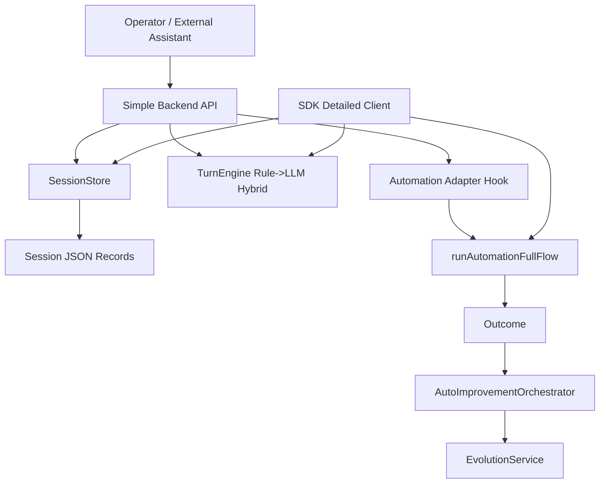

> Language: [English](./2026-02-24-dual-mode-multiturn-backend-sdk-plan.en.md) | [한국어](./2026-02-24-dual-mode-multiturn-backend-sdk-plan.md)

# Dual-Mode Multi-Turn Backend + SDK Reinforcement Plan

## 0. Goal

Reinforce the runtime so it can be used in two modes with the same core session model:

1. `backend_simple`: easiest HTTP backend usage with minimal setup
2. `sdk_detailed`: embeddable SDK usage with richer orchestration control

Both modes must support multi-turn LLM sessions and preserve reproducible session records.

## 1. Scope and Constraints

1. external assistant integrations (Slack/Telegram routing) stay out of scope
2. this repository provides reusable backend + SDK contracts only
3. coding model policy remains `gemini-3.1-pro-preview` for evolution/coding loops
4. automation interaction model remains `gemini-3-flash-preview` default for chat automation turns
5. all artifacts and logs must be storable under gitignored testing/runtime paths

## 2. Target Architecture

## 3. Contracts to Add

### 3.1 Session domain

1. create/list/get/close sessions
2. append user turns and assistant turns
3. keep metadata and optional screenshot references per turn

### 3.2 Backend Simple API

1. `GET /health`
2. `GET /backend/sessions`
3. `POST /backend/sessions`
4. `GET /backend/sessions/:id`
5. `POST /backend/sessions/:id/turns`
6. `POST /backend/sessions/:id/close`
7. static sample UI under `/backend/ui`

### 3.3 SDK Detailed API

1. `createMultiTurnAutomationSdk(...)`
2. `createSession(...)`
3. `sendUserTurn(...)`
4. `listSessions()`
5. `getSession(...)`
6. `closeSession(...)`

## 4. UX policy for both modes

1. no mandatory realtime stream requirement
2. session response returns next-step guidance and optional automation output
3. screenshot paths can be included in turn metadata for checkpoint sharing

## 5. Testing strategy

1. `session-store` unit tests for persistence/lifecycle
2. `backend-simple-service` unit tests for turn generation and session updates
3. `backend-simple-server` API tests (health/session/turn/close + ui route)
4. `sdk-multiturn` tests for SDK session lifecycle and fallback behavior
5. full regression: `npm run typecheck`, `npm run test:sdk`, `npm test`

## 6. Documentation updates

1. README EN/KR: add dual-mode quick usage
2. `CODEX-SDK-BACKEND-USAGE` EN/KR: add backend-simple + sdk-detailed flows
3. `CODEX-ENV-SETUP` EN/KR: add backend session env keys
4. AGENTS.md source-of-truth/order update if new doc links are introduced

## 7. Done criteria

1. dual mode APIs are implemented and exported
2. sample backend UI works against local backend
3. tests for new layers pass
4. docs are bilingual and linked mutually
