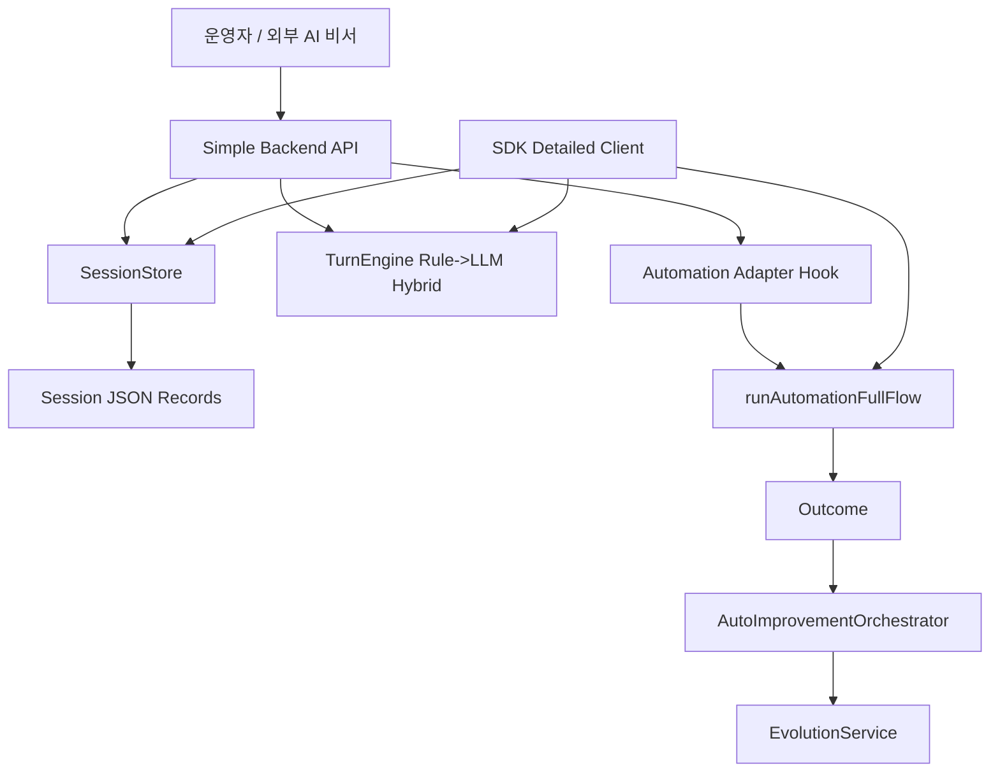

> Language: [English](./2026-02-24-dual-mode-multiturn-backend-sdk-plan.en.md) | [한국어](./2026-02-24-dual-mode-multiturn-backend-sdk-plan.md)

# Dual-Mode Multi-Turn Backend + SDK 보강 계획

## 0. 목표

런타임을 하나의 세션 코어로 다음 두 가지 사용 모드를 모두 지원하도록 보강한다.

1. `backend_simple`: HTTP 백엔드로 가장 단순하게 사용하는 모드
2. `sdk_detailed`: SDK 임베딩으로 세밀한 제어를 하는 모드

두 모드 모두 멀티턴 LLM 세션과 재현 가능한 세션 기록 구조를 가져야 한다.

## 1. 범위 및 제약

1. Slack/Telegram 라우팅 등 외부 AI 비서 연동은 범위 밖
2. 이 저장소는 재사용 가능한 backend + sdk 계약 제공에 집중
3. 코딩/자가개선 루프 모델 정책은 `gemini-3.1-pro-preview` 유지
4. 자동화 대화 턴 모델은 `gemini-3.0-flash` 기본값 유지
5. 아티팩트/로그는 gitignored 경로에 저장 가능해야 함

## 2. 목표 아키텍처

## 3. 추가할 계약

### 3.1 세션 도메인

1. 세션 생성/조회/목록/종료
2. 사용자 턴 + 어시스턴트 턴 누적
3. turn 단위 metadata와 screenshot 경로 보관

### 3.2 Backend Simple API

1. `GET /health`
2. `GET /backend/sessions`
3. `POST /backend/sessions`
4. `GET /backend/sessions/:id`
5. `POST /backend/sessions/:id/turns`
6. `POST /backend/sessions/:id/close`
7. `/backend/ui` 정적 샘플 UI 제공

### 3.3 SDK Detailed API

1. `createMultiTurnAutomationSdk(...)`
2. `createSession(...)`
3. `sendUserTurn(...)`
4. `listSessions()`
5. `getSession(...)`
6. `closeSession(...)`

## 4. 사용자 경험 정책

1. 실시간 스트리밍은 필수 아님
2. 세션 응답은 다음 액션 가이드 + 선택적 자동화 결과를 반환
3. 스크린샷 공유를 위해 turn metadata에 screenshotPath 저장 가능

## 5. 테스트 전략

1. `session-store` 단위 테스트(지속성/라이프사이클)
2. `backend-simple-service` 단위 테스트(턴 생성/세션 업데이트)
3. `backend-simple-server` API 테스트(health/session/turn/close + ui 라우팅)
4. `sdk-multiturn` 테스트(SDK 세션 라이프사이클/폴백)
5. 회귀 검증: `npm run typecheck`, `npm run test:sdk`, `npm test`

## 6. 문서 보강

1. README EN/KR: dual-mode 사용법 추가
2. `CODEX-SDK-BACKEND-USAGE` EN/KR: backend-simple + sdk-detailed 흐름 추가
3. `CODEX-ENV-SETUP` EN/KR: backend session env 키 추가
4. 필요 시 AGENTS.md Source of Truth/우선순위 갱신

## 7. 완료 기준

1. dual mode API 구현 및 export 완료
2. 샘플 backend UI가 로컬 backend와 연동 동작
3. 신규 레이어 테스트 통과
4. 문서가 EN/KR 이중화 및 상호 링크됨
